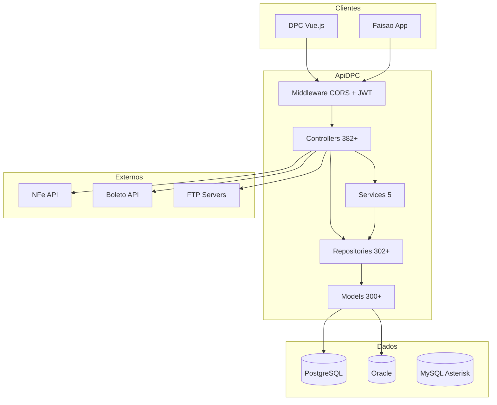

# ApiDPC – Documentação Arquitetural

## 1. Resumo executivo

ApiDPC é a API REST principal do ecossistema DPC, construída em **Laravel 5.5** (PHP 7.2+). Expõe centenas de endpoints consumidos pelo admin web (DPC Vue) e pelo app mobile (Faisao). Utiliza **três bancos de dados** (PostgreSQL para usuários e app, Oracle para ERP legado, MySQL para Asterisk CDR), autenticação **JWT** com refresh automático, padrão **Repository** em larga escala (302+ repositórios, 382+ controllers) e integrações com NFe, Boleto, Pedido, Atendimento, WebSocket, FTP e SMTP. O deploy é via Docker e GitHub Actions (branches alpha/beta).

---

## 2. Stack técnica

| Tecnologia | Versão | Uso |
|------------|--------|-----|
| PHP | >= 7.0 (runtime 7.2.5 no Docker) | Linguagem |
| Laravel | 5.5.* | Framework |
| tymon/jwt-auth | 1.0.0-rc.2 | Autenticação JWT |
| yajra/laravel-oci8 | 5.5.* | Driver Oracle |
| guzzlehttp/guzzle | ~6.0 | Cliente HTTP |
| barryvdh/laravel-dompdf | ^0.9.0 | Geração de PDF |
| phpoffice/phpspreadsheet | ^1.19 | Excel/planilhas |
| marvinlabs/laravel-discord-logger | ^1.1 | Logs no Discord |
| PHPUnit | ~6.0 | Testes |

---

## 3. Arquitetura e padrões

### Diagrama de camadas



### Padrões utilizados

- **Layered:** HTTP → Controller → Service (quando existe) / Repository → Model → DB.
- **Repository:** Interface `iBaseRepository` com `show`, `showAll`, `store`, `update`; base `BaseRepository`; repositórios por entidade.
- **Service:** Poucos services (StatusService, BoletoAvistaService, CriticaPedidoService, GestaoPontoService, PolibrasUploadImageService); parte da lógica permanece em controllers.
- **Resposta padrão:** `{ "error": 0|1, "msg": "...", "data": [...], "quantidade": N }`.

---

## 4. Organização de pastas

```
ApiDPC/
├── app/
│   ├── Console/Commands/     # Comandos Artisan (cron)
│   ├── Exceptions/Handler.php
│   ├── Http/
│   │   ├── Controllers/      # 382+ controllers
│   │   └── Middleware/      # CORS, JWT, RefreshToken
│   ├── Jobs/
│   ├── Providers/
│   ├── Repositories/        # 302+ repositories
│   ├── Services/            # 5 services
│   └── [Models]             # 300+ models na raiz de app/
├── bootstrap/
├── config/
├── database/migrations, seeds, factories
├── docker-compose/           # cron, nginx, php
├── public/
├── resources/assets, lang, views
├── routes/
│   ├── api.php              # ~2.738 linhas – rotas principais
│   ├── web.php
│   ├── itg.php              # integrações
│   └── console.php
├── storage/
├── tests/Feature, Unit
├── .github/workflows/
├── composer.json, package.json
├── Dockerfile, docker-compose.yml, deploy.sh
```

---

## 5. Fluxos principais

### Autenticação (JWT)

1. Cliente envia credenciais; API emite JWT (TTL 2h, refresh 1 ano).
2. Requisições usam header `Authorization` ou token em query.
3. Middleware `jwt` (RefreshToken) renova token quando expirado (com grace period e cache para evitar refresh concorrente).
4. Middleware `jwt.auth` (CustomGetUserFromToken) valida token e injeta usuário.
5. Usuário vem de PostgreSQL: `acesso.dim_usuario`, chave `cod_usuario`; model `App\User` implementa `JWTSubject`.

### CRUD típico

1. Rota em `routes/api.php` com prefixo `/api`, middleware `['cors', 'jwt']`.
2. Padrão comum: POST `/resource/busca` → showAll, POST `/resource/salvar` → store, POST `/resource/edit` → edit, DELETE `/resource/delete/{id}` → destroy.
3. Controller chama Repository (e eventualmente Service); Repository usa Models (Eloquent ou raw por connection).
4. Resposta em JSON no formato padrão.

### Integrações externas

- **APIs HTTP (Guzzle):** Atendimento, Pedido, Boleto, NFe, WebSocket, Sintegra (URLs em .env).
- **FTP:** Dovemail, SIME, relatórios de preço (comprovantes/arquivos).
- **SMTP:** smtp.dpcnet.com.br para notificações/relatórios.
- **Queue:** driver `sync` (sem fila assíncrona).

---

## 6. Autenticação

| Aspecto | Detalhe |
|---------|---------|
| Método | JWT (tymon/jwt-auth) |
| Armazenamento usuário | PostgreSQL, schema `acesso`, tabela `dim_usuario` |
| TTL token | 7200 s (2h) |
| Refresh TTL | 525600 s (1 ano) |
| Algoritmo | HS256 |
| Middlewares | `jwt` (refresh), `jwt.auth` (validação), `jwt.refresh` |
| Blacklist grace period | 30 s |

---

## 7. Estratégia de estado

- Backend stateless: estado de sessão está no JWT e no banco (usuário, permissões).
- Cache: driver `file`; usado no refresh token (evitar múltiplos refresh simultâneos).
- Sem fila assíncrona (queue `sync`).

---

## 8. Tratamento de erros

- **Handler global:** `app/Exceptions/Handler.php`; com `APP_DEBUG=false` retorna resposta vazia com status; com `APP_DEBUG=true` stack trace.
- **Resposta de erro:** `{ "error": 1, "msg": "..." }`.
- **Prática:** try/catch em services e em parte dos controllers; transações com rollback; inconsistência entre endpoints (alguns sem tratamento explícito).
- **Logs:** erros logados via Laravel; canal Discord para erros críticos.

---

## 9. Estratégia de logs

- **Biblioteca:** Monolog (padrão Laravel).
- **Canais:** stack com `daily` + `discord`.
- **Daily:** `storage/logs/lumen.log`, nível debug, retenção 14 dias.
- **Discord:** webhook `LOG_DISCORD_WEBHOOK_URL`, cores/emojis por nível, stacktrace inline ou anexo.
- **Uso:** `Log::info()`, `Log::error()`, etc., em pontos pontuais do código.

---

## 10. Ambiente e deploy

- **Runtime:** Docker (PHP 7.2.5-fpm, Oracle Instant Client 12.1; nginx na porta 8004).
- **CI/CD:** GitHub Actions (`.github/workflows/laravel.deploy.yml`), push em `alpha` ou `beta`, deploy via SSH (runner self-hosted).
- **Deploy:** `deploy.sh` – permissões, docker-compose, composer install, cache de config/routes/views, supervisor e cron.
- **Cron:** Laravel Scheduler (`RUN_SCHEDULE` no .env); exemplos: `registraboletocriticaavista` (a cada minuto), `atualizaimagensison` (diário 19h), `redimensionar-comprovantes` (diário 03h), relatórios de preço por estado.

---

## 11. Padrões consolidados vs inconsistências

### Consolidado

- Uso consistente de Repository para acesso a dados.
- Formato único de resposta JSON (`error`, `msg`, `data`, `quantidade`).
- JWT com refresh centralizado no middleware.
- Multi-database com connections nomeadas (pgsql, oracle, asterisk_cdr).
- Nomenclatura: Controllers/Repositories/Services com sufixos; métodos em camelCase.
- Logs com canal Discord para produção.

### Inconsistente

- Lógica de negócio em controllers (não só em services).
- Tratamento de erro e validação variam entre endpoints (sem Form Requests padronizados).
- Uso de SQL raw em controllers em alguns pontos (bypass ao Repository).
- Arquivo de rotas único e muito grande (`api.php` ~2.738 linhas).
- Poucos services para o volume de controllers; serviços não cobrem todos os fluxos complexos.

---

## 12. Riscos técnicos

| Risco | Impacto |
|-------|---------|
| PHP 7.2 e Laravel 5.5 EOL | Sem correções de segurança oficiais |
| Queue sync | Jobs pesados bloqueiam request; sem retry/background real |
| Rotas em um único arquivo | Manutenção e conflitos difíceis |
| Oracle/PostgreSQL/MySQL | Múltiplos pontos de falha e complexidade operacional |
| Dependências antigas (JWT RC, etc.) | Vulnerabilidades e incompatibilidades |

---

## 13. Dívida técnica identificável

- **Validação:** Falta de camada de Form Requests; validação espalhada em controllers/repositories.
- **Versionamento de API:** Ausência de prefixo por versão (ex.: `/api/v1/`).
- **Error handling:** Padronizar try/catch e respostas de erro em todos os endpoints.
- **Separação de responsabilidades:** Mover regras de negócio dos controllers para services.
- **Rotas:** Dividir `api.php` por domínio ou recurso.
- **Testes:** Pouca cobertura para o tamanho do projeto.
- **SQL raw:** Concentrar queries em repositories e evitar raw em controllers.
- **Documentação de API:** Endpoints não documentados de forma central (OpenAPI/Swagger).
