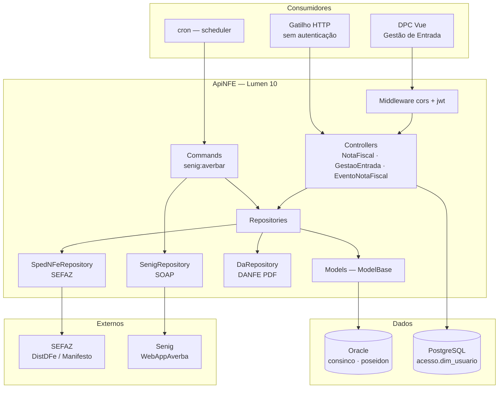
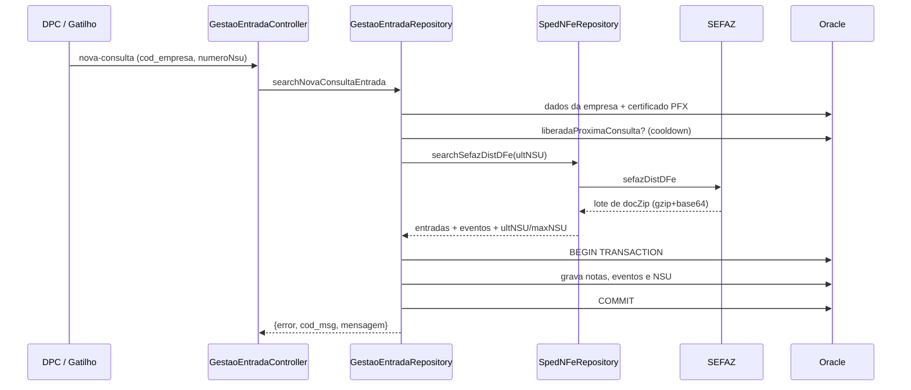
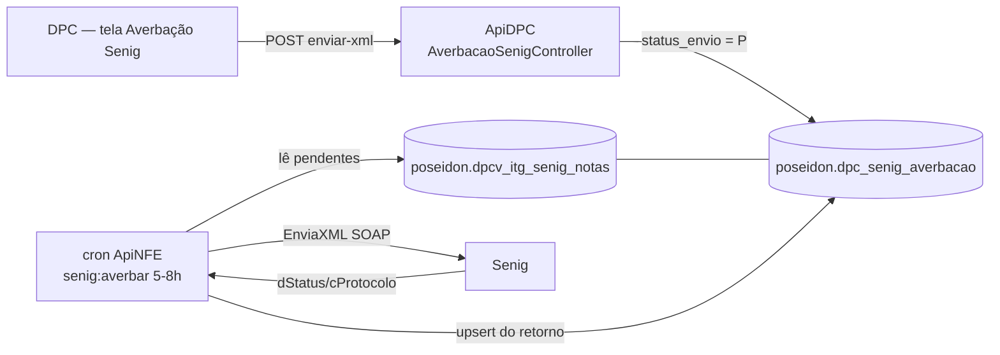

# ApiNFE — Arquitetura

**ApiNFE** é a API fiscal do ecossistema DPC: fala com a **SEFAZ** (via `nfephp-org/sped-nfe`) para consultar notas de entrada, manifestar eventos e baixar XML/DANFE, e com a **Senig** (SOAP) para averbação de seguro das NF-e de saída. É uma aplicação **Lumen 10 / PHP 8.2**, muito menor que a ApiDPC (~45 arquivos PHP úteis), com banco **Oracle** (schemas `consinco` e `poseidon`) e **PostgreSQL** (schema `acesso`, só para o usuário do JWT).

O único consumidor HTTP hoje é o **DPC (Vue)**, na tela *Contabilidade → Gestão de Entrada*, via `ENDERECO_APINFE`. A integração Senig **não tem rota HTTP**: roda por cron e se comunica com a ApiDPC por **tabela compartilhada** no Oracle.

---

## Stack técnica

| Tecnologia | Versão | Uso |
|---|---|---|
| **Lumen** | ^10.0 | Micro-framework (sem Eloquent auto, sem sessão) |
| **PHP** | ^8.1 (runtime `php:8.2-fpm`) | Linguagem |
| **nfephp-org/sped-nfe** | ^5.0 | Comunicação com a SEFAZ (DistDFe, manifesto, download, consulta cadastro) |
| **m-galdino/sped-doc-aux** | dev-master | Geração do DANFE em PDF (fork do `sped-da`) |
| **yajra/laravel-oci8** | ^10.0 | Driver Oracle (ext. `oci8` + Instant Client 12.1) |
| **firebase/php-jwt** | ^6.0 | Validação do JWT (HS256) |
| **league/flysystem** | ^3.0 | Filesystem |
| **ext-soap** | — | Cliente SOAP nativo usado na Senig (WSDL Delphi) |
| **nginx + PHP-FPM** | alpine / 8.2 | Servidor (host **8011** → 80) |
| **Supervisor / cron** | — | Workers de fila e scheduler |

---

## Arquitetura e padrões



**Padrões aplicados:**

- **Camadas:** rota → Controller → Repository → Model → Oracle. O Controller nunca consulta banco direto; só monta `$retorno` e devolve `response()->json()`.
- **Repository sem contrato:** `BaseRepository` é uma classe abstrata **vazia** — não há interface nem métodos herdados. Cada repository define os métodos que precisa (`showAll`, `store`, `update`, `getXml`, `registrar`…).
- **Repositories especializados por integração:** `SpedNFeRepository` (SEFAZ), `SenigRepository` (SOAP Senig), `DaRepository` (PDF). Só o `SenigRepository` tem responsabilidade realmente única — não toca banco.
- **Model = query builder, não Eloquent:** os models estendem `ModelBase` e expõem `protected function showAll($params, $return_data = true, $fillable = null)`, montando a query com `DB::connection(...)->table(...)`. `$fillable` aqui **não é mass-assignment** — é a lista de colunas do `SELECT`.
- **`showAll` chamado estaticamente:** `Empresa::showAll($params)` funciona porque o método é `protected` e cai no `__callStatic` do Eloquent, que faz `(new static)->showAll(...)` de dentro do escopo `Model`. Padrão frágil, mas é o vigente — ver [convenções](../regras/alterar-codigo/apinfe-convencoes.md).
- **Conexão por model:** cada model define `$this->connection = env('DB_CONNECTION_ORACLE')` no `__construct`, permitindo alternar prod/homologação sem tocar em código.
- **Resposta padrão:** `{ "error": 0|1, "mensagem": "...", ...dados }` — note **`mensagem`**, diferente do `msg` da ApiDPC.

---

## Organização de pastas

```
ApiNFE/
├── app/
│   ├── Console/Commands/
│   │   ├── SenigAverbacao.php      # senig:averbar — cron da averbação
│   │   ├── ScheduleTestTick.php    # valida que cron+scheduler funcionam
│   │   └── GetNfeXml.php           # script descartável (~47k linhas) — ver riscos
│   ├── Console/Kernel.php          # scheduler com guard RUN_SCHEDULE
│   ├── Exceptions/Handler.php      # Throwable; body vazio quando APP_DEBUG=false
│   ├── Http/
│   │   ├── Controllers/            # NotaFiscal, GestaoEntrada, EventoNotaFiscal
│   │   └── Middleware/             # JwtMiddleware, CorsMiddleware
│   ├── Repositories/               # 16 repositories
│   ├── Jobs/                       # apenas ExampleJob/Job (scaffold)
│   ├── ModelBase.php               # base dos models (timestamps off + sequence)
│   └── Dpc*.php, GeEmpresa.php…    # models na raiz de app/
├── bootstrap/app.php               # carrega .env e configs MANUALMENTE (Lumen 10)
├── config/database.php             # oracle, oracle_tst, pgsql, pgsql_tst
├── docker-compose/
│   ├── cron/schedule-cron          # roda artisan schedule:run a cada minuto
│   ├── nginx/, php/, oracle/
│   └── supervisor/                 # 27 workers Itg* (sem jobs correspondentes)
├── routes/web.php                  # todas as rotas (~50 linhas)
├── public/img/, storage/imagem/    # logos usados no DANFE
├── Dockerfile                      # PHP 8.2 + Instant Client + legacy OpenSSL
└── build.run                       # bootstrap completo do ambiente
```

---

## Endpoints

Todos em [routes/web.php](../../../ApiNFE/routes/web.php). Protegidos = grupo `['cors', 'jwt']`.

| Método | Rota | Auth | Descrição |
|---|---|:---:|---|
| GET | `/api/status` | — | Health check |
| GET | `/gatilho/buscar-nova-entrada` | ❌ | Dispara a consulta automática de NSU na SEFAZ |
| POST | `/consulta/cadastro` | ❌ | Consulta cadastro de contribuinte na SEFAZ |
| GET | `/nota-fiscal/busca-xml/{nropedvenda}` | ✅ | 2ª via do XML por nº do pedido de venda |
| GET | `/nota-fiscal/busca-pdf/{nropedvenda}` | ✅ | 2ª via do DANFE (PDF base64) |
| POST | `/gestao-entrada/buscar` | ✅ | Lista notas de entrada já gravadas |
| POST | `/gestao-entrada/nova-consulta` | ✅ | Consulta manual de NSU na SEFAZ |
| POST | `/gestao-entrada/download-danfe` | ✅ | Baixa XML na SEFAZ e gera DANFE |
| POST | `/gestao-entrada/cadastrar-evento` | ✅ | Manifesta evento (individual ou lote) |
| POST | `/gestao-entrada/buscar-evento-nf` | ✅ | Eventos gravados de uma nota |
| POST | `/gestao-entrada/buscar-ultimo-nsu-consultado` | ✅ | Último NSU por empresa |
| POST | `/gestao-entrada/buscar-emissor-nf` | ✅ | Emissores (para filtro da tela) |
| POST | `/evento-nota-fiscal/buscar` | ✅ | Tipos de evento cadastrados |
| POST | `/evento-nota-fiscal/salvar` | ✅ | Salva tipo de evento |

---

## Fluxos principais

### 1. Consulta de notas de entrada (DistDFe / NSU)

O coração do projeto. Roda em dois gatilhos — manual (usuário no DPC) e automático (cron externo chamando a rota pública).



Detalhes que importam:
- Só entram notas em que a DPC **não** é a emitente (`notaEntrada()` compara o CNPJ dentro da chave contra as empresas do grupo).
- Trata 4 tipos de documento: `resNFe`/`procNF` viram **entrada**; `resEve`/`procEv` viram **evento**.
- `cStat` é traduzido para `cod_sit_nfe`: 100 → autorizada (1), 101/151 → cancelada (3), 205 → denegada (2).
- O gatilho automático grava trilha em `poseidon.dpc_historico_gatilho` com `cod_msg` (0 = ok, 1 = cooldown, 2 = erro SEFAZ, 4 = erro ao gravar, 5 = exceção geral).

### 2. Manifestação de evento
`cadastrar-evento` → `SpedNFeRepository::cadastrarEventoNotaFiscal()` → `sefazManifesta` (uma chave) ou `sefazManifestaLote` (array de chaves). Retorno com `cStat = 135` é sucesso; qualquer outro é contabilizado em `qntdEvtComError`. Os eventos são gravados em seguida via `EntradaEventoRepository`.

### 3. Segunda via de XML / DANFE
`busca-xml` e `busca-pdf` recebem o **nº do pedido de venda**, resolvem a chave em `consinco.mfl_doctofiscal` e leem o XML já armazenado em `poseidon.dpcv_extranet_nf` — **não** consultam a SEFAZ. O XML da view vem partido em duas colunas (`xmlnf` + `xmlnfp`) e é remontado como `<nfeProc>`.

### 4. Averbação Senig (cron, sem rota HTTP)

Integração cross-project por **tabela compartilhada**, não por HTTP:



- Seleção padrão: notas com `status_envio` em `P`/`F` ou nulo, emitidas nos **últimos 3 dias**; **mais** qualquer nota com registro `status_envio = 'P'` (o usuário clicou em "integrar" no DPC), independente da data.
- Método SOAP é **`EnviaXML`** (NF-e). `EnviaXMLRet` existe no repository mas é exclusivo de CT-e.
- `dStatus`: `100` recebido, `110` erro de processamento, `154` segurado sem apólice 540.
- `EnviaXML` devolve **chave de pesquisa** de relatório, não protocolo definitivo de averbação — por isso grava em `chave_pesquisa`, não em `protocolo_senig`.
- Upsert pela chave única `UK_DPC_SENIG_AVERB_DOCTO` (`nro_empresa` + `numero_df` + `serie_df` + `nro_serie_ecf`), incrementando `qtd_tentativas`.
- Cada nota tem seu próprio `try/catch`: uma falha não aborta o lote, e a falha é registrada best-effort.
- Flags de operação: `--dry-run`, `--chave=`, `--limit=`, `--debug` (salva envelopes SOAP em `storage/logs/senig-debug/`). **A Senig só tem ambiente de produção** — testar sempre com `--dry-run` antes.

---

## Autenticação

| Aspecto | Detalhe |
|---|---|
| Método | JWT HS256 (`firebase/php-jwt`), validado em `JwtMiddleware` |
| Emissor | **A ApiNFE não emite token** — consome o JWT emitido pela ApiDPC (mesmo `JWT_SECRET`) |
| Transporte | **Somente query string** `?token=<JWT>` — o middleware lê `$request->get('token')`; header `Authorization` é ignorado |
| Payload usado | apenas `sub` → `user_id` |
| Propagação | `$request->attributes->set('auth', ['user_id' => ...])` — Symfony ParameterBag |
| Leitura no controller | `($request->attributes->get('auth', []))['user_id'] ?? null` |
| Usuário | `acesso.dim_usuario` (PostgreSQL, via conexão **default**), model `App\User` |
| Erros | 401 sem token; 400 expirado; 400 inválido |

> **Nunca** usar `$request->auth = $user` (padrão Lumen 5.x): no Lumen 10 colide com `Request::__get('auth')`, que tenta resolver `route()->parameter()` e quebra com *"Call to a member function parameter() on array"*.

---

## Banco de dados

Quatro conexões em [config/database.php](../../../ApiNFE/config/database.php): `oracle`, `oracle_tst`, `pgsql`, `pgsql_tst`. Default = `env('DB_CONNECTION')`, que aponta para **`pgsql`** (é onde vive `acesso.dim_usuario`). Os models de negócio ignoram o default e usam `env('DB_CONNECTION_ORACLE')`.

| Objeto | Schema | Papel |
|---|---|---|
| `ge_empresa`, `ge_cidade` | `consinco` | Empresas do grupo (emitente, CNPJ, IE, UF) |
| `mfl_doctofiscal` | `consinco` | Documento fiscal → chave de acesso por pedido de venda |
| `dpcv_extranet_nf` | `poseidon` | XML das NF-e emitidas (`xmlnf` + `xmlnfp`) |
| `dpc_conta_certif_digital_emp` | `poseidon` | **Certificados PFX por empresa** (blob + senha criptografada) |
| `dpc_conta_entrada_nota` / `_evento` / `_pessoa` | `poseidon` | Notas de entrada, eventos e emissores |
| `dpc_conta_nsu_consultado` | `poseidon` | Controle de NSU e cooldown entre consultas |
| `dpc_historico_gatilho` | `poseidon` | Trilha das execuções automáticas |
| `dpc_senig_averbacao` | `poseidon` | Controle de averbação (compartilhada com a ApiDPC) |
| `dpcv_itg_senig_notas` | `poseidon` | View de notas pendentes de averbação |
| `dim_usuario` | `acesso` (PG) | Usuário do JWT |
| `poseidon.montacpfcnpj()` · `consinco.dpcf_desconvertesenhas()` | — | Funções PL/SQL usadas em `SELECT` |

> **`DB::raw()` dentro de `$fillable` resolve a conexão _default_** (não a do model) no momento do `__construct`. Por isso `DB_CONNECTION` precisa apontar para uma conexão **válida e conectável**, mesmo quando o model só usa Oracle.

### Certificado digital
Os PFX ficam em `poseidon.dpc_conta_certif_digital_emp` (base64 no banco, senha descriptografada pela função `dpcf_desconvertesenhas`) e são lidos por `Certificate::readPfx()`. O Dockerfile **habilita o legacy provider do OpenSSL 3**; sem isso, PFX antigos (RC2-40-CBC/MD5) falham com `error:0308010C:digital envelope routines::unsupported`. Não remover esse bloco.

---

## Ambiente e deploy

- **Containers:** `apinfe-app` (PHP-FPM + Instant Client + supervisor + cron) e `apinfe-nginx` (porta **8011** → 80), rede bridge `apinfe`. Subida completa: `./build.run`.
- **Timeouts generosos:** nginx com `fastcgi_read_timeout 1800s` — reflexo de chamadas SEFAZ/Senig lentas.
- **Scheduler:** cron roda `artisan schedule:run` a cada minuto, mas o `Kernel` só agenda se **`RUN_SCHEDULE=1`**. Default seguro em dev é `0`.
- **Ambiente SEFAZ:** `TIPO_AMBIENTE` (1 = produção, 2 = homologação) alimenta `tpAmb` no config do sped-nfe. Exceção: `sefazDownload()` força `setEnvironment(1)`, pois o serviço só opera em produção.
- **URLs por ambiente (consumidas pelo DPC):** dev `http://devdpc.local:8011/`, alpha `https://apinfe.alpha.dpcnet.com.br/`, prod `https://apinfe.dpcnet.com.br/`.
- **Sem CI/CD:** não há workflow de deploy no repositório (diferente da ApiDPC).

### Execução local sem Docker

O repositório inteiro (Dockerfile, `docker-compose.yml`, `build.run`, README) assume containers, mas o ambiente de desenvolvimento em uso **roda direto na máquina**. O que o Dockerfile preparava passa a ser responsabilidade do host.

**Runtime:** `D:\Joabe\Documents\dev\xampp-multi\php82\php.exe` (PHP 8.2.4, ZTS x64). O `php` do `PATH` é **7.2.33 e não serve** — Lumen 10 exige `>= 8.1`.

**Extensões necessárias** (todas presentes em `php82`): `oci8` (3.2.1), `pgsql`, `pdo_pgsql`, `soap` (Senig), `openssl`, `curl`, `mbstring`, `dom`/`xml`, `zip`. O `pdo_oci` **não** é necessário — o `yajra/laravel-oci8` usa `oci8`.

**Oracle:** Instant Client 21.20 em `D:\oracle\instantclient` (no `PATH`). Não há `TNS_ADMIN`/`tnsnames.ora`, por isso o `.env` usa **descriptor TNS inline**.

**Bancos via túnel SSH** (`ssh -N tunnel-dpc`) — sem ele, toda rota autenticada falha:

| Porta | Destino |
|---|---|
| 1521 | Oracle homologação (`SERVICE_NAME=homolog`) |
| 1522 | Oracle produção |
| 15432 | PostgreSQL teste (base `apps`, onde fica `acesso.dim_usuario`) |

Rodando nativo os hosts são `127.0.0.1` — **não** `host.docker.internal`.

#### OpenSSL: provider legacy (obrigatório para certificado)

O Dockerfile habilitava o provider legacy editando `/etc/ssl/openssl.cnf`. Nativo no Windows isso não existe, e sem ele `Certificate::readPfx()` falha com `error:0308010C:digital envelope routines::unsupported` — quebrando **tudo que toca a SEFAZ** (consulta de NSU, manifestação, DANFE, Senig). A aplicação sobe e o login funciona normalmente; a falha só aparece ao usar o certificado.

São necessárias **duas** variáveis — no Linux basta a config, mas no Windows o OpenSSL não localiza a `legacy.dll` sozinho (verificado por teste A/B: cada uma isolada falha):

| Variável | Valor | Papel |
|---|---|---|
| `OPENSSL_CONF` | `…\php82\extras\ssl\openssl-legacy.cnf` | Ativa os providers `legacy` **e** `default` |
| `OPENSSL_MODULES` | `…\php82\extras\ssl` | Diz onde está a `legacy.dll` |

> Ativar a seção `[provider_sect]` desliga o carregamento implícito do provider `default` — por isso a config precisa reativá-lo explicitamente, senão nada de cripto funciona.

**Não definir essas variáveis no escopo do usuário/máquina:** seriam herdadas pelo PHP 7.2 da ApiDPC (mesmo `xampp-multi`), que usa OpenSSL 1.x e não entende `providers`. Elas precisam ficar escopadas — o que é feito de duas formas, conforme o contexto.

#### Servindo HTTP: Apache (recomendado)

A ApiNFE é servida pelo Apache do `xampp-multi` na porta 8011, com VirtualHost em `apache/conf/extra/httpd-vhosts-joabe.conf`. A versão do PHP é escolhida **por vhost**:

```apache
SetEnv OPENSSL_CONF     …/php82/extras/ssl/openssl-legacy.cnf
SetEnv OPENSSL_MODULES  …/php82/extras/ssl
SetHandler application/x-httpd-php82
Action     application/x-httpd-php82 "/php82/php-cgi.exe"
```

O `SetEnv` resolve o escopo de forma limpa: as variáveis existem só nas requisições desse vhost. Confirmado em runtime pelo header `X-Powered-By: PHP/8.2.4` (o `Server:` mostra 7.2.33, que é apenas o mod_php global do Apache).

**Por que Apache e não o servidor embutido:** `php -S` e `artisan serve` são single-thread (`PHP_CLI_SERVER_WORKERS` não existe no Windows) — atendem uma requisição por vez. Como uma chamada à SEFAZ pode levar segundos, ela travaria a API inteira. Com `Action`+`php-cgi` o Apache processa em paralelo.

> A **ApiDPC roda no mesmo Apache**, porta 8004, com vhost equivalente apontando para `/php-cgi/php-cgi.exe` (PHP 7.2). Um único processo `httpd` serve as duas portas executando versões diferentes de PHP — confirmado pelo `X-Powered-By` (7.2.33 na 8004, 8.2.4 na 8011).
>
> Se voltar a usar `artisan serve` na 8004, é preciso comentar o vhost **e** o `Listen 8004`: com a porta ocupada por outro processo o Apache **não sobe** e derruba todos os demais sites do arquivo.

**Dica de diagnóstico:** com `APP_DEBUG=true`, uma resposta de erro da ApiDPC passa de **500 KB** de HTML (um 401 sem token gera ~536 KB). O `Invoke-WebRequest` do PowerShell falha nesses casos com *"a conexão foi fechada de modo inesperado"*, o que parece crash do servidor mas não é. Conferir sempre `logs/apidpc-access.log` (que mostra o status real) ou testar com `curl` antes de concluir que algo quebrou.

#### Linha de comando: `dev.cmd`

Para comandos artisan (`senig:averbar`, etc.) o vhost não vale — quem exporta as variáveis é o `dev.cmd` (não versionado) na raiz do projeto:

```
dev.cmd senig:averbar --dry-run --chave=X   # repassa para o artisan
dev.cmd                                     # fallback: servidor embutido na 8011
```

No modo servidor ele passa `public/index.php` como **router script**; sem isso o PHP procura arquivo físico e devolve 404 em todas as rotas do Lumen.

---

## Captura própria de NF-e de entrada (módulo DFe)

Subsistema que substitui o serviço terceiro **Qive** na captura de documento fiscal de entrada: **NF-e, CT-e e NFS-e** hoje, MDF-e preparado e desligado. É 100% CLI — não expõe rota HTTP — e independente do módulo antigo (`dpc_conta_entrada_*`), que segue intocado.

Documentação completa (14 documentos, os 18 scripts de banco, o conhecimento acumulado sobre a SEFAZ e sobre o motor): [nfe_dfe/docs/readme.md](../nfe_dfe/docs/readme.md). O que está aqui é o resumo arquitetural.

### Commands

| Command | Fala com a SEFAZ? | Papel |
|---|---|---|
| `dfe:ingerir` | **sim** | Consome o fluxo de NSU e grava o documento **bruto** (gzip) |
| `dfe:normalizar` | **nunca** | Interpreta o bruto e popula nota, item, emitente, evento, CT-e e NFS-e |
| `dfe:conciliar` | não | Casa a nota capturada com a do ERP pela chave de acesso |
| `dfe:monitorar` | não | Backlog, validade de certificados, fila e pendências |
| `dfe:manifestar` | sim | Manifestação do destinatário — **desligado por padrão** |

### Por que duas etapas

A SEFAZ retém os documentos por **90 dias**. Se o parser falhar e o documento não tiver sido guardado, a perda é definitiva. Gravando o bruto primeiro, um bug de parser vira `dfe:normalizar --status=E` depois da correção — sem nova chamada e sem consumir cota.

Comprovado: reprocessar os mesmos 50 brutos não duplicou nada.

### A regra do `ultNSU` — o que mais custou aprender

> O cursor **não é um número que escolhemos**. É um token que a SEFAZ devolve e que só pode ser continuado.

Enviar `0` depois de já ter recebido um `ultNSU`, ou um NSU obtido por `consChNFe`, retorna `cStat 656` e **bloqueia o certificado por 1 hora**. Foram 4 bloqueios até entender; a chamada com o valor correto funcionou de primeira.

Consequências no código: `--reposicionar-cursor` recusa valor diferente do último `ultNSU` recebido (exige `--confirmar`), e o estado `CURSOR_TRAVADO` **não** sugere reposicionamento — não há saída conhecida para faixa expurgada.

### Consumo é por certificado/IP, não por CNPJ

Todas as filiais usam o e-CNPJ da matriz e saem do mesmo servidor, então **disputam uma cota só**. Um `656` aplica espera a todas as empresas e aborta o ciclo. Há freio de emergência porque 50 bloqueios consecutivos podem virar bloqueio permanente. O limite vive em **`POSEIDON.DPC_PARAMETRO`** (`dfe_max_bloqueios_dia`), e não no `.env`: ele é lido pela ApiNFE **e** pela tela do Monitor DFe na ApiDPC, e quando morava no `.env` de cada projeto os dois divergiram — a tela acusava freio acionado com o motor operando normal.

### Bloqueio de negócio

**Não é possível operar em paralelo com a Qive.** Duas aplicações consultando o mesmo CNPJ é causa documentada de consumo indevido. A migração exige corte seco. Ver [01_decisao-qive.md](../nfe_dfe/docs/01_decisao-qive.md) e [12_sefaz-656-consumo-indevido.md](../nfe_dfe/docs/12_sefaz-656-consumo-indevido.md).

### Armadilhas do driver, já resolvidas

| Sintoma | Causa | Solução |
|---|---|---|
| `ORA-01465: invalid hex number` ao gravar BLOB | `insert()` trata binário como literal | `insertLob()` do yajra, com bind `PDO::PARAM_LOB` |
| `array_flip(): Can only flip string and integer` | `parent::__construct()` chama `fill()`, e o `$fillable` é lista de SELECT com `DB::raw` | não chamar o construtor pai (convenção do projeto) |
| `debug_backtrace` estoura em `insertGetId` | o processor do yajra assume chamada via Eloquent | inserir pelo model, não pelo query builder |
| Data deslocada 4-5 h | `strtotime()+date()` usa o timezone do ambiente | `DateTime`, que respeita o offset do documento |

---

## Riscos técnicos

| Risco | Impacto |
|---|---|
| **Chave privada versionada** (`aplicativosdpc.com.key` + `.crt` na raiz) | Certificado TLS do domínio exposto a qualquer um com acesso ao repo; exige rotação |
| **`.env.example` com credenciais reais** (usuário/senha Oracle e PG, `JWT_SECRET`) | Segredos efetivos em texto claro no git |
| **Rotas públicas sensíveis** (`/gatilho/buscar-nova-entrada`, `/consulta/cadastro`) | Qualquer um dispara consultas à SEFAZ usando o certificado digital da empresa; risco de bloqueio por excesso de consumo |
| **Token em query string** | JWT vaza em access log do nginx, histórico e referer |
| `Access-Control-Allow-Origin: *` junto de `Allow-Credentials: true` | Combinação inválida/insegura; navegadores rejeitam e mascara a intenção real |
| **27 workers Supervisor sem jobs** (`app/Jobs/` só tem scaffold) e `QUEUE_CONNECTION=sync` | Workers consomem memória sem função; a doc sugere um pipeline de integração que não existe neste repo |
| **`GetNfeXml.php` com ~47.000 linhas** de números de NF hardcoded + import de `App\Models\FaleConosco` (classe inexistente) | Script descartável versionado e registrado no Kernel; polui o repo e quebra se executado |
| `$e` não definido em `GestaoEntradaRepository::searchNovaConsultaEntrada` (caminho do cooldown) | Em vez da mensagem "tempo entre consultas não atingido", estoura `Error` em PHP 8 |
| `require_once './../vendor/m-galdino/sped-doc-aux/bootstrap.php'` em `DaRepository` | Caminho relativo ao CWD: quebra fora do contexto web (ex.: artisan em outro diretório) |
| Instant Client **12.1** e PFX legado exigindo OpenSSL legacy | Dependências no fim da vida; ambos com workaround explícito no Dockerfile |
| **Zero testes** (só o scaffold `ExampleTest`) | Fluxos fiscais críticos sem rede de segurança |
| `APP_DEBUG=false` devolve **body vazio** em erro 500 | Falhas ficam mudas para o cliente; depuração só via log do container |

---

## Dívida técnica identificável

- **Segredos:** remover `.key`/`.crt` do histórico, rotacionar certificado e `JWT_SECRET`, e sanear o `.env.example`.
- **Proteger as rotas públicas:** exigir JWT (ou token de serviço/allowlist de IP) no gatilho e na consulta de cadastro.
- **Aceitar o token no header `Authorization`**, mantendo a query string apenas por compatibilidade.
- **Limpar o legado:** apagar `GetNfeXml.php`, os `Example*` e os 27 `.conf` de supervisor sem job correspondente.
- **`BaseRepository` vazio:** definir uma interface mínima (`showAll`/`store`/`update`) como a ApiDPC tem, ou assumir a ausência dela conscientemente.
- **Padronizar o retorno:** `mensagem` aqui vs. `msg` na ApiDPC; alinhar ou documentar no contrato.
- **Sair do `showAll` protegido via `__callStatic`:** tornar os métodos públicos e estáticos de verdade, ou mover a query para o repository.
- **Testes:** ao menos cobertura de parse (retorno SEFAZ e Senig), que é onde a lógica frágil se concentra.
- **Observabilidade:** logs só em `Log::debug`; não há canal de alerta (a ApiDPC usa Discord) para falhas de averbação/consulta.

---

## Referências

- Convenções de código: [apinfe-convencoes.md](../regras/alterar-codigo/apinfe-convencoes.md)
- Checklists: [bug](../regras/alterar-codigo/apinfe-checklist-corrigir-bug.md) · [feature](../regras/alterar-codigo/apinfe-checklist-nova-feature.md)
- Visão do ecossistema: [visao-geral-ecossistema-dpc.md](visao-geral-ecossistema-dpc.md)
- `README.md` do próprio repositório traz o guia operacional (build, troubleshooting de Docker/PECL/OpenSSL).
