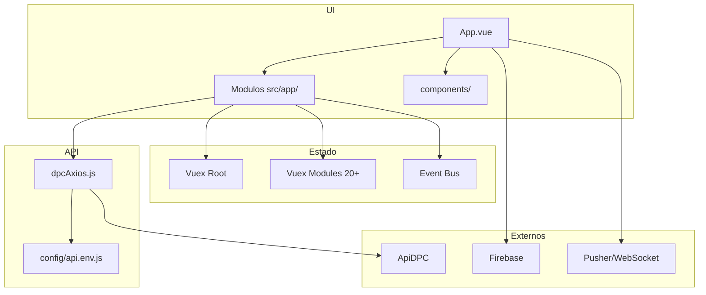

# DPC (admin-dpc-vue) – Documentação Arquitetural

## 1. Resumo executivo

DPC é o painel administrativo web do ecossistema DPC, construído em **Vue.js 2.5** com **Vuex** e **Vue Router** (history mode), bundler **Webpack 3**. Organiza a aplicação em **módulos por funcionalidade** (vendas, clientes, financeiro, usuários, etc.) em `src/app/`, com estado global no Vuex (root + mais de 20 módulos) e **autenticação JWT** via cookie e token em query/header. Consome a ApiDPC via **Axios** centralizado (`dpcAxios.js`) e integra **Firebase** (push) e **Laravel Echo + Pusher** (WebSocket). Estilo com **Bootstrap 3** e **SCSS**. Deploy via **Docker** (Node 10 build + Apache) e **Firebase Hosting**.

---

## 2. Stack técnica

| Tecnologia | Versão | Uso |
|------------|--------|-----|
| Vue.js | 2.5.20 | Framework frontend |
| Vuex | 3.0.1 | Estado global |
| Vue Router | 3.0.2 | Roteamento (history) |
| Axios | 0.19.2 | Cliente HTTP |
| Webpack | 3.12.0 | Build |
| Node | >= 4 (build: 10.15 no Docker) | Runtime build |
| Bootstrap (sass) | 3.3.7 | UI / grid / componentes |
| bootstrap-vue | 2.0.0-rc.21 | Componentes Vue + Bootstrap |
| jwt-decode | 2.2.0 | Decodificação JWT |
| vue-cookie | 1.1.4 | Cookie (token) |
| Firebase | 8.10.1 | Push notifications |
| laravel-echo / pusher-js | 1.5.3 / 4.4.0 | WebSocket |
| node-sass / sass-loader | 4.14.1 / 6.0.7 | SCSS |

---

## 3. Arquitetura e padrões

### Diagrama de camadas



### Padrões utilizados

- **Feature-based:** Cada funcionalidade em `src/app/[feature]/` com `components/`, `routes.js`, e quando necessário `vuex/`.
- **Vuex modular:** Store root (`token`, `user`, `menus`, `permissaoUser`, etc.) + módulos por feature.
- **API centralizada:** Uma instância Axios via `dpcAxios.connection()`, base URL e endpoints em `config/api.env.js` (126+ constantes).
- **Event bus:** `utils/events/bus.js` para eventos entre componentes não pai-filho.
- **Route guards:** `router/beforeEach.js` – checagem de autenticação, carregamento de menus e permissões.

---

## 4. Organização de pastas

```
DPC/
├── build/                    # Webpack
│   ├── webpack.base.conf.js
│   ├── webpack.dev.conf.js
│   ├── webpack.prod.conf.js
│   └── utils.js
├── config/
│   ├── index.js
│   ├── dev.env.js, prod.env.js, test.env.js
│   └── api.env.js            # 126+ endpoints
├── src/
│   ├── main.js               # Entry, plugins, Echo
│   ├── App.vue
│   ├── Account.js            # Auth (login, logoff, hasAccess)
│   ├── dpcAxios.js           # Axios + interceptors
│   ├── router/
│   │   ├── index.js
│   │   ├── routes.js
│   │   └── beforeEach.js
│   ├── vuex/
│   │   ├── index.js, state.js, mutations.js, actions.js, getters.js
│   │   └── modules.js
│   ├── app/
│   │   ├── index.js, routes.js, vuex.js
│   │   ├── directives/
│   │   ├── root/              # Login, 404
│   │   └── [30+ features]     # absenteismo, vendas, clientes, usuarios, financeiro, etc.
│   ├── components/           # Compartilhados
│   │   ├── root/              # sidebar, topbar, table, modal
│   │   └── box/
│   ├── assets/css/sass/
│   └── utils/events/bus.js
├── static/
├── test/
├── dockerfile
├── firebase.json
├── package.json
└── .babelrc
```

---

## 5. Fluxos principais

### Autenticação

1. Login envia credenciais à ApiDPC; recebe JWT.
2. `Account.js` decodifica JWT, preenche Vuex (`setToken`, `setUser`) e cookie.
3. `dpcAxios` adiciona token em toda requisição (query `?token=...` e/ou header).
4. Interceptor de resposta lê novo token no header `Authorization` e atualiza Vuex/cookie (refresh).
5. `router/beforeEach` verifica autenticação; carrega menus se necessário; `Account.hasAccess()` valida permissão da rota; redireciona para login se não autorizado.
6. Logoff: limpa cookie e Vuex; redireciona para login.

### Consumo de API

1. Componente ou Vuex action chama `dpcAxios.connection().post(get, ...)` (ou get/put/delete).
2. URL base: `process.env.ENDERECO_APIDPC`; path vindo de `config/api.env.js` (ex.: `CLIENTE`, `PEDIDO`, `USUARIOS`).
3. Padrão de uso: POST para buscas (ex.: `/busca`), body com filtros; resposta esperada no formato ApiDPC (`error`, `msg`, `data`, `quantidade`).
4. Erros 401/400 no interceptor disparam logoff e redirecionamento.

### Estado (Vuex)

- **Root:** token, user, menus, permissaoUser, rota, serverTimeOffset, relatorioDados, rotasAcessadas.
- **Módulos:** um por feature (gestao, vendedores, usuarios, pedidos, metas, clientes, etc.) com state/mutations/actions/getters.
- **Event bus:** notificações e eventos entre componentes (ex.: `show-notification`).

---

## 6. Autenticação

| Aspecto | Detalhe |
|---------|---------|
| Método | JWT (cookie + Vuex) |
| Decodificação | jwt-decode |
| Persistência | vue-cookie |
| Envio | Query `?token=` + header (interceptor) |
| Refresh | Interceptor lê `Authorization` da resposta e atualiza store/cookie |
| Guards | router/beforeEach + Account.isAuthenticated() + Account.hasAccess() |

---

## 7. Estratégia de estado

- **Global:** Vuex (root + módulos por feature); `strict: true` em dev.
- **Server state:** mantido no Vuex (actions disparam requests e commitam resultados).
- **Comunicação cross-component:** Event bus (`bus.js`) além de props/emit.

---

## 8. Estratégia de consumo de API

- **Cliente:** Axios único via `dpcAxios.connection()`.
- **Base URL:** `process.env.ENDERECO_APIDPC`.
- **Endpoints:** Constantes em `config/api.env.js` (ex.: `api.env.CLIENTE`, `api.env.PEDIDO`).
- **Auth:** Interceptor adiciona token (query/header).
- **Refresh:** Interceptor de resposta atualiza token quando a API devolve novo no header.
- **Erro:** 401/400 → logoff; demais → console e/ou notificação (vue-notification).

---

## 9. Tratamento de erros

- **HTTP:** Interceptors do Axios (logout em 401/400; resto logado no console).
- **UI:** `vue-notification` (toast); evento `bus.$emit('show-notification', [type, title, message])`.
- **Loading/blocking:** "Black modal" e estados de loading em componentes.

---

## 10. Ambiente e deploy

- **Dev:** `npm run dev` → webpack-dev-server (porta 8081, HMR).
- **Build:** `npm run build` → Webpack prod (output em `dist/`, chunk splitting, UglifyJS).
- **Docker:** dockerfile em duas etapas (Node 10.15 build → imagem com Apache); serve estático em `/var/www/site`.
- **Firebase:** firebase.json para Hosting e Functions (pasta `functions/`).
- **Variáveis:** `config/dev.env.js`, `config/prod.env.js`, `config/test.env.js`; alias `@` → `src/`.

---

## 11. Riscos técnicos

| Risco | Impacto |
|-------|---------|
| Vue 2 EOL | Sem suporte oficial; migração para Vue 3 trabalhosa |
| Webpack 3 | Build lento; menos otimizações; dependências antigas |
| jQuery | Conflitos com Vue, bundle maior, código legado |
| Node 10 (Docker) | EOL; falhas de segurança em imagem de build |
| Sem lazy loading | Bundle inicial grande; tempo de carregamento |
| Event bus | Dificulta debug e testes; acoplamento implícito |

---

## 12. Dívida técnica identificável

- **TypeScript:** Projeto todo em JavaScript; sem tipagem estática.
- **Testes:** Cobertura limitada.
- **Lazy loading:** Rotas e módulos Vuex não lazy-loaded.
- **Event bus:** Substituir por Vuex ou composables/emit onde fizer sentido.
- **jQuery:** Remover onde for possível.
- **Atualização de stack:** Planejar upgrade Vue 3, Webpack 5 (ou Vite), Node LTS, Bootstrap 5.
- **Error tracking:** Incluir Sentry ou similar para erros em produção.
