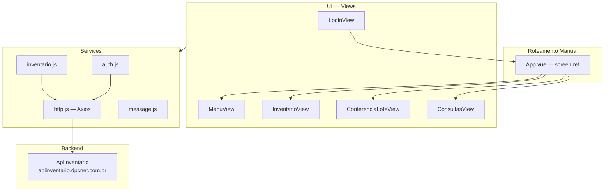

# DpcInventario — Arquitetura

**DpcInventario** é uma SPA **Vue 3** (Vite) usada como interface de WMS para conferência de inventário em tempo real. O projeto roda num coletador/terminal de depósito, consome a **ApiInventario** (`apiinventario.dpcnet.com.br`) e faz deploy via **Docker + Nginx**. É independente dos projetos DPC/Faisao/ApiDPC — tem backend próprio.

---

## Stack técnica

| Tecnologia | Versão | Uso |
|-----------|--------|-----|
| **Vue** | 3.5.25 | Framework UI (Composition API, `<script setup>`) |
| **Vite** | 7.2.4 | Build tool e dev server |
| **Element Plus** | 2.12.0 | Componentes UI (Form, Table, TreeSelect, Popover, MessageBox) |
| **Axios** | 1.13.2 | HTTP client com interceptadores |
| **Node.js** | ≥20.19 | Runtime de build |
| **Nginx** | Alpine | Serve a SPA e faz proxy reverso para ApiInventario |
| **Docker** | multi-stage | Node build → Nginx Alpine; porta 8099 |

---

## Arquitetura e padrões



**Padrões aplicados:**

- **Roteamento por estado:** sem vue-router; `App.vue` mantém um `ref screen` que determina qual view é renderizada via `v-if/v-else-if`.
- **Service layer:** toda comunicação HTTP fica em `src/services/`; as views nunca chamam Axios diretamente.
- **Interceptor centralizado:** `http.js` injeta `Authorization: Bearer {token}` em toda requisição e dispara o evento `auth:token-expired` ao receber 401.
- **Persistência local:** token, usuário e empresa são lidos/gravados em `localStorage` por `auth.js`.
- **Event system:** `App.vue` escuta `auth:token-expired` e `beforeunload` (durante conferência) via `window.addEventListener`.
- **Feedback sonoro:** `ConferenciaLoteView` usa Web Audio API para beeps de sucesso/erro no scan.
- **Polling:** `MenuView` verifica tarefas atribuídas via `setInterval` de 30 s.

---

## Organização de pastas

```
DpcInventario/
├── src/
│   ├── assets/
│   │   ├── theme.css           # Variáveis CSS (--stork-color-*)
│   │   ├── main.css
│   │   └── message-stack.css
│   ├── components/             # Componentes genéricos (ainda com scaffold Vite)
│   ├── services/
│   │   ├── http.js             # Axios + interceptadores (auth/401)
│   │   ├── auth.js             # login/logout/token/empresa — localStorage
│   │   ├── inventario.js       # Endpoints do domínio
│   │   └── message.js          # Sistema de notificações (toast/snack)
│   ├── views/
│   │   ├── auth/
│   │   │   └── LoginView.vue   # Login + seleção de empresa
│   │   ├── inventario/
│   │   │   ├── InventarioView.vue        # Lista de lotes disponíveis
│   │   │   └── ConferenciaLoteView.vue   # Conferência de itens (scan + contagem)
│   │   └── consulta/
│   │       └── ConsultasView.vue         # Busca de endereços de produtos
│   ├── App.vue                 # Raiz: roteamento manual via `screen`
│   └── main.js
├── vite.config.js              # Proxy dev → localhost:8098
├── nginx.conf                  # Proxy prod → apiinventario.dpcnet.com.br (porta 8099)
├── Dockerfile
└── docker-compose.yml
```

---

## Fluxos principais

### Login
1. `LoginView` carrega a lista de empresas (`GET /empresas`) ao montar.
2. Usuário escolhe empresa (TreeSelect), preenche credenciais e submete.
3. `POST /login` retorna JWT; `auth.js` salva token, usuário e empresa em `localStorage`.
4. `App.vue` ouve o emit `logged-in` e muda `screen` para `menu`.

### Menu e tarefas
1. `MenuView` exibe dados do usuário/empresa lidos de `localStorage`.
2. Ao montar, chama `GET /tarefas/minha` e repete a cada 30 s via `setInterval`.
3. Exibe indicador visual e popover com tarefas disponíveis.

### Conferência de lote
1. `InventarioView` lista lotes (`GET /lotes?empresa=X`).
2. Usuário seleciona lote e clica "Assumir" → `POST /lotes/{id}/assumir`.
3. `ConferenciaLoteView` recebe `codInventarioLote` via prop e chama `GET /lotes/{id}/proximo`.
4. Item exibido; usuário escaneia EAN/DUN ou digita SeqProduto.
5. Código validado localmente → busca embalagens (`GET /produtos/{seq}/embalagens`).
6. Usuário informa quantidade (e opcionalmente validade/lote), adiciona contagens.
7. `POST /lotes/{id}/itens/{itemId}/conferir` confirma e carrega próximo item.
8. Ao terminar o lote, emite `done` e retorna ao menu.

### Consulta de endereços
1. Usuário escolhe critério (SeqEndereço, SeqPalete, SeqProduto, EAN/DUN).
2. `GET /produtos/consulta-enderecos` retorna produto e lista de endereços.
3. Endereços ordenados por espécie (M → A → P → V) e exibidos em tabela.

---

## Autenticação

| Aspecto | Detalhe |
|---------|---------|
| Método | JWT emitido pela ApiInventario |
| Persistência | `localStorage` (`token`, `user`, `company`) via `auth.js` |
| Envio | Header `Authorization: Bearer {token}` — injetado em todo request por `http.js` |
| Expiração | 401 no interceptor → dispara evento `auth:token-expired` → `App.vue` redireciona ao login |
| Logout | `auth.js` remove dados do `localStorage`; `App.vue` muda `screen` para `login` |

---

## Estratégia de estado

Sem Vuex nem Pinia. O estado é gerenciado em três camadas:

- **Global persistido:** token, usuário e empresa em `localStorage`; lidos ao montar componentes que precisam.
- **Roteamento:** `screen` ref em `App.vue` (valores: `login`, `menu`, `inventario`, `conferencia`, `consultas`); props passam dados entre views (ex.: `codInventarioLote`).
- **Local:** `ref` e `computed` dentro de cada view; sem compartilhamento direto entre views irmãs.

---

## Ambiente e deploy

- **Dev:** `npm run dev` — Vite na porta 5173; proxy de `/empresas`, `/login`, `/me`, `/lotes`, `/tarefas`, `/produtos` para `http://localhost:8098` (`DEV_API_TARGET` em `vite.config.js`).
- **Build:** `npm run build` — gera `dist/`.
- **Docker prod:** `docker-compose up` — imagem multi-stage (Node 20 build + Nginx Alpine); porta `8099:8099`; nginx faz proxy para `https://apiinventario.dpcnet.com.br`.
- **Variáveis:** sem `.env.example`; única variável de dev configurável é `DEV_API_TARGET` hardcoded em `vite.config.js`.

---

## Riscos técnicos

| Risco | Impacto |
|-------|---------|
| Roteamento manual (sem vue-router) | Sem guards nativos, deep links impossíveis, histórico de navegação inexistente |
| Sem gerenciamento de estado global | Escala mal se o número de views crescer; compartilhamento de dados via props/eventos pode ficar complexo |
| Sem testes automatizados | Regressões invisíveis; cobertura depende de QA manual |
| URLs hardcoded (`apiinventario.dpcnet.com.br`) | Troca de ambiente exige rebuild ou ajuste manual de `nginx.conf` / `vite.config.js` |
| `.env.example` ausente | Onboarding lento; configuração de dev não documentada |

---

## Dívida técnica identificável

- **vue-router:** substituir roteamento manual; permitir guards de autenticação e deep links.
- **Pinia:** adotar store global para autenticação e dados de sessão em vez de `localStorage` direto nas views.
- **TypeScript:** projeto em JS puro; sem tipagem nem autocompletion de contratos de API.
- **Testes:** nenhum teste unitário ou de integração presente.
- **`.env.example`:** documentar variáveis de ambiente esperadas.
- **`DEV_API_TARGET` hardcoded:** mover para variável de ambiente no `vite.config.js`.
