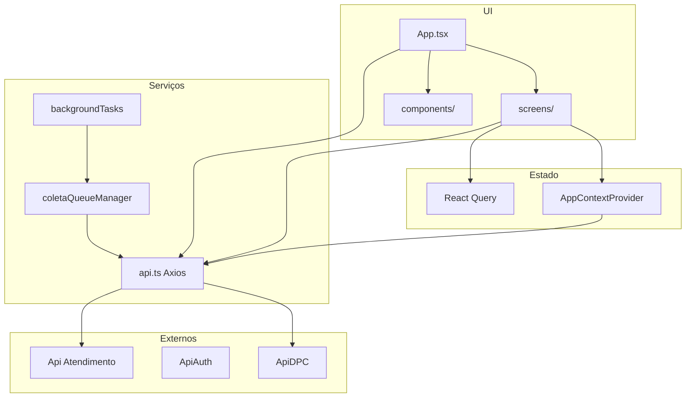

# Faisao – Documentação Arquitetural

## 1. Resumo executivo

Faisao é o aplicativo mobile do ecossistema DPC, desenvolvido em **React Native** com **Expo SDK 54** e **React 19**, em **TypeScript**. Focado em gestão de vendas (vendedores, clientes, pedidos, títulos), usa **React Query** para estado do servidor e **React Context API** para estado global (filtros, usuário, GPS). Autenticação **JWT** via API própria (`apiauth.dpcnet.com.br`) com token em **expo-secure-store** e validação de IMEI. Consome a **ApiDPC** com Axios (token em query) e faz rastreamento de **localização em background** com fila offline (AsyncStorage). UI com **NativeWind** (Tailwind), **React Native Paper** e **styled-components**. Build e distribuição via **EAS Build** (Expo).

O Faisao é, em essência, um **cliente mobile** que replica e adapta fluxos já existentes no **DPC (admin web)**, consumindo os mesmos endpoints expostos pela **ApiDPC** sempre que possível. Por isso, o planejamento de qualquer feature ou bug do Faisao deve considerar primeiro como o fluxo funciona hoje no DPC e na ApiDPC, e só então desenhar a experiência mobile.

---

## 2. Stack técnica

| Tecnologia | Versão | Uso |
|------------|--------|-----|
| React | 19.1.0 | UI |
| React Native | 0.81.5 | Mobile |
| Expo SDK | 54.0.33 | Tooling e nativos |
| TypeScript | ~5.9.2 | Linguagem |
| @react-navigation/native | 7.1.14 | Navegação |
| @react-navigation/native-stack | 7.3.21 | Stack |
| @react-navigation/bottom-tabs | 7.4.2 | Tabs |
| @tanstack/react-query | 5.83.0 | Server state / cache |
| axios | 1.10.0 | HTTP |
| expo-secure-store | 15.0.8 | Token |
| jwt-decode | 4.0.0 | JWT |
| nativewind | 4.1.23 | Estilo (Tailwind) |
| tailwindcss | 3.4.0 | Tailwind |
| react-native-paper | 5.14.5 | Componentes UI |
| expo-location | 19.0.8 | GPS |
| expo-task-manager | 14.0.9 | Background tasks |
| expo-background-fetch | 14.0.9 | Background fetch |
| Metro | (Expo) | Bundler |

---

## 3. Arquitetura e padrões

### Diagrama de camadas



### Padrões utilizados

- **Layered:** Telas e componentes → Context / React Query → Services (api, etc.) → APIs externas.
- **Service layer:** `src/services/api.ts` (Axios + interceptors), `equipeService`, `coletaQueueManager`, etc.
- **Server state:** React Query (`useQuery`, `useInfiniteQuery`) com cache e refetch.
- **Global state:** Context (`AppContextProvider`: user, filtros, toast, GPS, etc.).
- **Singleton:** `ColetaQueueManager` para fila de localização.
- **Hooks:** `useAppState`, `useGpsStatus` para reutilização de lógica.

---

## 4. Organização de pastas

```
Faisao/
├── src/
│   ├── components/         # Compartilhados
│   │   ├── Card/, DatePicker/, Filter/, Header/, Loading/
│   │   ├── ModalLocationServicesOff, ModalOverlay, ToastWrapper
│   │   └── ...
│   ├── contexts/
│   │   ├── AppContextProvider.tsx
│   │   └── useGpsStatus.tsx
│   ├── routes/
│   │   ├── index.tsx       # Stack principal
│   │   ├── tab.routes.tsx  # Bottom tabs
│   │   ├── vendedor.routes.tsx
│   │   └── cliente.routes.tsx
│   ├── screens/
│   │   ├── Login/, Cliente/, Vendedores/, Pedido/, Titulos/
│   │   ├── DadosCliente/, DadosVendedor/, User/
│   │   ├── Devolucoes/, ViewCliente/, ViewVendedor/
│   │   └── ScreenWrapper/
│   ├── services/
│   │   ├── api.ts
│   │   ├── backgroundTasks.ts, coletaQueueManager.ts
│   │   ├── NavigationService.ts, equipeService.ts
│   │   └── bairroService, cityService, rcaService, names.ts
│   ├── style/colors.ts
│   └── utils/ (device, downloadCsv)
├── assets/
├── App.tsx
├── index.js
├── package.json, app.json, eas.json
├── tsconfig.json, babel.config.js, metro.config.js
├── tailwind.config.js, eslint.config.js, prettier.config.js
├── android/, ios/, .expo/
```

---

## 5. Fluxos principais

### Autenticação

1. Login: POST para `https://apiauth.dpcnet.com.br/auth/login` com `username`, `password`, `imei`, `app_id: '506'`.
2. Resposta com JWT é armazenada em `expo-secure-store` (chave `userToken`).
3. `getLoggedUser()` valida token na inicialização; decode com `jwt-decode` para dados do usuário.
4. Em cada request, interceptor em `api.ts` adiciona `?token=` na URL (token lido do SecureStore).
5. Resposta 401 no interceptor dispara logout (limpa store, desregistra background tasks, reset para Login).
6. Logout: limpa SecureStore e redireciona para Login.

### Consumo de API

1. Base URL: `https://apidpc.dpcnet.com.br/api`; atendimento: `https://apiatendimento.dpcnet.com.br/`.
2. Instância Axios criada em `api.ts` com interceptors de request (token) e response (401 → logout).
3. Dados de listagem: React Query (`useQuery` / `useInfiniteQuery`) com keys como `['vendedores']`, `['clientes']`, `['pedidos']`, `['titulos']`.
4. Padrão: POST para buscas (ex.: `/call-center/gestao/busca/`, `/cliente/busca/`, `/pedido/busca/`, `/titulo/buscar/`).
5. Rastreamento: POST `/rastreamento` com payload de localização (enviado pelo coletaQueueManager).

### Background e offline

- Localização coletada em background via `expo-task-manager`; dados enfileirados no `ColetaQueueManager`.
- Fila persistida em AsyncStorage quando offline; envio em lote quando volta conexão.
- EventEmitter no ColetaQueueManager para notificar UI quando necessário.

---

## 6. Autenticação

| Aspecto | Detalhe |
|---------|---------|
| API de login | apiauth.dpcnet.com.br/auth/login |
| Armazenamento | expo-secure-store (userToken) |
| Envio do token | Query param `?token=` (interceptor) |
| Validação | jwt-decode; checagem na inicialização e em 401 |
| IMEI | Enviado no login (validação de dispositivo) |
| Logout | Limpa SecureStore, desregistra tasks, reset para Login |

---

## 7. Estratégia de estado

- **Global:** React Context (`AppContextProvider`) – usuário, filtros, notificações, estado de GPS/bateria.
- **Server state:** React Query – listas, detalhes, cache e refetch automático.
- **Local:** useState/useReducer nos componentes.
- **Persistência:** SecureStore (token); AsyncStorage (fila de localização offline).

---

## 8. Ambiente e deploy

- **Dev:** `expo start` (Metro); `expo run:android` / `expo run:ios` para build local.
- **Build:** EAS Build (`eas.json`): perfis development, preview (APK), production (auto-increment).
- **Variáveis:** URLs de API hardcoded em `api.ts` e tela de Login; não há .env no projeto (recomendado usar env do EAS ou app.config).
- **Alias:** `~/*` → `src/*` (tsconfig e metro).

---

## 9. Riscos técnicos

| Risco | Impacto |
|-------|---------|
| URLs hardcoded | Dificulta ambientes (homolog/prod) e troca de backend |
| TypeScript strict desligado | Mais erros em runtime e menos segurança de tipos |
| Duas libs de toast | Bundle e manutenção desnecessárias |
| Sem error tracking | Erros em produção difíceis de diagnosticar |
| Sem .env / EAS env | Segredos e configs misturados no código |

---

## 10. Dívida técnica identificável

- **Variáveis de ambiente:** Introduzir .env ou EAS env vars para base URLs e flags.
- **TypeScript:** Habilitar `strict: true` e corrigir erros gradualmente.
- **Toasts:** Escolher uma lib de toast e remover a outra.
- **Logs e erros:** Reduzir console.log em prod; integrar Sentry (ou similar) para erros.
- **Testes:** Aumentar cobertura (Jest e Testing Library já configurados).
- **Documentação de contrato:** Documentar endpoints e payloads usados pelo app em relação à ApiDPC/ApiAuth.
