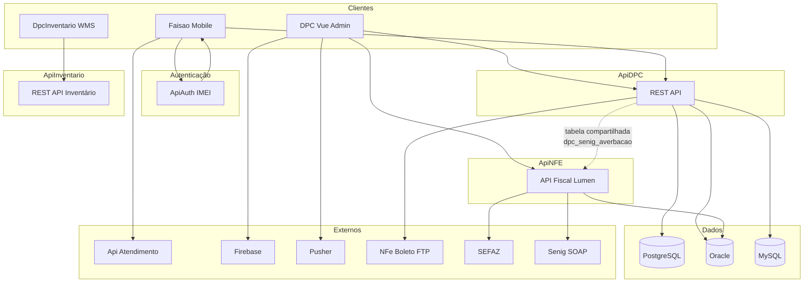

# Visão geral do ecossistema DPC

Este documento descreve o ecossistema DPC como um todo: os três projetos principais e como cada um interage com os demais. Para detalhes de stack, organização de pastas, riscos e dívida técnica de cada projeto, use os arquivos de arquitetura específicos listados ao final.

---

## 1. Resumo do ecossistema

| Projeto | Papel | Documentação |
|---------|--------|---------------|
| **ApiDPC** | API REST central (Laravel 5.5); fonte única de dados de negócio para o admin e o app. | [apidpc-arquitetura.md](apidpc-arquitetura.md) |
| **DPC** | Painel administrativo web (Vue 2 + Vuex); usuários internos (gestão de vendas, clientes, financeiro, usuários, etc.). | [dpc-arquitetura.md](dpc-arquitetura.md) |
| **Faisao** | Aplicativo mobile (React Native/Expo); vendedores em campo (clientes, pedidos, títulos, rastreamento). | [faisao-arquitetura.md](faisao-arquitetura.md) |
| **DpcInventario** | SPA de WMS (Vue 3/Vite); operadores de depósito fazem conferência de inventário em tempo real; backend próprio (ApiInventario). | [dpcInventario-arquitetura.md](dpcInventario-arquitetura.md) |
| **ApiNFE** | API fiscal (Lumen 10); consulta e manifesta NF-e na SEFAZ, gera DANFE e averba seguro na Senig. Consumida pelo DPC (Gestão de Entrada). | [apinfe-arquitetura.md](apinfe-arquitetura.md) |

---

## 2. Diagrama de visão geral

```mermaid
flowchart TB
    subgraph clients [Clientes]
        DPC[DPC Vue Admin]
        Faisao[Faisao Mobile]
        Inventario[DpcInventario WMS]
    end
    subgraph auth [Autenticação]
        ApiAuth[ApiAuth IMEI]
    end
    subgraph core [ApiDPC]
        API[REST API]
    end
    subgraph inv [ApiInventario]
        ApiInv[REST API Inventário]
    end
    subgraph nfe [ApiNFE]
        ApiNFE[API Fiscal Lumen]
    end
    subgraph data [Dados]
        PG[(PostgreSQL)]
        ORA[(Oracle)]
        MYSQL[(MySQL)]
    end
    subgraph external [Externos]
        ApiAtend[Api Atendimento]
        Firebase[Firebase]
        Pusher[Pusher]
        NFe[NFe Boleto FTP]
        SEFAZ[SEFAZ]
        Senig[Senig SOAP]
    end
    DPC --> API
    Faisao --> ApiAuth
    ApiAuth --> Faisao
    Faisao --> API
    Faisao --> ApiAtend
    DPC --> Firebase
    DPC --> Pusher
    API --> PG
    API --> ORA
    API --> MYSQL
    API --> NFe
    Inventario --> ApiInv
    DPC --> ApiNFE
    ApiNFE --> SEFAZ
    ApiNFE --> Senig
    ApiNFE --> ORA
    API -. tabela compartilhada<br/>dpc_senig_averbacao .-> ApiNFE
```

- **Clientes:** DPC (web), Faisao (mobile) e DpcInventario (WMS de depósito).
- **ApiDPC:** núcleo (middleware, 382+ controllers, 302+ repositórios, 300+ models).
- **ApiNFE:** API fiscal separada; o DPC fala com ela direto (não passa pela ApiDPC).
- **Bancos:** PostgreSQL (usuários/app), Oracle (ERP), MySQL (Asterisk CDR).
- **Autenticação:** DPC usa JWT direto da ApiDPC; Faisao usa ApiAuth (`apiauth.dpcnet.com.br`) para login com IMEI e depois consome ApiDPC com o mesmo token. A ApiNFE **não emite token** — valida o JWT da ApiDPC com o mesmo segredo.
- **Externos:** Api Atendimento (Faisao), Firebase/Pusher (DPC), NFe/Boleto/FTP (ApiDPC), SEFAZ e Senig (ApiNFE).

---

## 3. Como cada projeto interage com os demais

| De | Para | O quê |
|----|------|--------|
| **DPC** | ApiDPC | Todas as operações (CRUD, buscas, relatórios); JWT; base URL em `ENDERECO_APIDPC`; 126+ endpoints em `config/api.env.js`. |
| **Faisao** | ApiAuth | Login com `username`, `password`, `imei`, `app_id: '506'`; retorno JWT guardado em SecureStore. |
| **Faisao** | ApiDPC | Dados de negócio (vendedores, clientes, pedidos, títulos, rastreamento); token em query; base `apidpc.dpcnet.com.br`. |
| **Faisao** | Api Atendimento | Chamados/atendimento; base `apiatendimento.dpcnet.com.br`. |
| **ApiDPC** | DPC / Faisao | Resposta padrão `{ "error": 0 ou 1, "msg": "...", "data": [...], "quantidade": N }`; JWT refresh no header `Authorization`. |
| **DpcInventario** | ApiInventario | Login, lotes, conferência de itens, consulta de endereços; JWT via Bearer; base `apiinventario.dpcnet.com.br`. |
| **DPC** | ApiNFE | Tela *Contabilidade → Gestão de Entrada*: consulta de NSU/SEFAZ, manifestação de eventos e DANFE. Base em `ENDERECO_APINFE`; token na **query string**; prefixos `gestao-entrada` e `evento-nota-fiscal`. |
| **ApiDPC** | ApiNFE | **Sem HTTP.** A tela de Averbação Senig (DPC → ApiDPC) grava `status_envio = 'P'` em `poseidon.dpc_senig_averbacao`; o cron `senig:averbar` da ApiNFE lê a view `dpcv_itg_senig_notas`, envia à Senig e faz upsert do retorno na mesma tabela. |
| **ApiNFE** | DPC | Resposta `{ "error": 0 ou 1, "mensagem": "...", <chave do recurso> }` — note **`mensagem`** (a ApiDPC usa `msg`). |

**DPC e Faisao** não se comunicam diretamente. A interação é indireta via ApiDPC (mesmos dados e regras). O admin (DPC) pode receber eventos em tempo real via Pusher/Firebase.

---

## 4. Autenticação no ecossistema

| Projeto | Fluxo |
|---------|--------|
| **DPC** | Login direto na ApiDPC → JWT em cookie + Vuex; refresh pelo interceptor Axios; guards no router (`Account.isAuthenticated()`, `Account.hasAccess()`). |
| **Faisao** | Login na ApiAuth (validação de IMEI) → JWT em `expo-secure-store`; token enviado em query (`?token=`) nas requisições à ApiDPC; 401 no interceptor dispara logout. |
| **ApiDPC** | Emite e valida JWT (tymon/jwt-auth); usuário em PostgreSQL (`acesso.dim_usuario`, chave `cod_usuario`); middlewares `jwt` (refresh) e `jwt.auth`. |
| **ApiNFE** | Só **valida** (firebase/php-jwt, HS256, mesmo `JWT_SECRET` da ApiDPC); token aceito **apenas em query string** `?token=`; usa só o `sub` do payload; sem refresh. |

**ApiAuth** é um serviço separado (fora dos repositórios ApiDPC/DPC/Faisao documentados aqui), usado apenas pelo Faisao para login com validação de dispositivo (IMEI).

---

## 5. Dados e integrações externas

| Projeto | Persistência / integrações |
|---------|----------------------------|
| **ApiDPC** | Persiste em PG/ORA/MySQL; integra NFe, Boleto, FTP, SMTP; queue `sync` (sem fila assíncrona). |
| **ApiNFE** | Persiste em Oracle (`consinco`, `poseidon`); lê usuário em PG (`acesso`); integra SEFAZ (sped-nfe) e Senig (SOAP); certificados PFX guardados no banco. |
| **DPC** | Firebase (push), Laravel Echo + Pusher (WebSocket); não persiste dados de negócio. |
| **Faisao** | AsyncStorage (fila de localização offline); envia rastreamento para ApiDPC (`POST /rastreamento`); consome Api Atendimento. |

---

## 6. Deploy e ambientes (resumo)

| Projeto | Deploy | Observação |
|---------|--------|------------|
| **ApiDPC** | Docker (PHP 7.2, nginx porta 8004); CI/CD GitHub Actions (branches alpha/beta); cron e supervisor. | `deploy.sh`; variáveis em `.env`. |
| **DPC** | Docker (Node 10 build + Apache), Firebase Hosting. | Variáveis em `config/dev.env.js`, `config/prod.env.js`. |
| **Faisao** | EAS Build (Expo); sem pipeline de CI no repositório. | URLs atualmente hardcoded; recomendado .env ou EAS env vars. |
| **DpcInventario** | Docker multi-stage (Node 20 build + Nginx Alpine); porta 8099. | `docker-compose.yml`; `DEV_API_TARGET` hardcoded em `vite.config.js`. |
| **ApiNFE** | Docker (PHP 8.2-fpm + nginx, porta 8011); subida manual via `./build.run`. | **Sem CI/CD**; supervisor + cron; agendamentos sob a flag `RUN_SCHEDULE`. |

---

## 7. Referências cruzadas

- **apidpc-arquitetura.md** — Detalhes da API REST (stack, camadas, repositórios, autenticação JWT, bancos, rotas, deploy).
- **dpc-arquitetura.md** — Detalhes do painel admin (Vue/Vuex, módulos, dpcAxios, Firebase/Pusher, deploy).
- **faisao-arquitetura.md** — Detalhes do app mobile (React Native/Expo, React Query, ApiAuth, rastreamento, deploy).
- **dpcInventario-arquitetura.md** — Detalhes do WMS de inventário (Vue 3/Vite, roteamento manual, Element Plus, ApiInventario, Docker/Nginx).
- **apinfe-arquitetura.md** — Detalhes da API fiscal (Lumen 10, sped-nfe/SEFAZ, DANFE, averbação Senig, certificados digitais, Oracle).
