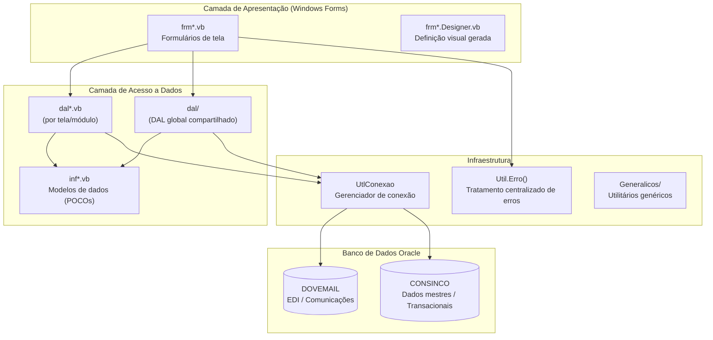

# Maracanã — Arquitetura Técnica

> [!WARNING]
> **PROJETO OBSOLETO — SOMENTE LEITURA**
> Documentação para referência de migração. Nenhuma alteração deve ser feita no código-fonte.
> Ver [visão geral](maracana-visao-geral.md) para contexto completo.

---

## Arquitetura em camadas

O Maracanã segue um padrão **3-tier** simplificado sem camada de serviço explícita:



---

## Padrões adotados

| Padrão | Descrição |
|---|---|
| 3-tier (UI / DAL / Info) | Separação entre tela, acesso a dados e modelo |
| Naming `dal<Entidade>.vb` | Arquivo DAL específico por entidade/tela |
| Naming `inf<Entidade>.vb` | Classe de modelo com propriedades públicas (POCO) |
| Naming `frm<Nome>.vb` | Formulário principal da tela |
| ToolStrip padrão | Barra com Salvar, Fechar, Desfazer, Permissão em todas as telas |
| Sequências Oracle | PKs geradas via `SELECT MAX(id)+1` ou sequência Oracle |
| MessageBox para validação | Validações de UI com `MessageBox.Show()` |

---

## Organização de pastas

```
Maracana/Maracana/
├── Telas/                        # 36 módulos de negócio
│   ├── Comercial/
│   ├── Financeiro/
│   ├── Compras/
│   └── ...
├── Generalicos/                  # Utilitários e componentes genéricos reutilizáveis
├── dal/                          # DAL global compartilhado entre módulos
├── My Project/                   # Configurações do projeto VB.NET (AssemblyInfo, etc.)
├── frmPrincipal.vb               # Formulário principal / MDI container
├── Principal.vb                  # Controlador principal da aplicação
├── AcessoUsuarioform.vb          # Tela de login e controle de acesso
├── DinamicForm.vb                # Geração dinâmica de formulários
├── app.config                    # Strings de conexão e configurações
└── packages.config               # Dependências NuGet
```

---

## Ponto de entrada da aplicação

| Arquivo | Responsabilidade |
|---|---|
| `frmPrincipal.vb` | MDI container principal, menu de navegação entre módulos |
| `Principal.vb` | Controlador de inicialização e estado global |
| `AcessoUsuarioform.vb` | Autenticação e controle de permissões por usuário |
| `DinamicForm.vb` | Utilitário para geração dinâmica de telas parametrizadas |

---

## Gestão de conexão

- Classe `UtlConexao` encapsula abertura/fechamento de conexões OleDb com Oracle
- Strings de conexão configuradas em `app.config`
- Dois schemas utilizados:
  - `DOVEMAIL` — operações EDI, comunicações, projetos eletrônicos
  - `CONSINCO` — dados mestres (clientes, produtos, segmentos, etc.)

---

## Padrão DAL

Cada tela possui sua própria dupla de arquivos:

```
dal<Entidade>.vb      ← métodos de Select, Insert, Update, Delete
inf<Entidade>.vb      ← classe com propriedades públicas (modelo de dados)
```

Exemplo da tela `Cadastro_Projeto`:
- `dalProjetos.vb` — 467 linhas, todos os SQLs e operações de banco
- `infProjetos.vb` — 30 propriedades representando a entidade projeto EDI

---

## Tratamento de erros

- Utilitário centralizado `Util.Erro()` chamado nos blocos `Catch`
- Exibe mensagem amigável ao usuário e registra log do erro
- Padrão em todas as telas: `Try / Catch ex As Exception / Util.Erro(ex)`

---

## Dependências externas (NuGet)

| Pacote | Uso |
|---|---|
| Aspose.Cells | Exportação e manipulação de planilhas Excel |
| GMap.NET | Exibição de mapas geográficos |
| Ionic.Zip | Compressão/descompressão de arquivos ZIP |
| Microsoft ReportViewer | Relatórios RDLC embarcados |
| PDFSharp + MigraDoc | Geração de documentos PDF |
| FirebirdSQL | Conexão com bancos Firebird legados |
| MySQL Connector | Conexão com bancos MySQL legados |

---

## Riscos / Dívida técnica

| Risco | Impacto |
|---|---|
| OleDb + Oracle legado | Driver instável, sem suporte ativo; difícil manutenção |
| Build x86 (32-bit) | Limitação de memória; incompatível com ambientes 64-bit modernos |
| Sem testes automatizados | Toda validação é manual; risco alto em refatorações |
| Lógica de negócio na camada UI | Regras espalhadas nos formulários, difícil reuso |
| SQL inline nas DALs | Sem ORM; queries hardcoded dificultam manutenção e migração |
| VB.NET sem tipagem forte | Uso de `Object` e conversões implícitas frequentes |
| Versão do VS 2015 | Solution file antigo; possíveis incompatibilidades com IDEs modernas |

---

## Referências cruzadas

- [Visão geral do projeto](maracana-visao-geral.md)
- [Telas documentadas](telas/)
