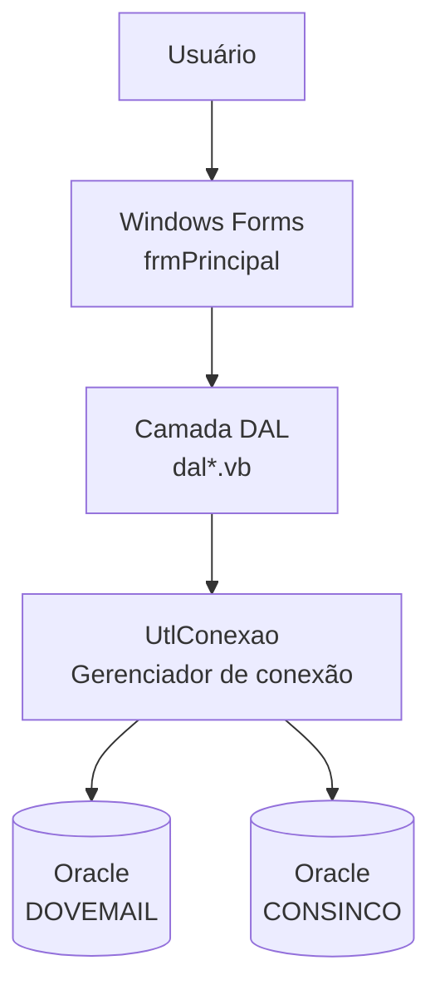

# Maracanã — Visão Geral

> [!WARNING]
> **PROJETO OBSOLETO — SOMENTE LEITURA**
> Este projeto está sendo migrado para [DPC](../../../DPC) (frontend) e [ApiDPC](../../../ApiDPC) (backend).
> **Nenhuma alteração deve ser feita neste projeto.** Ele serve exclusivamente como referência para telas ainda não migradas.

---

## Resumo do projeto

O **Maracanã** é uma aplicação ERP/CRM desktop construída em VB.NET Windows Forms, utilizada pela DPC para gestão de operações comerciais, financeiras, logísticas, RH e atendimento ao cliente. Toda a persistência ocorre em banco Oracle via OleDb, com dois schemas principais: `DOVEMAIL` (operações EDI e comunicações) e `CONSINCO` (dados mestres e transacionais).

---

## Stack técnica

| Tecnologia | Versão | Uso |
|---|---|---|
| VB.NET | .NET Framework 4.7.2 | Linguagem principal |
| Windows Forms | — | Framework de UI desktop |
| Oracle (OleDb) | — | Banco de dados principal |
| Visual Studio | 2015+ (ToolsVersion 12.0) | IDE de desenvolvimento |
| Aspose.Cells | — | Manipulação de planilhas Excel |
| GMap.NET | — | Mapas geográficos |
| Ionic.Zip | — | Compressão de arquivos |
| Microsoft ReportViewer | — | Relatórios |
| PDFSharp / MigraDoc | — | Geração de PDF |
| FirebirdSQL | — | Banco alternativo (legado) |
| MySQL | — | Banco alternativo (legado) |

---

## Diagrama de visão geral

---

## Status de migração

| Camada | Destino | Observação |
|---|---|---|
| UI / Telas | [DPC](../../../../DPC) — Vue.js 2 | Cada tela VB.NET sendo reimplementada como componente Vue |
| Lógica de negócio e dados | [ApiDPC](../../../../ApiDPC) — Laravel | DALs e regras migradas para controllers/services/repositories |
| Banco de dados | Oracle → MySQL/outro | A migrar conforme roadmap |

---

## Módulos (Telas/)

O diretório `Telas/` contém 36 módulos de negócio:

| Módulo | Descrição |
|---|---|
| Armazém / Armazem | Operações de armazenagem e estoque |
| Atendimentos | Registro e acompanhamento de atendimentos |
| BI | Business Intelligence e painéis gerenciais |
| Cadastro | Cadastros mestres (clientes, produtos, etc.) |
| Calau | Módulo operacional específico |
| Call Center | Gestão de central de atendimento |
| Comercial | Operações comerciais e de vendas |
| Compras | Gestão de compras e fornecedores |
| Consultas | Relatórios e consultas gerais |
| Contabil | Gestão contábil |
| Contas Recorrentes | Gestão de cobranças recorrentes |
| Cotações | Cotações de produtos e serviços |
| Cotefacil | Cotação simplificada |
| DataWareHouse | Operações de data warehouse |
| Delphi | Integrações com módulos legados Delphi |
| DoveMail | Sistema de EDI e comunicações eletrônicas |
| Faturamento | Emissão e gestão de notas fiscais |
| Fidelize | Programa de fidelidade de clientes |
| Financeiro | Gestão financeira (contas a pagar/receber) |
| Gerencial | Painéis e relatórios gerenciais |
| Inventory | Controle de inventário |
| Ison | Sistema operacional específico |
| Marketing | Campanhas e ações de marketing |
| Operações | Gestão de operações internas |
| Outras Campanhas | Campanhas diversas |
| Parâmetros | Configurações e parâmetros do sistema |
| Permissões | Controle de acesso e segurança |
| Pessoal | RH e gestão de pessoal |
| Ponto a Ponto | Operações ponto a ponto |
| SAC | Serviço de Atendimento ao Consumidor |
| Serviços do Windows | Serviços Windows integrados |
| TI | Ferramentas e gestão de TI |
| Telefonia | Gestão de telefonia e comunicações |
| Verbas | Gestão de verbas e orçamentos |
| Ycambi | Câmbio e operações cambiais |

---

## Referências cruzadas

- [Arquitetura técnica detalhada](maracana-arquitetura.md)
- [Telas documentadas](telas/)
  - [Comercial > EDI Pedidos > Cadastro_Projeto](telas/comercial/edi-pedidos-cadastro-projeto.md)
