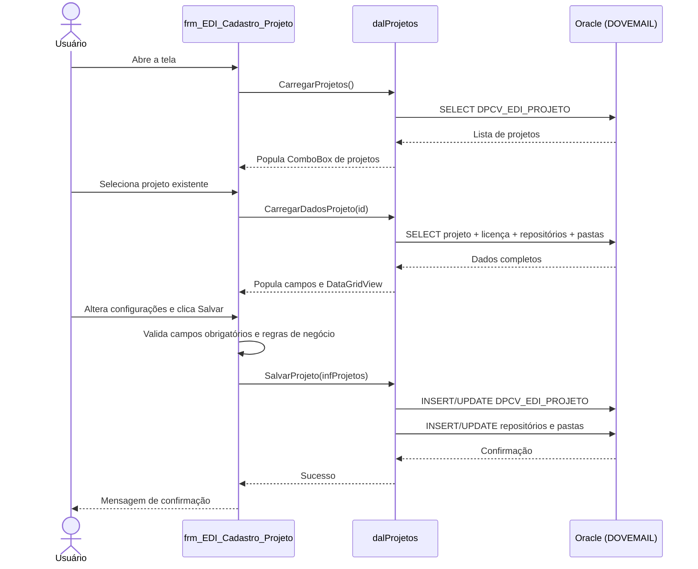

# Tela: Comercial > EDI Pedidos > Cadastro_Projeto

> [!WARNING]
> **PROJETO OBSOLETO — SOMENTE LEITURA**
> Esta tela é referência para migração. Nenhuma alteração deve ser feita no código-fonte original.

**Caminho no projeto:**
`Maracana/Maracana/Telas/Comercial/EDI Pedidos/Cadastro_Projeto/`

---

## Propósito

Tela de cadastro e configuração de **projetos EDI** (Electronic Data Interchange). Cada projeto define como pedidos eletrônicos de um determinado cliente/licença são processados: onde os arquivos são armazenados, quais regras de negócio se aplicam e como os pedidos são validados antes de entrar no sistema.

---

## Arquivos da tela

| Arquivo | Linhas | Responsabilidade |
|---|---|---|
| `frm_EDI_Cadastro_Projeto.vb` | ~570 | Lógica da tela: eventos, validações, orquestração de fluxo |
| `frm_EDI_Cadastro_Projeto.Designer.vb` | ~900 | Definição visual gerada pelo VS (controles, layout) |
| `frm_EDI_Cadastro_Projeto.resx` | — | Recursos embarcados (ícones, imagens) |
| `dalProjetos.vb` | ~467 | Acesso a dados: todos os SQLs e operações Oracle |
| `infProjetos.vb` | ~30 | Modelo de dados: classe com ~30 propriedades da entidade projeto |

---

## Diagrama de fluxo principal

---

## Funcionalidades principais

### 1. Gerenciamento de projetos
- Selecionar projeto existente via ComboBox na ToolStrip
- Criar novo projeto com código e descrição únicos
- Código de projeto de terceiros (`txtCodTerceiro`)
- Ativar/desativar projeto via checkbox `chkAtivo`

### 2. Vínculo com licença/cliente
- Associar projeto a uma licença de cliente (`cbxLicenca`)
- Criar nova licença diretamente pelo botão "Nova Licença" (abre `FrmNovaLicença`)
- AutoComplete para seleção de licença existente

### 3. Configuração de repositórios e pastas
- Selecionar repositório (local de armazenamento de arquivos EDI) via ComboBox
- Selecionar pasta dentro do repositório via ComboBox
- Adicionar/remover pares repositório-pasta via botões **Adicionar** / **Remover**
- DataGridView exibe os vínculos configurados com colunas:
  - Código do repositório
  - Endereço/caminho do repositório
  - Pasta configurada
  - Checkboxes: `Pedido`, `Retorno_Pedido`, `Retorno_Cancelamento`, `Retorno_Análise`, `Retorno_XML`

### 4. Regras de processamento de pedidos

| Controle | Regra de negócio |
|---|---|
| `chkAcatarPreco` | Aceitar/honrar preços informados no arquivo EDI |
| `chkDescartarProduto` | Descartar produtos sem estoque disponível |
| `chkValidacaoTotalizadores` | Validar totais/checksums do arquivo EDI |
| `chkBloqueioOTC` | Bloquear operações OTC (Order To Cash) |
| `chkBloquearPedido` | Bloquear pedidos abaixo do valor mínimo |
| `chkRet_ped_individual` | Retornar pedidos individualmente |
| `chkRetQtdMaxPed` | Retornar quantidade máxima por pedido |
| `chkBloq_ped_cond_pgto` | Bloquear pedidos sem condição de pagamento válida |

### 5. Restrições financeiras
- `txtVlr_min_ped` — valor mínimo para aceitar um pedido
- `txtVlr_max_bloq_ped` — valor máximo para bloqueio de pedido
- **Validação:** valor máximo de bloqueio não pode exceder o valor mínimo de pedido

### 6. Códigos de motivo
- `txtMotivoAtendimentoOk` — código de motivo para pedido atendido com sucesso
- `txtMotivoAtendimentoOk_Item` — código de motivo para item atendido com sucesso
- `txtCod_mot_nao_rela` — código de motivo para pedido não relacionado

### 7. Segmento e vendedor
- `cbxSegmento` — segmento de comissão (inclui opção "COMISSÃO FIXA")
- `txtVendedor` — código do representante de vendas, com validação de existência

---

## Tabelas do banco de dados

| Schema.Tabela | Uso |
|---|---|
| `DOVEMAIL.DPCV_EDI_PROJETO` | Definição principal dos projetos EDI |
| `DOVEMAIL.DPCV_EDI_PROJETO_LICENCA` | Associação projeto ↔ licença de cliente |
| `DOVEMAIL.DPC_EDI_LAYOUT` | Definições de layout EDI disponíveis |
| `DOVEMAIL.DPC_EDI_REPOSITORIO` | Repositórios de armazenamento de arquivos |
| `DOVEMAIL.DPC_EDI_ARQUIVO_REPOSI_PASTA` | Associação arquivo ↔ repositório ↔ pasta |
| `DOVEMAIL.DPC_EDI_REPOSITORIO_PROJETO` | Associação repositório ↔ projeto |
| `DOVEMAIL.DPC_EDI_REPOSI_ARQUIVO_PASTA` | Mapeamento repositório ↔ arquivo ↔ pasta |
| `CONSINCO.MAD_SEGMENTO` | Segmentos de comissão disponíveis |
| `DOVEMAIL.DPCV_EDI_PROJ_VEND` | Associação projeto ↔ vendedor |

---

## Operações CRUD

| Operação | Descrição |
|---|---|
| **Select** | Carregar lista de projetos para o ComboBox da ToolStrip |
| **Select** | Carregar dados completos de um projeto (campos + repositórios + pastas) |
| **Insert** | Criar novo projeto com configurações iniciais |
| **Update** | Atualizar configurações de projeto existente |
| **Insert** | Adicionar vínculo repositório-pasta ao projeto |
| **Delete** | Remover vínculo repositório-pasta do DataGridView |

---

## Controles UI relevantes

| Controle | Tipo | Finalidade |
|---|---|---|
| ToolStrip ComboBox | ComboBox | Selecionar projeto ativo |
| `btnSalvar` | ToolStripButton | Salvar alterações |
| `btnFechar` | ToolStripButton | Fechar formulário |
| `btnDesfazer` | ToolStripButton | Desfazer alterações não salvas |
| `txtDescricao` | TextBox | Descrição do projeto |
| `txtCodTerceiro` | TextBox | Código do projeto no sistema de terceiros |
| `chkAtivo` | CheckBox | Status ativo/inativo do projeto |
| `cbxLicenca` | ComboBox | Licença/cliente vinculado |
| `btnNovaLicenca` | Button | Abrir tela de nova licença |
| `cbxRepositorio` | ComboBox | Repositório a adicionar |
| `cbxPasta` | ComboBox | Pasta do repositório a adicionar |
| `btnAdicionar` | Button | Adicionar par repositório-pasta ao grid |
| `btnRemover` | Button | Remover par selecionado do grid |
| `dgvRepositorios` | DataGridView | Lista de repositórios-pastas configurados |
| `chkAcatarPreco` | CheckBox | Regra: aceitar preço do EDI |
| `chkDescartarProduto` | CheckBox | Regra: descartar produtos sem estoque |
| `chkValidacaoTotalizadores` | CheckBox | Regra: validar totais |
| `chkBloqueioOTC` | CheckBox | Regra: bloquear OTC |
| `chkBloquearPedido` | CheckBox | Regra: bloquear abaixo do mínimo |
| `txtVlr_min_ped` | TextBox | Valor mínimo de pedido |
| `txtVlr_max_bloq_ped` | TextBox | Valor máximo para bloqueio |
| `cbxSegmento` | ComboBox | Segmento de comissão |
| `txtVendedor` | TextBox | Código do vendedor |

---

## Validações de negócio

- Código e descrição do projeto são obrigatórios para salvar
- `txtVlr_max_bloq_ped` não pode ser maior que `txtVlr_min_ped`
- Vendedor informado deve existir no sistema (validação no banco)
- Não é possível adicionar par repositório-pasta duplicado no DataGridView
- Licença vinculada deve estar ativa

---

## Observação de migração

Esta tela deve ser replicada na migração como:

| Camada | Destino | O que migrar |
|---|---|---|
| Tela de configuração | **DPC** (Vue.js) | Formulário com DataGridView de repositórios/pastas, checkboxes de regras, campos de restrição financeira e motivos |
| APIs de persistência | **ApiDPC** (Laravel) | Endpoints CRUD para projetos EDI, repositórios, pastas e vínculos; validações de negócio (valor mínimo/máximo, vendedor) |
| Lógica de negócio | **ApiDPC** (Laravel) | Regras de processamento de pedidos EDI (8 flags de comportamento) |
| Tabelas | Banco da ApiDPC | Estruturas `DPCV_EDI_PROJETO`, `DPC_EDI_REPOSITORIO`, vínculos de pastas e licenças |

---

## Referências cruzadas

- [Visão geral do Maracanã](../../maracana-visao-geral.md)
- [Arquitetura técnica](../../maracana-arquitetura.md)
