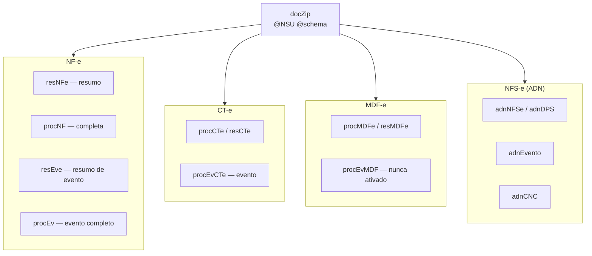

# Conhecimento da SEFAZ e do ADN — documento vivo

> **O que é este documento.** Tudo o que já foi aprendido sobre o comportamento
> real dos serviços de distribuição de documentos fiscais — SEFAZ (`DistDFe`) e
> ADN (NFS-e). Não é resumo da Nota Técnica: é a NT **mais** o que só se
> descobre operando, que é onde a NT cala.
>
> **Como manter.** Sempre que um comportamento novo for observado ou um
> entendimento anterior cair, atualizar **aqui**. Cada afirmação carrega o seu
> grau de certeza, e isso não é enfeite — foi confundir hipótese com fato que
> custou os diagnósticos mais longos:
>
> | Marca | Significa |
> |---|---|
> | 🟢 **normativo** | está na NT ou no manual oficial |
> | 🔵 **medido** | observado na nossa base, com data e número |
> | 🟡 **hipótese** | explicação plausível, **não** confirmada |
> | 🔴 **derrubado** | já foi afirmado e os dados desmentiram — fica registrado para ninguém repetir |
>
> **Onde pesquisar** (nesta ordem, e **nunca** no Context7 — ele indexa
> documentação de bibliotecas, e a `sped-nfe` documenta a API dela, não as
> regras do fisco; a tabela de cStat dela chegou a descrever o 656 de forma
> incompleta e atrasou um diagnóstico):
>
> 1. `nfe.fazenda.gov.br` — Notas Técnicas e MOC. É a fonte normativa.
> 2. Bases de provedores, que documentam o comportamento **em produção**:
>    `atendimento.tecnospeed.com.br`, `blog.nstecnologia.com.br`,
>    `focusnfe.com.br/blog`, `oobj.com.br/bc`, `qive.com.br/blog`,
>    `tributos.io/blog`, `acbr.sourceforge.io`.

---

## 1. Os serviços, e os dois domínios de cota


Os dois domínios são **independentes**: um bloqueio na SEFAZ não afeta o ADN, e
vice-versa. O motor trata isso explicitamente (`dominioCota()`), e o freio de
espera global é aplicado por domínio, não para o sistema todo.

## 2. Os três modos do `DistDFe`

| Modo | Move o cursor? | Limite | Para que serve |
|---|---|---|---|
| `distNSU` | **sim** | lote de **50 documentos** por resposta 🟢 | consumo contínuo, é o que a rotina usa |
| `consNSU` | não | **20 consultas/hora** 🟢 | sondar um NSU específico sem risco |
| `consChNFe` | não | **20 consultas/hora** 🟢 (mesmo balde do `consNSU`) | buscar por chave; é o que a tela de download de DANFE usa |

> O limite de 20/h do `consNSU`/`consChNFe` é **compartilhado com a tela atual
> de download de DANFE**. Se alguém estiver usando a tela, o orçamento de
> sondagem diminui.

## 3. Regras de ritmo

**Fonte de tudo que está 🟢 aqui:** NT 2014.002 **v.1.40**, publicada em
03/07/2026, item **3.11.4** ("Recomendações Para Evitar o Uso Indevido").
Conferido no PDF oficial em 12/09/2026 — ver §3.1 para o que **não** está lá.

| Situação | Regra | Grau |
|---|---|---|
| Resposta traz documentos | **não há intervalo mínimo** especificado — pode chamar em sequência | 🟢 |
| `cStat 137` (nada novo) | esperar **1 hora** antes de consultar de novo | 🟢 |
| Consultar antes dessa 1 hora | devolve `cStat 656` e **bloqueia o CNPJ por 1 hora**, com desbloqueio **automático** | 🟢 |
| Consultar antes de vencer o bloqueio | **o tempo é zerado** e a contagem recomeça até completar 1 hora | 🟢 |
| Consultar fora da sequência do `ultNSU` | mesma rejeição 656, mesmo bloqueio de 1 hora | 🟢 |
| `ultNSU` igual ao `maxNSU` | não há mais documentos: **aguardar 1 hora**, senão é uso indevido | 🟢 |
| A rejeição 656 devolve o **`ultNSU` correto** daquele CNPJ | desde a v.1.14 — dá para ressincronizar sem adivinhar | 🟢 |
| Retenção para consulta por NSU | **90 dias** no Ambiente Nacional | 🟢 |
| Guarda legal do XML | **11 anos** (Ajuste SINIEF 2/2025, era 5, desde 01/05/2025) | 🟢 |
| 50 bloqueios → bloqueio **permanente** | **não está na NT** — ver §3.1 | 🟡 |

O intervalo entre chamadas quando **há** documentos é o único número que a NT
não dá — a nossa pausa de 30s é prudência própria, não limite publicado. Ver
`dfe_pausa_seg` em [03_conhecimento-motor.md](03_conhecimento-motor.md).

### 3.1 🔴 Duas regras que estavam aqui como 🟢 e não são

Corrigido em **12/09/2026**, depois de baixar o PDF oficial da NT 2014.002
v.1.40 e contar os termos nas 18 páginas.

**"50 bloqueios consecutivos viram bloqueio permanente do certificado"** — a
palavra `permanente` aparece **zero vezes** na NT. A única fonte que sustenta
algo parecido é uma página da **oobj de 2018**, que fala em "após 50 bloqueios
de 1 hora, a empresa poderá receber a Rejeição 656 permanentemente" — e trata do
**serviço de autorização**, não do `NFeDistribuicaoDFe`. A palavra
**"consecutivos" não está nem lá**: foi acrescentada por nós.

Não vira 🔴 total: ausência na NT não é prova de inexistência, e o fisco tem
discricionariedade administrativa. Fica 🟡, e **deixa de ser a justificativa do
freio** — ver §3.2.

**A rejeição 656 devolve o `ultNSU`, e nós descartávamos.** A NT diz, no mesmo
item 3.11.4.1:

> A partir da data informada na versão 1.14 desta Nota Técnica, o número da
> última consulta realizada para o CNPJ de 14 dígitos informado na requisição
> passou a ser retornado no XML da rejeição 656 (consumo indevido) […] caso o
> usuário não conheça o número do ultNSU, pode realizar a consulta a partir
> deste número.

O `DfeSefazRepository` já lê o campo; o `DfeIngerir` não usava. Corrigido em
12/09/2026 — hoje o valor é **registrado** em `dsc_ultimo_motivo`, sem mover o
cursor sozinho.

### 3.2 Por que o freio existe, então

Não é pelos 50 bloqueios. É por **defeito nosso**.

Entre 28 e 31/08/2026 um bug de fuso fez o cooldown nunca segurar consulta, e o
motor consultou de 15 em 15 minutos dentro da janela de 1 hora — que é
literalmente a condição do 656, e cada tentativa reinicia a hora. O freio é a
única camada que **não depende de nenhuma lógica de tempo estar correta**: ele
conta linhas em `dpc_dfe_execucao`. Foi exatamente uma lógica de tempo que
falhou.

Detalhe em
[../../../../.claude-work-items/temp/freio-sefaz/plano-ajuste-freio.md](../../../../.claude-work-items/temp/freio-sefaz/plano-ajuste-freio.md).

## 4. cStat — o que já vimos

| cStat | Significa | O que o motor faz |
|---|---|---|
| `137` | nenhum documento localizado | encerra o fluxo como `EM_DIA` e agenda o cooldown |
| `138` | documento localizado | drena o lote e continua |
| `656` | **consumo indevido** | bloqueia o **domínio** por 60 min e aborta o ciclo |

### O 656 tem duas variantes de `xMotivo`, e as duas aparecem na mesma situação

```
"Rejeicao: Consumo Indevido ... Deve ser utilizado o ultNSU nas solicitacoes subsequentes"
"Rejeicao: Consumo Indevido ... Deve ser aguardado 1 hora ... caso nao existam mais documentos"
```

🔴 **Derrubado:** filtrar por texto para distinguir "erro de cursor" de "ritmo".
As duas frases foram observadas na **mesma** condição — consulta de NF-e sem
documentos novos. Tratar as duas como o mesmo evento.

## 5. O 656 tem dois eixos diferentes, e confundi-los custa caro

Esta é a distinção mais importante do documento.

| Eixo | O que é | Grau |
|---|---|---|
| **Cota / bloqueio** | por **CNPJ de 14 dígitos informado na requisição** | 🟢 NT 2014.002 v.1.40, item 3.11.4.1 |
| **Gatilho** | por **SERVIÇO** — o `NFeDistribuicaoDFe` devolve 656 onde o `CTeDistribuicaoDFe` não devolve | 🔵 O CT-e tolerou **9 consultas vazias consecutivas** com o cursor imóvel. Em 02/09, dos 33 bloqueios da base, **33 são NFE e 0 são CTE** — e o CT-e tinha 32 execuções e 5.031 documentos no mesmo período |

O texto da NT é explícito nos dois pontos:

> Nesse caso, **o CNPJ é bloqueado por 1 hora**, sendo impedido de realizar novas
> consultas nesse intervalo.

> Se diversas aplicações do mesmo ator […] efetuarem consultas por NSU para o
> **mesmo CNPJ (14 dígitos – informado na requisição xml)**, essas devem seguir
> a mesma sequência de numeração ordenada e de forma ascendente.

A rejeição **593** ("CNPJ-Base consultado difere do CNPJ-Base do Certificado
Digital") mostra o papel do certificado: ele precisa compartilhar a **raiz de 8
dígitos** com o CNPJ consultado. É o que permite o e-CNPJ da matriz atender as
13 filiais — e não é a unidade da cota.

### 🔴 Este eixo dizia "CERTIFICADO e IP" até 12/09/2026

**A palavra `IP` não aparece uma única vez nas 18 páginas da NT.**

A evidência que sustentava aquilo era: *"em 07–08/08 as empresas 0008-43 e
0003-39 tomaram 656 na **primeira** consulta delas, com `ultNSU=0`, que seria
legítimo — logo o controle é por certificado"*.

**Tem confundidor.** Aqueles dois CNPJs são atendidos pela **Qive**, que já vinha
consultando o `DistDFe` deles havia meses. O cursor deles na SEFAZ estava muito
além de zero. Mandar `0` ali não é primeira consulta legítima: é **consultar
fora da sequência**, que é a segunda causa de 656 da própria NT. O caso deixa de
ser evidência.

A outra evidência — a emp 900 passar 7 min depois de uma rajada da emp 30 — é
compatível com as **duas** hipóteses (CNPJ diferente *e* certificado diferente).
Não discrimina.

E o nosso próprio código já anotava a contradição, em
`ApiNFE/app/Repositories/DfeCursorRepository.php:213`:

> EVIDENCIA EM SENTIDO CONTRARIO, registrada para nao se perder: em 18/08/2026 a
> empresa 30 consultou com o MESMO certificado da matriz e recebeu cStat 138
> limpo, o que sugere contabilizacao por CNPJ, como a NT 2014.002 descreve — e
> nao por certificado.

O código sabia; este documento marcou 🟢 o oposto. Lição registrada: **marca 🟢
sem link para o item da NT é palpite com aparência de fato.**

### O que o motor ainda faz, e por quê

Apesar da NT, o motor segue conservador em três níveis — `chaveDeCota()` agrupa
por **raiz de 8 dígitos** (certificado), `agendaEsperaGlobal()` pausa o
**domínio inteiro**, e o 656 aborta o ciclo. Isso **não** foi afrouxado junto
com a correção deste documento, por um motivo: a anomalia da empresa 30 (§5.1)
não está explicada, e a NT descreve o comportamento normal, não o dela.

O experimento que decide está em curso desde 12/09/2026 — ver §5.1.

### 5.1 🔵 A anomalia da empresa 30, e o experimento em curso

Duas medições limpas, mesmo certificado, mesma configuração
(`qtd_min_em_dia = 60`), fluxo já em dia:

| | Empresa 29 (DF) | Empresa 30 (MS) |
|---|---|---|
| Janela | 11/09 14:15 → 12/09 11:30 | 11/09 dia inteiro |
| Execuções | 19 | 13 |
| **Bloqueios** | **0** | **9** |
| Consultas que voltaram vazias | 7 — **todas `cStat 137`** | todas 656 |
| Intervalos | 60 e 75 min | 60 a 105 min |

A empresa 29 é a primeira do módulo a registrar `cod_ultimo_status = 137`. **A
regra normativa funciona:** respeitada a hora, consulta vazia devolve 137.

A empresa 30, no mesmo certificado e com os mesmos intervalos, não. **A causa
não está caracterizada.**

**Experimento em curso, iniciado em 12/09/2026:** a empresa 30 foi religada
enquanto a 29 segue ativa. As duas dividem o certificado e têm CNPJs diferentes
— é a montagem que discrimina os dois eixos, e que nunca havia sido rodada
porque o motor aborta o ciclo no primeiro 656.

### 🔵 RESULTADO — o gatilho é do CNPJ, medido em 12/09/2026

Quatro execuções bastaram. Todas as variáveis controladas, só o CNPJ diferente:

| Hora | Empresa | Intervalo desde a consulta anterior **dela** | Documentos | Resultado |
|---|---|---|---|---|
| 12:00 | **29** | — | 0 (vazia) | `EM_DIA` — **`cStat 137`** |
| 12:15 | **30** | — | 131 | `EM_DIA` — `cStat 138` |
| **13:15** | **29** | **75 min** | **0 (vazia)** | **`cStat 137`** ✅ |
| **13:30** | **30** | **75 min** | **0 (vazia)** | **`cStat 656`** ❌ |

Mesmo certificado (raiz `66471517`), mesmo `qtd_min_em_dia = 60`, mesmo intervalo
de 75 minutos, as duas em dia e recebendo consulta vazia — **quinze minutos de
diferença entre uma e outra**, e resultados opostos.

**O gatilho do 656 é uma propriedade do CNPJ.** Não é do certificado, não é do
intervalo, não é da configuração. Isso encerra a pergunta que estava aberta
desde agosto, e confirma o que a NT descreve.

### 🔵 O BLOQUEIO também é do CNPJ — sondagem deliberada, 12/09/2026 19:31

O gatilho ficou provado acima, mas faltava o outro eixo: um bloqueio na 30
alcança a 29 do lado da SEFAZ? Nosso `agendaEsperaGlobal` mascarava — ele pausa
as duas, então a 29 nunca consultava dentro da janela.

**Sondagem autorizada e feita uma única vez**, violando de propósito a
invariante "nada automático consulta a SEFAZ depois de um bloqueio":

```
19:00:02  emp 30  CONSUMO_INDEVIDO   -> CNPJ ...0030-01 bloqueado ate 20:00
19:31:47  emp 29  EM_DIA (cStat 137) -> consultou DENTRO da janela de bloqueio
                                        da 30, no MESMO certificado, e passou
```

Duas condições tiveram de valer ao mesmo tempo, e valeram: a 30 estava bloqueada
(faltavam 28 min) e a 29 já cumprira **a própria hora** (62 min desde a consulta
dela às 18:30). Sem a segunda, um 656 na 29 seria violação da regra dela mesma e
não provaria nada.

**A cota é do CNPJ nos dois eixos — gatilho e bloqueio.** O
`agendaEsperaGlobal` por domínio deixa de ter base: ele está pausando fluxos
saudáveis por causa de um doente.

### 🔴 E não é dessincronia de NSU

A hipótese mais provável para a anomalia da 30 caiu no mesmo dia. O registro que
o motor passou a fazer no bloqueio — comparando o `ultNSU` que a rejeição devolve
com o que foi enviado — deu, no bloqueio das 19:00:

> Cursor **CONFERE** com a SEFAZ (ultNSU=20522): o bloqueio não é dessincronia
> de NSU.

O cursor da empresa 30 está exatamente onde a SEFAZ diz que deveria estar. A
segunda causa de 656 da NT — "consultar fora da sequência" — está descartada
para ela. **A causa da anomalia segue desconhecida**, e agora sem candidato
óbvio.

**O preço, medido:** a empresa 29 não fez nada errado e teve a liberação
empurrada de **14:15 para 14:30** pelo bloqueio da 30. Quinze minutos por
bloqueio, hoje com dois CNPJs. Com treze, um CNPJ doente pagaria pelos outros
doze o dia inteiro.

**O que fazer com a empresa 30 continua aberto.** A NT dá a pista mais provável —
"consultar fora da sequência" também devolve 656 — e a rejeição **traz o `ultNSU`
correto no XML**. O código que registra essa divergência foi escrito em
12/09/2026 mas **ainda não está no servidor**; com ele, o próximo bloqueio dela
diria de imediato se o cursor está dessincronizado.

### 🔴 A "terceira causa" era, em grande parte, defeito nosso

Estava registrado aqui que a taxa normal de 656 era ~2,5/dia por fluxo, medida
de 28 a 31/08/2026, e que 13 CNPJs levariam a ~32/dia. **Os dados de 02/09
desmentem.** Olhando o que veio *imediatamente antes* de cada bloqueio:

```
30/08 05:45  emp 30  anterior=EM_DIA  0 docs   15 min antes  -> 656
30/08 06:00  emp 30  anterior=656     0 docs   15 min antes  -> 656
31/08 03:15  emp 30  anterior=EM_DIA  0 docs   15 min antes  -> 656
31/08 03:30  emp 30  anterior=656     0 docs   15 min antes  -> 656
31/08 05:00  emp 30  anterior=EM_DIA  0 docs   15 min antes  -> 656
```

`EM_DIA` grava "espere 60 minutos". A execução seguinte do **mesmo fluxo** vinha
**15 minutos depois** — o intervalo do cron. O motor ignorava o próprio cooldown
e consultava dentro da hora, que é literalmente a condição normativa do 656.

Era o bug de fuso do `dta_liberado_em`, corrigido em `19c7b25` (31/08 19:02). O
corte na série é exato: repetições de 15 minutos **todos os dias** antes do
commit, **zero** depois — os intervalos passam a 150, 181, 314, 688, 855 min.

O que **resta** de genuíno: 🔵 CNPJ ocioso devolve 656 mesmo com espera
respeitada. A empresa 900 (`nro_ultimo_nsu = 87`, imóvel) bloqueou 5× em 01/09
com intervalos de 150–181 min. Fica pausada por isso.

Investigação completa: [12_sefaz-656-consumo-indevido.md](12_sefaz-656-consumo-indevido.md).

## 6. NSU — semântica que já enganou

| Fato | Grau |
|---|---|
| O NSU é **por CNPJ** e **compartilhado entre consumidores**: a Qive consumindo o mesmo CNPJ avança a mesma sequência | 🟢 |
| `ultNSU` = até onde a resposta entregou · `maxNSU` = o topo disponível | 🟢 |
| Faixa expurgada (>90 dias): parte dos integradores relata salto para o primeiro NSU disponível, parte relata `137` com `ultNSU` inalterado | 🟡 |
| Cursor que não avança com `maxNSU` maior = `CURSOR_TRAVADO`. O motor **para** o fluxo em vez de insistir | — |

O cursor é mantido **por fluxo** (`cod_tipo_dfe`), não por empresa: NF-e, CT-e,
MDF-e e NFS-e da mesma empresa têm posições independentes.

## 7. Os schemas do `docZip`



A **promoção resumo → completo** é proposital: quando o `procNF` chega depois do
`resNFe` com a mesma chave, a linha é atualizada em vez de ignorada.

## 8. Eventos

### NF-e e CT-e nomeiam por código; o ADN nomeia por elemento

| Família | Como o evento é identificado |
|---|---|
| NF-e | `tpEvento` numérico |
| CT-e | `tpEvento` numérico |
| **NFS-e (ADN)** | pelo **elemento de detalhe**, ex. `e101101` = cancelamento. **Não existe `tpEvento`** 🔵 |

### Eventos de CT-e que o motor reconhece

| Código | Evento | Efeito |
|---|---|---|
| `110111` | Cancelamento | marca o CT-e como cancelado (`cod_situacao = 3`) |
| `110180` | Comprovante de entrega | guarda data e recebedor |
| `110181` | Cancelamento do comprovante | desfaz o anterior |
| `110110` | Carta de correção | registra |
| `310610` | CT-e autorizado em MDF-e | detalhe `evCTeAutorizadoMDFe` |
| `310611` | CT-e cancelado em MDF-e | detalhe `evCTeCanceladoMDFe` |

🔵 Ao ativar os eventos de CT-e (v10, 02/09): 2.853 eventos, **20 CT-e
cancelados totalizando R$ 26.796,56** que até então passavam por válidos, e 936
comprovantes de entrega — todos com data, mas só 225 com nome de recebedor
utilizável.

### Eventos de manifestação do destinatário (NF-e)

| Código | Evento | Prazo (da autorização) | Máx. por nota |
|---|---|---|---|
| `210210` | Ciência da Operação | **10 dias** | 1 |
| `210200` | Confirmação da Operação | **90 dias** | 2 |
| `210220` | Desconhecimento da Operação | **90 dias** | 2 |
| `210240` | Operação não Realizada | **90 dias** | 2 |

🟢 NT 2020.001 v1.60 (abril/2026), item 4, Ajuste SINIEF 44/20: os prazos são
contados da **autorização da NF-e** (`dhRecbto`, não `dhEmi`) e fora deles a
SEFAZ devolve `cStat 596`. O teto de 2 manifestações conclusivas por nota é o
Ajuste SINIEF 43/23 — não é sequência aberta, e a última vale. A v1.60
**reduziu** o prazo conclusivo de 180 para 90 dias (Ajuste SINIEF 14/2026);
qualquer material que ainda fale em 180 está desatualizado.

🔵 Medido em 24/09/2026: a diferença entre `dhEmi` e `dhRecbto` tem média de
1,9h, mas chegou a **24 dias** numa nota real — usar a emissão em vez da
autorização só erra nesses casos de borda, que são justamente os únicos em que
o filtro de prazo decide algo. A primeira nota manifestada fora do prazo (13
dias contados da emissão, mas ainda dentro contando da autorização) confirmou a
âncora certa na prática, não só na norma.

🟢 **A SEFAZ nunca devolve ao destinatário o evento da própria manifestação.**
NT 2014.002 v1.40 (julho/2026, conferida também contra a v1.02d de março/2021 —
idêntica nos dois pontos abaixo), seção "A distribuição ocorrerá para os
atores…, tabela de distribuição:

> Eventos de Manifestação do Destinatário — Emitente: **Sim** · Destinatário:
> **Não** · Transportador: Não · Terceiros: Sim

E o fluxo do modelo, mesma NT, é a citação que fecha o mecanismo:

> 5. O Ambiente Nacional gera um NSU do evento gerado pelo destinatário **para o
>    emitente**...
> 6. Caso seja um evento de manifestação do destinatário **diferente do tipo
>    "desconhecimento da operação"**, o Ambiente Nacional gera um NSU para o
>    destinatário com a NF-e (liberação do download)...

Consequência prática: **qualquer desenho que dependa de `dpc_dfe_evento` para
confirmar que UMA manifestação nossa foi aceita está errado por construção** —
essa tabela só recebe o evento quando somos o EMITENTE (nota emitida por nós e
manifestada por um cliente, ou transferência entre filiais nossas). A
confirmação do nosso próprio envio vem só do retorno síncrono do
`NFeRecepcaoEvento`, gravado em `poseidon.dpc_dfe_manifestacao`. E o sinal
observável de que uma nota de terceiro FOI manifestada — por nós ou por
qualquer processo, quando não temos o evento em mãos — é a chegada do XML
completo (`procNFe`): antes da manifestação, o destinatário só recebe o resumo
(`resNFe`, nota de rodapé 1 da mesma tabela).

## 9. Particularidades de layout que já custaram diagnóstico

| Achado | Detalhe | Grau |
|---|---|---|
| **`vNF` não é a soma dos itens** | `vNF = vProd - vDesc + vFrete + vSeg + vOutro + vST + vIPI`. Só o `vProd` do `ICMSTot` reconcilia com `sum(item.vProd)` — comprovado 12/12 contra 0/12 | 🔵 |
| **Chave de NFS-e tem 50 caracteres**, não 44 | `dpc_dfe_documento.chave_nf` é `VARCHAR2(44)` e trunca — defeito aberto, impede religar evento de NFS-e automaticamente | 🔵 |
| **`nProt` aparece duas vezes no `procEvCTe`** | leitura tem de ser escopada ao nó, senão pega o protocolo errado | 🔵 |
| **A tag `IE` não existe** quando o emitente é CPF ou não-contribuinte | `getElementsByTagName('IE')->item(0)->nodeValue` lança `Error` (não `Exception`) em PHP 8 — foi assim que o parser antigo entrava em laço no mesmo NSU e provocava 656 | 🔵 |
| CLOB do Oracle | o driver `oci8` converte CLOB → string direto; `DBMS_LOB.SUBSTR` no `SELECT` **trunca em 4000 bytes** e quebra com XML de NF-e | 🔵 |

## 10. Certificado digital

| Fato | Grau |
|---|---|
| É um **e-CNPJ A1 da matriz** (`66471517000177`) replicado em todas as filiais de mesma raiz — comprovado por hash | 🔵 |
| A cota da SEFAZ é do certificado, então **replicar o certificado replica o teto**, não o multiplica | 🔵 |
| As empresas 375/376 (DRL, raiz `28011064`) precisam de certificado próprio | 🔵 |
| Vencimento passou **9 meses** sem ninguém notar (13/11/2025). O `dfe:monitorar` alerta antes do vencimento por causa disso | 🔵 |
| Configuração OpenSSL legada exige **duas** variáveis (`OPENSSL_CONF` + `OPENSSL_MODULES`); com uma só, o certificado quebra com `0308010C` | 🔵 |

## 11. O que continua desconhecido

| Pergunta | Por que importa |
|---|---|
| Qual o intervalo mínimo real entre chamadas quando **há** documentos? | a pausa de 30s é palpite conservador; medir libera velocidade de drenagem |
| Quanto tempo basta entre dois fluxos do **mesmo certificado**? | hoje a regra é "não disputar": o segundo fluxo pega o ciclo seguinte, 15 min depois. **O experimento de 12/09 (§5.1) responde isto** |
| Por que a empresa 30 devolve 656 com espera respeitada e a **29 não**, no mesmo certificado e na mesma configuração? | é a anomalia de §5.1 — a NT descreve o comportamento da 29, não o da 30 |

Fechadas em 12/09/2026, contra o PDF da NT 2014.002 v.1.40:

| Pergunta | Resposta |
|---|---|
| ~~"50 bloqueios consecutivos" conta consecutivos como?~~ | **Não é regra da NT.** "permanente" não aparece no documento, e "consecutivos" era invenção nossa. Ver §3.1 |
| ~~A cota é por certificado ou por CNPJ?~~ | **Por CNPJ de 14 dígitos**, textual no item 3.11.4.1. Ver §5 |
| ~~Como descobrir o `ultNSU` certo depois de um 656?~~ | **A própria rejeição devolve.** Desde a v.1.14. Ver §3.1 |
| O comportamento real de faixa de NSU expurgada | decide se `--reposicionar-cursor` é necessário por CNPJ |

---

Voltar ao [índice](readme.md) · motor: [03_conhecimento-motor.md](03_conhecimento-motor.md)
