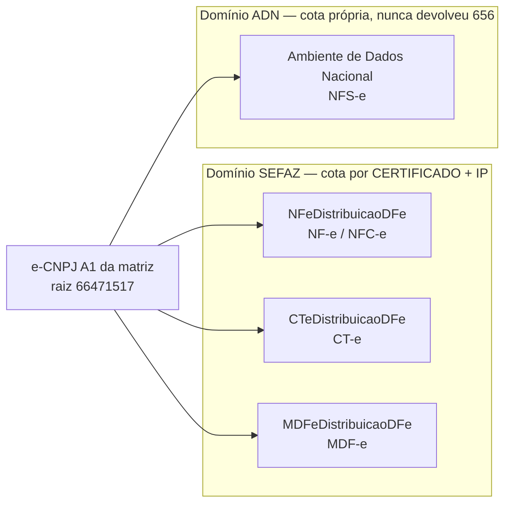
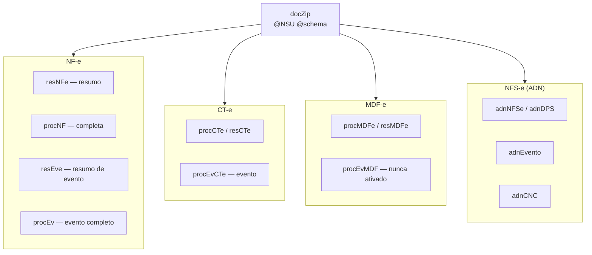

# Conhecimento da SEFAZ e do ADN — documento vivo

> **O que é este documento.** Tudo o que já foi aprendido sobre o comportamento
> real dos serviços de distribuição de documentos fiscais — SEFAZ (`DistDFe`) e
> ADN (NFS-e). Não é resumo da Nota Técnica: é a NT **mais** o que só se
> descobre operando, que é onde a NT cala.
>
> **Como manter.** Sempre que um comportamento novo for observado ou um
> entendimento anterior cair, atualizar **aqui**. Cada afirmação carrega o seu
> grau de certeza, e isso não é enfeite — foi confundir hipótese com fato que
> custou os diagnósticos mais longos:
>
> | Marca | Significa |
> |---|---|
> | 🟢 **normativo** | está na NT ou no manual oficial |
> | 🔵 **medido** | observado na nossa base, com data e número |
> | 🟡 **hipótese** | explicação plausível, **não** confirmada |
> | 🔴 **derrubado** | já foi afirmado e os dados desmentiram — fica registrado para ninguém repetir |
>
> **Onde pesquisar** (nesta ordem, e **nunca** no Context7 — ele indexa
> documentação de bibliotecas, e a `sped-nfe` documenta a API dela, não as
> regras do fisco; a tabela de cStat dela chegou a descrever o 656 de forma
> incompleta e atrasou um diagnóstico):
>
> 1. `nfe.fazenda.gov.br` — Notas Técnicas e MOC. É a fonte normativa.
> 2. Bases de provedores, que documentam o comportamento **em produção**:
>    `atendimento.tecnospeed.com.br`, `blog.nstecnologia.com.br`,
>    `focusnfe.com.br/blog`, `oobj.com.br/bc`, `qive.com.br/blog`,
>    `tributos.io/blog`, `acbr.sourceforge.io`.

---

## 1. Os serviços, e os dois domínios de cota



Os dois domínios são **independentes**: um bloqueio na SEFAZ não afeta o ADN, e
vice-versa. O motor trata isso explicitamente (`dominioCota()`), e o freio de
espera global é aplicado por domínio, não para o sistema todo.

## 2. Os três modos do `DistDFe`

| Modo | Move o cursor? | Limite | Para que serve |
|---|---|---|---|
| `distNSU` | **sim** | lote de **50 documentos** por resposta 🟢 | consumo contínuo, é o que a rotina usa |
| `consNSU` | não | **20 consultas/hora** 🟢 | sondar um NSU específico sem risco |
| `consChNFe` | não | **20 consultas/hora** 🟢 (mesmo balde do `consNSU`) | buscar por chave; é o que a tela de download de DANFE usa |

> O limite de 20/h do `consNSU`/`consChNFe` é **compartilhado com a tela atual
> de download de DANFE**. Se alguém estiver usando a tela, o orçamento de
> sondagem diminui.

## 3. Regras de ritmo

| Situação | Regra | Grau |
|---|---|---|
| Resposta traz documentos | **não há intervalo mínimo** especificado — pode chamar em sequência | 🟢 |
| `cStat 137` (nada novo) | esperar **1 hora** antes de consultar de novo | 🟢 |
| Consultar antes dessa 1 hora | devolve `cStat 656` e **bloqueia por 1 hora** | 🟢 |
| Consultar antes de vencer o bloqueio | **reinicia o cronômetro** do bloqueio | 🟢 |
| 50 bloqueios **consecutivos** | podem virar bloqueio **permanente** do certificado | 🟢 |
| Retenção para consulta por NSU | **90 dias** no Ambiente Nacional | 🟢 |
| Guarda legal do XML | **11 anos** (Ajuste SINIEF 2/2025, era 5, desde 01/05/2025) | 🟢 |

O intervalo entre chamadas quando **há** documentos é o único número que a NT
não dá — a nossa pausa de 30s é prudência própria, não limite publicado. Ver
`dfe_pausa_seg` em [03_conhecimento-motor.md](03_conhecimento-motor.md).

## 4. cStat — o que já vimos

| cStat | Significa | O que o motor faz |
|---|---|---|
| `137` | nenhum documento localizado | encerra o fluxo como `EM_DIA` e agenda o cooldown |
| `138` | documento localizado | drena o lote e continua |
| `656` | **consumo indevido** | bloqueia o **domínio** por 60 min e aborta o ciclo |

### O 656 tem duas variantes de `xMotivo`, e as duas aparecem na mesma situação

```
"Rejeicao: Consumo Indevido ... Deve ser utilizado o ultNSU nas solicitacoes subsequentes"
"Rejeicao: Consumo Indevido ... Deve ser aguardado 1 hora ... caso nao existam mais documentos"
```

🔴 **Derrubado:** filtrar por texto para distinguir "erro de cursor" de "ritmo".
As duas frases foram observadas na **mesma** condição — consulta de NF-e sem
documentos novos. Tratar as duas como o mesmo evento.

## 5. O 656 tem dois eixos diferentes, e confundi-los custa caro

Esta é a distinção mais importante do documento.

| Eixo | O que é | Evidência |
|---|---|---|
| **Cota / bloqueio** | por **CERTIFICADO e IP** — não por CNPJ | 🔵 01/09: emp 8 tomou 656 na primeira consulta dela, minutos depois do bloqueio da matriz (mesmo certificado). No mesmo dia, emp 900 (raiz 45694407) passou 7 min depois de uma rajada de 11 chamadas da emp 30 (raiz 66471517) — certificados diferentes, zero interferência |
| **Gatilho** | por **SERVIÇO** — o `NFeDistribuicaoDFe` devolve 656 onde o `CTeDistribuicaoDFe` não devolve | 🔵 O CT-e tolerou **9 consultas vazias consecutivas** com o cursor imóvel. Em 02/09, dos 33 bloqueios da base, **33 são NFE e 0 são CTE** — e o CT-e tinha 32 execuções e 5.031 documentos no mesmo período |

Consequência prática: como todas as filiais compartilham o e-CNPJ da matriz, um
bloqueio atinge **todas** elas. Por isso o motor consulta **um fluxo por
certificado por ciclo** e, ao tomar 656, para o ciclo inteiro em vez de tentar a
empresa seguinte.

### 🔴 A "terceira causa" era, em grande parte, defeito nosso

Estava registrado aqui que a taxa normal de 656 era ~2,5/dia por fluxo, medida
de 28 a 31/08/2026, e que 13 CNPJs levariam a ~32/dia. **Os dados de 02/09
desmentem.** Olhando o que veio *imediatamente antes* de cada bloqueio:

```
30/08 05:45  emp 30  anterior=EM_DIA  0 docs   15 min antes  -> 656
30/08 06:00  emp 30  anterior=656     0 docs   15 min antes  -> 656
31/08 03:15  emp 30  anterior=EM_DIA  0 docs   15 min antes  -> 656
31/08 03:30  emp 30  anterior=656     0 docs   15 min antes  -> 656
31/08 05:00  emp 30  anterior=EM_DIA  0 docs   15 min antes  -> 656
```

`EM_DIA` grava "espere 60 minutos". A execução seguinte do **mesmo fluxo** vinha
**15 minutos depois** — o intervalo do cron. O motor ignorava o próprio cooldown
e consultava dentro da hora, que é literalmente a condição normativa do 656.

Era o bug de fuso do `dta_liberado_em`, corrigido em `19c7b25` (31/08 19:02). O
corte na série é exato: repetições de 15 minutos **todos os dias** antes do
commit, **zero** depois — os intervalos passam a 150, 181, 314, 688, 855 min.

O que **resta** de genuíno: 🔵 CNPJ ocioso devolve 656 mesmo com espera
respeitada. A empresa 900 (`nro_ultimo_nsu = 87`, imóvel) bloqueou 5× em 01/09
com intervalos de 150–181 min. Fica pausada por isso.

Investigação completa: [12_sefaz-656-consumo-indevido.md](12_sefaz-656-consumo-indevido.md).

## 6. NSU — semântica que já enganou

| Fato | Grau |
|---|---|
| O NSU é **por CNPJ** e **compartilhado entre consumidores**: a Qive consumindo o mesmo CNPJ avança a mesma sequência | 🟢 |
| `ultNSU` = até onde a resposta entregou · `maxNSU` = o topo disponível | 🟢 |
| Faixa expurgada (>90 dias): parte dos integradores relata salto para o primeiro NSU disponível, parte relata `137` com `ultNSU` inalterado | 🟡 |
| Cursor que não avança com `maxNSU` maior = `CURSOR_TRAVADO`. O motor **para** o fluxo em vez de insistir | — |

O cursor é mantido **por fluxo** (`cod_tipo_dfe`), não por empresa: NF-e, CT-e,
MDF-e e NFS-e da mesma empresa têm posições independentes.

## 7. Os schemas do `docZip`



A **promoção resumo → completo** é proposital: quando o `procNF` chega depois do
`resNFe` com a mesma chave, a linha é atualizada em vez de ignorada.

## 8. Eventos

### NF-e e CT-e nomeiam por código; o ADN nomeia por elemento

| Família | Como o evento é identificado |
|---|---|
| NF-e | `tpEvento` numérico |
| CT-e | `tpEvento` numérico |
| **NFS-e (ADN)** | pelo **elemento de detalhe**, ex. `e101101` = cancelamento. **Não existe `tpEvento`** 🔵 |

### Eventos de CT-e que o motor reconhece

| Código | Evento | Efeito |
|---|---|---|
| `110111` | Cancelamento | marca o CT-e como cancelado (`cod_situacao = 3`) |
| `110180` | Comprovante de entrega | guarda data e recebedor |
| `110181` | Cancelamento do comprovante | desfaz o anterior |
| `110110` | Carta de correção | registra |
| `310610` | CT-e autorizado em MDF-e | detalhe `evCTeAutorizadoMDFe` |
| `310611` | CT-e cancelado em MDF-e | detalhe `evCTeCanceladoMDFe` |

🔵 Ao ativar os eventos de CT-e (v10, 02/09): 2.853 eventos, **20 CT-e
cancelados totalizando R$ 26.796,56** que até então passavam por válidos, e 936
comprovantes de entrega — todos com data, mas só 225 com nome de recebedor
utilizável.

## 9. Particularidades de layout que já custaram diagnóstico

| Achado | Detalhe | Grau |
|---|---|---|
| **`vNF` não é a soma dos itens** | `vNF = vProd - vDesc + vFrete + vSeg + vOutro + vST + vIPI`. Só o `vProd` do `ICMSTot` reconcilia com `sum(item.vProd)` — comprovado 12/12 contra 0/12 | 🔵 |
| **Chave de NFS-e tem 50 caracteres**, não 44 | `dpc_dfe_documento.chave_nf` é `VARCHAR2(44)` e trunca — defeito aberto, impede religar evento de NFS-e automaticamente | 🔵 |
| **`nProt` aparece duas vezes no `procEvCTe`** | leitura tem de ser escopada ao nó, senão pega o protocolo errado | 🔵 |
| **A tag `IE` não existe** quando o emitente é CPF ou não-contribuinte | `getElementsByTagName('IE')->item(0)->nodeValue` lança `Error` (não `Exception`) em PHP 8 — foi assim que o parser antigo entrava em laço no mesmo NSU e provocava 656 | 🔵 |
| CLOB do Oracle | o driver `oci8` converte CLOB → string direto; `DBMS_LOB.SUBSTR` no `SELECT` **trunca em 4000 bytes** e quebra com XML de NF-e | 🔵 |

## 10. Certificado digital

| Fato | Grau |
|---|---|
| É um **e-CNPJ A1 da matriz** (`66471517000177`) replicado em todas as filiais de mesma raiz — comprovado por hash | 🔵 |
| A cota da SEFAZ é do certificado, então **replicar o certificado replica o teto**, não o multiplica | 🔵 |
| As empresas 375/376 (DRL, raiz `28011064`) precisam de certificado próprio | 🔵 |
| Vencimento passou **9 meses** sem ninguém notar (13/11/2025). O `dfe:monitorar` alerta antes do vencimento por causa disso | 🔵 |
| Configuração OpenSSL legada exige **duas** variáveis (`OPENSSL_CONF` + `OPENSSL_MODULES`); com uma só, o certificado quebra com `0308010C` | 🔵 |

## 11. O que continua desconhecido

| Pergunta | Por que importa |
|---|---|
| Qual o intervalo mínimo real entre chamadas quando **há** documentos? | a pausa de 30s é palpite conservador; medir libera velocidade de drenagem |
| Quanto tempo basta entre dois fluxos do **mesmo certificado**? | hoje a regra é "não disputar": o segundo fluxo pega o ciclo seguinte, 15 min depois |
| Por que CNPJ **ocioso** devolve 656 com espera respeitada? | é o resíduo genuíno do 656 depois da correção do cooldown |
| "50 bloqueios consecutivos" conta consecutivos **como**? Uma consulta bem-sucedida no meio zera? | define se o risco de bloqueio permanente escala com o número de CNPJs |
| O comportamento real de faixa de NSU expurgada | decide se `--reposicionar-cursor` é necessário por CNPJ |

---

Voltar ao [índice](readme.md) · motor: [03_conhecimento-motor.md](03_conhecimento-motor.md)
