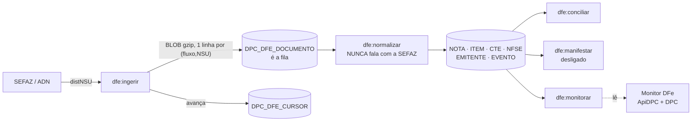

# Conhecimento do motor DFe — documento vivo

> **O que é este documento.** O que se aprendeu construindo e operando o motor
> próprio de captura de documentos fiscais de entrada da ApiNFE — o que
> substitui a Qive. Desenho, decisões, defeitos que já aconteceram e as medições
> que sustentam cada número.
>
> **Como manter.** Toda descoberta nova entra aqui. Defeito corrigido **não sai**
> da tabela da seção 6: o registro do sintoma é o que impede o próximo
> diagnóstico começar do zero. Quando um número for revisado, o antigo fica
> marcado 🔴 em vez de ser apagado.
>
> Complementos: [02_conhecimento-sefaz.md](02_conhecimento-sefaz.md) (o lado do fisco) ·
> [04_dados-tabelas.md](04_dados-tabelas.md) (cada tabela em detalhe) ·
> [06_operacao-comandos.md](06_operacao-comandos.md) (como rodar).

---

## 1. O princípio do desenho, em uma frase

**Na ingestão só pode existir código incapaz de falhar por causa do conteúdo do
documento.**

Isso não é preciosismo: a SEFAZ retém documentos por ~90 dias, então bug de
parser durante a captura significava **documento perdido para sempre**. Separando
em duas etapas, vira `dfe:normalizar --status=E` depois do fix — sem gastar cota.



| | `dfe:ingerir` | `dfe:normalizar` |
|---|---|---|
| Fala com a SEFAZ | sim | **nunca** — é invariante |
| Lê do XML | só o envelope e os atributos `@NSU`/`@schema` | tudo |
| Se falhar | documento fica `status_process = 'E'`, reprocessável | idem, sem custo de cota |

## 2. A regra de quando consultar a SEFAZ

> Consolidado em **13/09/2026**. Até então esta regra vivia espalhada entre
> comentários de código, o [06_operacao-comandos.md](06_operacao-comandos.md) e
> esta seção, e nenhum dos três tinha a versão inteira.

### 2.1 O princípio

**A SEFAZ trata cada CNPJ de 14 dígitos como uma conta própria** — NT 2014.002
v.1.40, item 3.11.4.1, e medido em 12/09/2026 nos dois eixos (§7). O motor
consulta um fluxo só quando *aquele CNPJ* já cumpriu a espera dele, e um
bloqueio pausa apenas o CNPJ que o tomou.

O certificado não é a unidade de cota. O papel dele é outro, definido pela
rejeição **593**: o CNPJ-base de 8 dígitos do certificado precisa bater com o do
CNPJ consultado. É o que permite o e-CNPJ da matriz atender as 14 filiais.

### 2.2 O ciclo, como está hoje

O cron dispara `dfe:ingerir --agendado` **a cada 15 minutos**.

```
1. FREIO GLOBAL
   ≥ dfe_max_bloqueios_dia (10) bloqueios em 24h no sistema todo
   → não consulta nada, sai com código 0
   Existe para conter DEFEITO NOSSO, não por regra da SEFAZ — ver §2.5

2. ELEGÍVEIS
   status operável  E  systimestamp >= dta_liberado_em
   ordenados por atraso decrescente (quem está mais atrás pega o ciclo)

3. PARA CADA FLUXO ELEGÍVEL
   ├ orçamento global esgotado? .......... ORCAMENTO, encerra o ciclo
   ├ mesma RAIZ de certificado já usada
   │   neste ciclo? ...................... adia para o próximo    ⚠ ver §2.4
   ├ pausa de dfe_pausa_seg (30s) desde o fluxo anterior
   ├ monta o Tools UMA VEZ por empresa (1 readPfx, não 1 por chamada)
   ├ abre DPC_DFE_EXECUCAO
   │
   └ repete até o teto por empresa (40) ou o fim da fila:
         r = distNSU(cursor)
         grava CADA docZip (upsert por fluxo+NSU)   ← commit por lote
         avança o cursor
         sleep(dfe_pausa_seg)
```

### 2.3 O que cada resposta da SEFAZ produz

| Resposta | Estado | O que o motor faz |
|---|---|---|
| `138` documento localizado | continua | grava o lote e chama de novo — **não há intervalo mínimo** quando vem documento |
| `137`, `ultNSU >= maxNSU` | `EM_DIA` | espera `qtd_min_em_dia` (60 min) — o mínimo que a NT exige |
| `137`, `ultNSU < maxNSU` | `CURSOR_TRAVADO` | **pausa o fluxo** e espera gente |
| `ultNSU <= cursor anterior` | `CURSOR_TRAVADO` | cinto de segurança contra cursor que não anda |
| `656` consumo indevido | `CONSUMO_INDEVIDO` | ver o quadro abaixo |

**No `656`:**

| | |
|---|---|
| Espera de `dfe_min_backoff_656` (60 min, piso normativo) | aplicada **só aos fluxos daquele CNPJ**, dentro do domínio afetado |
| Outros CNPJs | **seguem livres** — desde 13/09/2026 (`agendaEsperaDoCnpj`) |
| NFS-e do mesmo CNPJ | segue livre: é domínio ADN, cota própria |
| Outros tipos do mesmo CNPJ (CT-e, MDF-e) | pausam junto — em 01/09/2026 o CT-e e o NF-e da mesma empresa 30, a 30s, deram 656 |
| O `ultNSU` que a rejeição devolve | **sempre registrado** em `dsc_ultimo_motivo`: confere, diverge, ou não veio |
| O ciclo | **aborta** ⚠ ver §2.4 |
| Aviso no terminal | a partir de **3 bloqueios seguidos** sem sucesso no meio |

Estados terminais: `EM_DIA` · `ORCAMENTO` · `AGUARDANDO` · `CURSOR_TRAVADO` ·
`CONSUMO_INDEVIDO` · `ERRO_SEFAZ` · `ERRO_BD` · `CERT_INVALIDO` · `ABANDONADA`.

**Três se curam sozinhos** (`EM_DIA`, `ORCAMENTO`, `AGUARDANDO`).
**Dois param e esperam gente, de propósito**: `CURSOR_TRAVADO` e
`CONSUMO_INDEVIDO` — insistir neles reinicia a hora de bloqueio a cada
tentativa, e o fluxo nunca sai sozinho.

### 2.4 ⚠ As duas travas que sobraram, e o que as segura

As duas nasceram da hipótese — **derrubada em 12/09/2026** — de que a cota era do
certificado:

| Trava | Custo hoje |
|---|---|
| **Um fluxo por raiz de certificado por ciclo** | as 14 empresas dividem a raiz `66471517`, então é **um CNPJ a cada 15 min**: cada filial consultada a cada ~3h15 |
| **Um `656` aborta o ciclo inteiro** | os CNPJs seguintes ficam sem consulta mesmo estando liberados |

Quando forem estreitadas, entra junto uma terceira regra:

**Janela noturna** — não consultar fluxo **que já está em dia** entre 22h e 06h.
Medido em regime permanente: a madrugada é **30% das execuções e 0,8% dos
documentos** (18 execuções, 2 documentos). Fluxo *drenando atraso* continua
rodando à noite — a drenagem da empresa 29 fez 114 consultas seguidas sem um
único 656. A hora seria parâmetro, não constante no código.

**O que segura as três não é técnico, é falta de dado.** Não se sabe quantos dos
14 CNPJs se comportam como a empresa 30 (§7). Consultar todos por ciclo
multiplica a exposição por um número que ainda é chute. Isso se resolve sozinho
conforme os CNPJs forem ativados depois do corte da Qive: com quatro ou cinco
medidos, a decisão deixa de ser aposta.

### 2.5 Por que o freio global existe

Não é pela regra dos "50 bloqueios" — essa **não está na NT**
([02_conhecimento-sefaz.md §3.1](02_conhecimento-sefaz.md)).

É para conter **defeito nosso**. De 28 a 31/08/2026 um bug de fuso fez o cooldown
nunca segurar consulta, e o motor consultou de 15 em 15 minutos dentro da janela
de 1 hora — que é a condição do 656, e cada tentativa **zera o tempo e reinicia
a contagem**. Toda outra camada depende de aritmética de tempo estar correta.
Esta não: ela conta linhas em `DPC_DFE_EXECUCAO`. Foi exatamente uma aritmética
de tempo que falhou.

Por isso o freio é **global** mesmo sabendo que a cota é por CNPJ: um defeito
nosso não respeita fronteira de CNPJ.

## 3. As 13 tabelas, em uma linha cada

| Tabela | Papel |
|---|---|
| `DPC_DFE_EMPRESA` | identidade fiscal do CNPJ monitorado |
| `DPC_DFE_CURSOR` | **a posição de leitura, por fluxo** — nunca zerar sem intenção |
| `DPC_DFE_DOCUMENTO` | o XML bruto em BLOB gzip, **e a fila** |
| `DPC_DFE_EXECUCAO` | a trilha: um registro por fluxo por ciclo |
| `DPC_DFE_NOTA` | NF-e/NFC-e normalizada |
| `DPC_DFE_NOTA_ITEM` | os itens |
| `DPC_DFE_EMITENTE` | o fornecedor |
| `DPC_DFE_EVENTO` | eventos de NF-e, inclusive órfãos |
| `DPC_DFE_CTE` | o frete |
| `DPC_DFE_CTE_NFE` | quais notas o frete carrega |
| `DPC_DFE_CTE_EVENTO` | eventos de CT-e (entrega, cancelamento) |
| `DPC_DFE_NFSE` | serviço tomado |
| `DPC_DFE_MANIFESTACAO` | o que foi declarado à SEFAZ |

Detalhe de cada coluna: [04_dados-tabelas.md](04_dados-tabelas.md). Contrato para
frontend: [05_dados-consumo-frontend.md](05_dados-consumo-frontend.md).

### Decisões de estrutura que resolvem defeitos por desenho

| Decisão | O defeito que ela elimina |
|---|---|
| UK `(cod_dfe_cursor, nro_nsu)` | reler NSU nunca duplica — idempotência garantida pelo **banco** |
| `DPC_DFE_EVENTO.cod_dfe_nota` **nullable** | evento cuja nota ainda não chegou era **descartado em silêncio** e o NSU avançava: perda definitiva. Agora fica órfão e é religado |
| `dta_liberado_em` como coluna | o cooldown era 60 min hardcoded dentro do SQL, com a política duplicada entre PHP e uma function não versionada |
| `dsc_tipo_doc` na nota | permite promoção resumo → completo; antes a nota ficava eternamente com os dados do resumo |
| UK `(cod_dfe_nota, cod_tipo_evento)` na manifestação | impede manifestar em duplicidade, que é o risco **jurídico** |
| BLOB gzip em vez de NCLOB | ~2,3 GB/ano contra ~15 GB/ano (NCLOB usa 2 bytes/caractere) |

## 4. Os parâmetros, e por que saíram do `.env`

Vivem em **`POSEIDON.DPC_PARAMETRO`** desde 02/09/2026 (`3c20e65`).

| Parâmetro | Valor | Faixa | O que é |
|---|---|---|---|
| `dfe_max_consultas` | 200 | 1–5000 | orçamento de `distNSU` por ciclo |
| `dfe_pausa_seg` | 30 | 0–600 | segundos entre chamadas |
| `dfe_max_bloqueios_dia` | 10 | 1–20 | freio de emergência |
| `dfe_min_backoff_656` | 60 | 60–1440 | espera após bloqueio; piso normativo |

**O motivo da mudança:** `dfe_max_bloqueios_dia` é lido por **dois projetos** — o
freio na ApiNFE e o card "usado / limite" da tela na ApiDPC. Com o valor no
`.env` de cada um, divergiram (10 aqui, 5 lá) e **a tela acusava freio acionado
com o motor operando normal**. Valor que dois projetos leem não pode viver em
dois arquivos.

A tabela **não tem PK nem CHECK**, então a validação vive no
`DpcParametroRepository` (um em cada projeto, lendo a mesma linha): valor não
numérico ou fora de faixa é recusado, cai no default conservador e gera aviso no
`dfe:monitorar` e no log. Configuração ruim nunca derruba a rotina, e também
nunca passa por boa.

As esperas **por fluxo** ficam em `DPC_DFE_CURSOR`, não aqui — `qtd_min_em_dia` e
`qtd_min_entre_consulta`. É proposital: a espera certa depende do serviço. Em
01/09 os fluxos de SEFAZ foram para 120 min enquanto o ADN ficou em 60.

`qtd_min_em_dia` está em **60** na empresa 29 e em **180 no NF-e da empresa 30**,
desde 14/09/2026. Os 60 são o mínimo que a NT exige e a 29 confirmou que basta —
19 execuções limpas, dois intervalos de exatos 60 min inclusive. Chegou a ser
proposto subir para 70 como margem, e a medição desautorizou.

Os 180 da empresa 30 são **contenção, não afinação**. Nas 18 horas seguintes à
mudança A ela produziu **8 bloqueios em 14 execuções e capturou zero documento**,
levando o freio global a **9 de 10** — sozinha, e prestes a parar a captura da
empresa 29, que não tem defeito nenhum. Como ela bloqueia em ~57% das consultas
vazias, reduzir a frequência a um terço reduz a contagem na mesma proporção. Não
resolve a causa, que segue desconhecida: reduz o dano ao orçamento comum.

Quem usa cada um, e quando: [§2](#2-a-regra-de-quando-consultar-a-sefaz).

## 5. Agendamento e infraestrutura

| Item | Estado |
|---|---|
| Agendador | `dfe:ingerir` a cada 15 min, `dfe:normalizar` a cada 10, ambos com `withoutOverlapping` |
| Guard | tudo sob `if (env('RUN_SCHEDULE') == 1)` |
| Trava contra concorrência | `dfe:ingerir` manual se recusa a rodar quando `RUN_SCHEDULE=1` (`--forcar` ignora) |
| Container alpha | `apinfe-app` em `dkalpha00`, cron por supervisor, `RUN_SCHEDULE=1` |
| Base do container | `oracle_tst` → `homolog` / `operconsinco-dpc-bdhomolog01` |
| Ambiente | `TIPO_AMBIENTE=1` com base de teste: fala com a **SEFAZ real**, grava na base de **teste** |
| `dfe:manifestar` | **não** é agendado — ato fiscal, aguarda validação da contabilidade |

## 6. Defeitos que já aconteceram — leia antes de diagnosticar

O registro fica aqui inteiro. Cada linha custou horas.

| Sintoma | Causa-raiz | Correção |
|---|---|---|
| 656 recorrente, 5×/dia, "sem defeito nenhum" | **o cooldown nunca segurava consulta.** `DTA_LIBERADO_EM` é `TIMESTAMP(6)` sem fuso; gravar `systimestamp` truncava o offset, mas **comparar** a coluna com `systimestamp` promovia usando o fuso da **sessão** (`+00:00` contra `dbtimezone` São Paulo) → 3h de desvio, e um cooldown de 60 min parecia vencido na hora | `cast(systimestamp as timestamp)` na leitura. `localtimestamp` **não** resolve — devolve hora do fuso da sessão. `19c7b25` |
| Conferência acusava divergência em toda nota | comparava `vNF` com `sum(item.vProd)` — **grandezas diferentes**. `vNF` soma frete, seguro, ST, IPI | passou a comparar `vlr_total_produto` (o `vProd` do `ICMSTot`): 12/12 batem, contra 0/12 antes. `1bdc4a7` |
| "12 religados" e "12 sem documento vinculado" na mesma execução | `religaOrfaos()` contava **linhas tocadas**, não linhas religadas | `EXISTS` no `UPDATE`. Foi imprimir órfãos **ao lado** de religados que expôs isso |
| Execução aberta de 28/08 a 01/09 | um `Ctrl+C` deixava a linha aberta para sempre; nada no sistema fechava — o `dfe:monitorar` só reportava | `fechaAbandonadas()` no início do ciclo + `SIGINT`/`SIGTERM`. Estado novo `ABANDONADA`. `87f2d9f` |
| Dois fluxos da mesma empresa, 656 no segundo | pausa entre fluxos não bastava: a cota é do **certificado** | um fluxo por certificado por ciclo. `d5e76c1` |
| Agendador registrava `FAIL` a cada 15 min com o motor correto | o freio retornava `exit 1` | `exit 0` + `warn`: o freio é **pausa prevista**, não falha. Alarme que soa diariamente ensina o time a ignorar alarme |
| `v10` falhava no DBeaver com `PLS-00103 ... end-of-file` | o arquivo estava em **LF**, e o divisor de statements do DBeaver corta o bloco PL/SQL no `end if;`. **O instalador de produção `01_estrutura` tinha o mesmo problema** | `.gitattributes` com `*.sql text eol=crlf` e geradores escrevendo `newline='\r\n'` |
| Cron parecia ter parado às 14:12 | eu comparava timestamps de São Paulo do log com `date` UTC do shell do container | dois relógios, nenhum defeito |
| 232 `procEvCTe` voltavam a `IGNORADO` | o cron do container rodava **código antigo em paralelo** com o reprocessamento local | os timestamps provaram: local 08:40–09:14, container 09:00–09:01 |
| Rota autenticada da ApiDPC quebrando com `SQLSTATE[08006]` | falta o túnel `ssh -N tunnel-dpc` — parece erro de banco, é de rede | subir o túnel |
| Certificado quebrando com `0308010C` | OpenSSL legado exige **duas** variáveis: `OPENSSL_CONF` **e** `OPENSSL_MODULES` | as duas |
| `php -l` passa e a rota morre em runtime | ApiDPC é **PHP 7.2** mas o `php` do PATH é 8.2: `fn()`, `??=`, `?->`, `match()` passam no lint e derrubam em produção | varrer sintaxe > 7.2 na mão |
| XML de NF-e truncado em 4000 bytes | `DBMS_LOB.SUBSTR` no `SELECT`. O driver `oci8` já converte CLOB → string | ler a coluna direto |

### Erros de método, não de código

| O que fiz | Por que estava errado |
|---|---|
| Concluí "o scheduler inteiro parou" de **um** snapshot | o `normalizar` estava drenando normalmente |
| Descartei a hipótese de CRLF porque "o `v8` era LF" | eu nunca havia verificado **como** o `v8` foi executado. Não era evidência |
| Escolhi a empresa 1 para o teste de volume por "quem tem backlog" | o critério certo era "quem podemos consultar" — só a empresa 30 está livre da Qive. O teste inteiro foi invalidado |
| Commitei na `alpha` local com 14 commits de atraso | conferir alinhamento com o remoto **antes** de commitar |
| Documentei `DFE_MIN_BACKOFF_656` como variável morta | ela **é** lida no branch de bloqueio. Quem quisesse ajustar seria informado de que não fazia nada |

## 7. Medições

| O que | Número | Quando |
|---|---|---|
| Base normalizada | **18.757 documentos**, todos `C` — 0 pendente, 0 erro, 0 ignorado | 02/09 |
| Conferência de totais | 740 notas, 45.083 itens, **0 divergências** | 01/09 |
| Eventos de CT-e (v10) | 2.853 eventos · **20 CT-e cancelados = R$ 26.796,56** · 936 comprovantes de entrega (225 com recebedor utilizável) | 02/09 |
| Cancelamentos de NFS-e | **R$ 7.450,36** | 02/09 |
| Volume da empresa 30 | ~847 NF-e + ~375 CT-e por dia | 01/09 |
| 656 por serviço | **33 NFE, 0 CTE** — o CT-e teve 32 execuções e 5.031 documentos no período | 02/09 |
| 🔴 Taxa "normal" de 656 | ~2,5/dia por fluxo, e projeção de ~32/dia com 13 CNPJs — **derrubado**: era o cooldown quebrado. Ver [02_conhecimento-sefaz.md §5](02_conhecimento-sefaz.md) | revisto 02/09 |
| Drenagem intensa | **114 consultas seguidas** a 30s de intervalo, 5.611 documentos, **0 bloqueios** — quando vem documento, não há limite de ritmo | 11/09 |
| 656 por CNPJ, mesmo certificado | empresa **29: 0 bloqueios em 20** consultas vazias · empresa **30: 6 em 16**. Mesma configuração, mesma raiz de CNPJ | 12–13/09 |
| Padrão do 656 na empresa 30 | vem sempre depois de **1 ou 2 consultas boas**, nunca mais — parece contador de cota daquele CNPJ. 🟡 hipótese, 6 eventos | 13/09 |
| Madrugada (22h–06h) | **30% das execuções, 0,8% dos documentos** — 18 execuções, 2 documentos | 12–13/09 |
| Indisponibilidade da SEFAZ | `www1.nfe.fazenda.gov.br:443` fora do ar das **01:00 às 05:00**, 8 execuções em `ERRO_SEFAZ`. O motor aplicou cooldown normal, não disparou rajada e não gastou vaga do freio | 13/09 |

## 8. A conciliacao com o ERP

Frente aberta em 02/09/2026, **documentada à parte** enquanto o desenho não
assenta: [14_conciliacao-erp.md](14_conciliacao-erp.md).

Em uma linha: o motor sabe o que existe na SEFAZ, mas não sabe o que já entrou
no ERP — e a entrada não é um evento, é um processo com etapas, cada uma numa
tabela diferente do schema `consinco`. Quando fechar, o que for conhecimento
permanente volta para cá.

---

## 9. Itens abertos

| Item | Situação |
|---|---|
| **Teste de volume da empresa 30** | **adiado em 02/09/2026, sem data.** Os fluxos NFE e CTE seguem pausados e acumulando atraso, o que *preserva* o cenário — retomar não custa preparo. Detalhe abaixo |
| ~~Freio por fluxo × global~~ | ✅ **decidido em 12-13/09/2026.** O freio global **fica**, com a justificativa corrigida ([§2.5](#25-por-que-o-freio-global-existe)): contém defeito nosso, não a regra dos "50 bloqueios" — que não está na NT. Ganhou um contador de **consecutivos** como indicador, avisando a partir de 3 |
| **Estreitar `chaveDeCota` e o `break` do 656** | 🔶 **liberado tecnicamente, segurado por falta de dado.** A cota é do CNPJ (provado nos dois eixos), mas não se sabe quantos dos 14 CNPJs se comportam como a empresa 30. Ver [§2.4](#24--as-duas-travas-que-sobraram-e-o-que-as-segura) |
| **Janela noturna** | 🔶 medida (30% das execuções, 0,8% dos documentos) e desenhada, entra junto com a anterior |
| **Por que a empresa 30 bloqueia** | ⬜ **o item aberto principal, e sem candidato.** Em 12–14/09/2026 somou **14 bloqueios em 30 consultas vazias**, onde a empresa 29 — mesmo certificado, mesma configuração — está em **0 de 34**. Não é dessincronia de NSU (o `ultNSU` da rejeição confere com o cursor), não é o intervalo (os dois usavam 60 min). Contido em 14/09 subindo o `qtd_min_em_dia` dela para 180; a causa continua aberta |
| **Freio global × cota por CNPJ** | 🔶 **inconsistência exposta em 14/09.** O cooldown virou por CNPJ, mas o freio segue global — então um CNPJ doente ainda derruba todos, por outra porta. A 30 sozinha levou o freio a 9 de 10. Um freio por CNPJ com um teto global mais alto por cima resolveria; decidir junto com a [§2.4](#24--as-duas-travas-que-sobraram-e-o-que-as-segura) |
| ~~Chave de NFS-e truncada~~ | ✅ **fechado.** Conferido em 03/09/2026: `DPC_DFE_DOCUMENTO.CHAVE_NF` e `DPC_DFE_NFSE.CHAVE_NFSE` são `VARCHAR2(50)`, e as 37 NFS-e têm chave de 50 caracteres. As colunas de 44 que restam guardam chave de NF-e e CT-e, que têm 44 mesmo |
| **CNPJs ociosos** | ~~empresa 900~~ saiu da base com a limpeza da ALL CARS. O fenômeno persiste na **empresa 30** — ver a linha acima |
| **MDF-e** | `procEvMDF` nunca ativado; 14 fluxos pausados |
| **`dfe:manifestar`** | desligado, aguardando a contabilidade |
| **Corte da Qive** | livres hoje: **30** (MS) e **29** (DF, saiu da Qive em 09/09/2026), as duas ativas. Os outros 12 CNPJs seguem atendidos pela Qive e o NSU é compartilhado. Cada novo CNPJ ativado mede a taxa-base do fenômeno da empresa 30 |
| **Parâmetros em produção** | `POSEIDON.DPC_PARAMETRO` de prd **não tem** as 5 linhas. Como o motor passou a viver só em teste (decisão de 09/09/2026), isto só volta a importar se prd voltar a rodar captura. **Atenção:** as explicações de `dfe_max_bloqueios_dia` e `dfe_min_backoff_656` foram reescritas em 12/09 e o script usa `where not exists` — em base que já tem as linhas, o texto velho permanece |
| **`pecl` pinado** | `redis-6.0.2`, `oci8-3.4.0`, `memcached-3.2.0` — qualquer rebuild da imagem falha |

### O teste de volume, quando voltar

**Não está agendado.** Foi adiado em 02/09/2026 para dar lugar a outra frente, e
volta depois. Nada precisa ser desfeito: os dois fluxos continuam pausados e o
atraso continua crescendo, que é exatamente o cenário que o teste quer medir.

| | |
|---|---|
| Fluxos | empresa **30**, `NFE` e `CTE` |
| Cursores parados em | **18.698** e **7.150** |
| Pausados desde | 02/09/2026 10:45 |
| O que se quer medir | se a pausa de 30 s aguenta drenar ~850 NF-e + ~375 CT-e de atraso de uma vez, sem 656 |

**Há um relógio correndo, e ele não é do teste.** A SEFAZ retém por ~90 dias: o
que entrou na fila em 02/09 começa a sair da janela por volta de **01/12/2026**.
Retomar depois disso não invalida o teste, mas **perde documento** — e a empresa
30 é um dos dois CNPJs que podemos consultar, com movimento real.

Ao retomar, primeiro ajustar o motivo gravado no banco, que hoje ainda descreve
o teste como iminente:

```sql
update poseidon.dpc_dfe_cursor c
   set c.dsc_ultimo_motivo = 'pausado: teste de volume adiado em 02/09/2026, sem data',
       c.updated_at = sysdate,
       c.updated_by = 'MANUAL'
 where c.cod_tipo_dfe in ('NFE','CTE')
   and c.cod_dfe_empresa = (select e.cod_dfe_empresa
                              from poseidon.dpc_dfe_empresa e
                             where e.nro_empresa = 30);
commit;
```

> Este `update` ficou **pendente**: o túnel SSH estava fora quando o teste foi
> adiado. Rodar quando houver conexão — senão quem abrir a tela do Monitor lê
> "acumulando atraso para teste de volume" e conclui que há algo agendado.

---

Voltar ao [índice](readme.md) · SEFAZ: [02_conhecimento-sefaz.md](02_conhecimento-sefaz.md)
