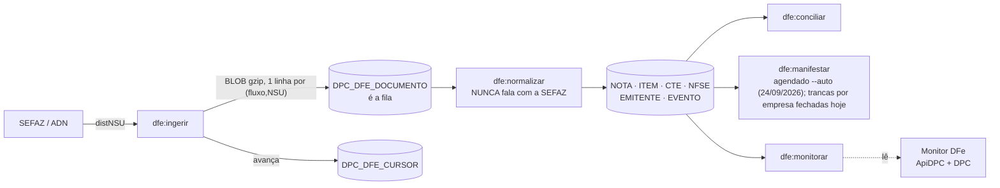

# Conhecimento do motor DFe — documento vivo

> **O que é este documento.** O que se aprendeu construindo e operando o motor
> próprio de captura de documentos fiscais de entrada da ApiNFE — o que
> substitui a Qive. Desenho, decisões, defeitos que já aconteceram e as medições
> que sustentam cada número.
>
> **Como manter.** Toda descoberta nova entra aqui. Defeito corrigido **não sai**
> da tabela da seção 6: o registro do sintoma é o que impede o próximo
> diagnóstico começar do zero. Quando um número for revisado, o antigo fica
> marcado 🔴 em vez de ser apagado.
>
> Complementos: [02_conhecimento-sefaz.md](02_conhecimento-sefaz.md) (o lado do fisco) ·
> [04_dados-tabelas.md](04_dados-tabelas.md) (cada tabela em detalhe) ·
> [06_operacao-comandos.md](06_operacao-comandos.md) (como rodar).

---

## 1. O princípio do desenho, em uma frase

**Na ingestão só pode existir código incapaz de falhar por causa do conteúdo do
documento.**

Isso não é preciosismo: a SEFAZ retém documentos por ~90 dias, então bug de
parser durante a captura significava **documento perdido para sempre**. Separando
em duas etapas, vira `dfe:normalizar --status=E` depois do fix — sem gastar cota.


```mermaid
flowchart LR
    S["SEFAZ / ADN"] -->|"distNSU"| I["dfe:ingerir"]
    I -->|"BLOB gzip, 1 linha por (fluxo,NSU)"| D[("DPC_DFE_DOCUMENTO<br/>é a fila")]
    I -->|"avança"| C[("DPC_DFE_CURSOR")]
    D --> N["dfe:normalizar<br/>NUNCA fala com a SEFAZ"]
    N --> T[("NOTA · ITEM · CTE · NFSE<br/>EMITENTE · EVENTO")]
    T --> K["dfe:conciliar"]
    T --> M["dfe:manifestar<br/>agendado --auto (24/09/2026); trancas por empresa fechadas hoje"]
    T --> V["dfe:monitorar"]
    V -.->|"lê"| TELA["Monitor DFe<br/>ApiDPC + DPC"]
```

| | `dfe:ingerir` | `dfe:normalizar` |
|---|---|---|
| Fala com a SEFAZ | sim | **nunca** — é invariante |
| Lê do XML | só o envelope e os atributos `@NSU`/`@schema` | tudo |
| Se falhar | documento fica `status_process = 'E'`, reprocessável | idem, sem custo de cota |

## 2. A regra de quando consultar a SEFAZ

> Consolidado em **13/09/2026**. Até então esta regra vivia espalhada entre
> comentários de código, o [06_operacao-comandos.md](06_operacao-comandos.md) e
> esta seção, e nenhum dos três tinha a versão inteira.

### 2.1 O princípio

**A SEFAZ trata cada CNPJ de 14 dígitos como uma conta própria** — NT 2014.002
v.1.40, item 3.11.4.1, e medido em 12/09/2026 nos dois eixos (§7). O motor
consulta um fluxo só quando *aquele CNPJ* já cumpriu a espera dele, e um
bloqueio pausa apenas o CNPJ que o tomou.

O certificado não é a unidade de cota. O papel dele é outro, definido pela
rejeição **593**: o CNPJ-base de 8 dígitos do certificado precisa bater com o do
CNPJ consultado. É o que permite o e-CNPJ da matriz atender as 14 filiais.

### 2.2 O ciclo, como está hoje

O cron dispara `dfe:ingerir --agendado` **a cada 15 minutos**.

```
1. FREIO GLOBAL — última barreira
   ≥ dfe_max_bloqueios_dia (10) bloqueios em 24h no sistema todo
   → não consulta nada, sai com código 0
   Pega o defeito SISTEMICO, que nenhum teto individual contém — ver §2.5

2. ELEGÍVEIS
   status operável  E  systimestamp >= dta_liberado_em
   ordenados por atraso decrescente (quem está mais atrás pega o ciclo)

3. PARA CADA FLUXO ELEGÍVEL
   ├ orçamento global esgotado? .......... ORCAMENTO, encerra o ciclo
   ├ mesmo CNPJ já consultado neste ciclo? adia para o próximo ciclo
   ├ FREIO DO CNPJ: ≥ dfe_max_bloqueios_cnpj (6)
   │   bloqueios em 24h DESTE CNPJ? ...... pula este CNPJ, segue nos outros
   ├ JANELA NOTURNA: em dia E entre 22h e 06h?
   │   (exige já ter consultado alguma vez) pula, fica para as 06h
   ├ pausa de dfe_pausa_seg (30s) desde o fluxo anterior
   ├ monta o Tools UMA VEZ por empresa (1 readPfx, não 1 por chamada)
   ├ abre DPC_DFE_EXECUCAO
   │
   └ repete até o teto por empresa (40) ou o fim da fila:
         r = distNSU(cursor)
         grava CADA docZip (upsert por fluxo+NSU)   ← commit por lote
         avança o cursor
         sleep(dfe_pausa_seg)
```

### 2.3 O que cada resposta da SEFAZ produz

| Resposta | Estado | O que o motor faz |
|---|---|---|
| `138` documento localizado | continua | grava o lote e chama de novo — **não há intervalo mínimo** quando vem documento |
| `137`, `ultNSU >= maxNSU` | `EM_DIA` | espera `qtd_min_em_dia` (60 min) — o mínimo que a NT exige |
| `137`, `ultNSU < maxNSU` | `CURSOR_TRAVADO` | **pausa o fluxo** e espera gente |
| `ultNSU <= cursor anterior` | `CURSOR_TRAVADO` | cinto de segurança contra cursor que não anda |
| `656` consumo indevido | `CONSUMO_INDEVIDO` | ver o quadro abaixo |

**No `656`:**

| | |
|---|---|
| Espera de `dfe_min_backoff_656` (60 min, piso normativo) | aplicada **só aos fluxos daquele CNPJ**, dentro do domínio afetado |
| Outros CNPJs | **seguem livres** — desde 13/09/2026 (`agendaEsperaDoCnpj`) |
| NFS-e do mesmo CNPJ | segue livre: é domínio ADN, cota própria |
| Outros tipos do mesmo CNPJ (CT-e, MDF-e) | pausam junto — em 01/09/2026 o CT-e e o NF-e da mesma empresa 30, a 30s, deram 656 |
| O `ultNSU` que a rejeição devolve | **sempre registrado** em `dsc_ultimo_motivo`: confere, diverge, ou não veio |
| O ciclo | **segue nos outros CNPJs** — desde 14/09/2026 |
| Aviso no terminal | a partir de **3 bloqueios seguidos** sem sucesso no meio |

Estados terminais: `EM_DIA` · `ORCAMENTO` · `AGUARDANDO` · `CURSOR_TRAVADO` ·
`CONSUMO_INDEVIDO` · `ERRO_SEFAZ` · `ERRO_BD` · `CERT_INVALIDO` · `ABANDONADA`.

**Três se curam sozinhos** (`EM_DIA`, `ORCAMENTO`, `AGUARDANDO`).
**Dois param e esperam gente, de propósito**: `CURSOR_TRAVADO` e
`CONSUMO_INDEVIDO` — insistir neles reinicia a hora de bloqueio a cada
tentativa, e o fluxo nunca sai sozinho.

### 2.4 ✅ As travas foram estreitadas em 14/09/2026

Até então sobravam duas, herdadas da hipótese — derrubada em 12/09 — de que a
cota era do certificado:

| Trava | O que custava | Situação |
|---|---|---|
| Um fluxo por **raiz de certificado** por ciclo | as 15 empresas dividem a raiz `66471517`, então era **um CNPJ a cada 15 min**: cada filial atendida a cada ~3h45 | ✅ agrupa pelo **CNPJ de 14 dígitos** |
| Um `656` **abortava o ciclo** | os CNPJs seguintes ficavam sem consulta mesmo liberados | ✅ pula só aquele CNPJ |

**O que destravou:** o freio por CNPJ (§2.6), criado no mesmo dia. Sem ele,
estreitar o escopo só espalharia o problema — era a objeção que segurava a
mudança desde 12/09.

**O que forçou a hora:** as empresas 17 (PE) e 20 (GO) saíram da Qive com 29.252
e 12.413 notas de entrada em 90 dias, contra 892 da empresa 29. Com a
serialização por certificado e a ordenação por atraso decrescente, o fluxo em
drenagem venceria **todos** os ciclos, e as empresas 29 e 30 ficariam sem
consultar por dias.

### 2.4.1 A janela noturna

Entrou junto: **fluxo que já está em dia não consulta entre 22h e 06h.**

Medido em regime permanente, de 11 a 13/09/2026:

| Faixa | Execuções | Documentos | Bloqueios |
|---|---|---|---|
| Dia · 06h–22h | 42 | **240** | 5 |
| Madrugada · 22h–06h | 18 | **2** | 1 |

Trinta por cento das execuções para 0,8% dos documentos. **Não é para reduzir
656** — eles se espalham pelo dia, 5 contra 1 no mesmo período. É para cortar
desperdício, e o ganho cresce com o número de CNPJs.

Duas condições, e a segunda não é óbvia: `qtd_atraso` zero **e já ter consultado
alguma vez**. Fluxo recém-cadastrado tem máximo e cursor em zero, então parece em
dia — sem a segunda condição, uma empresa cadastrada à noite só começaria a
drenar às 06h. Fluxo com atraso continua drenando de madrugada: quando vem
documento a SEFAZ não devolve 656.

A regra vale também no `--dry-run`, ao contrário dos freios. Eles são travas de
segurança e faz sentido o dry-run ignorá-las; esta é agendamento, e escondê-la
faria o dry-run mentir sobre o horário.

### 2.5 Por que o freio global existe

Não é pela regra dos "50 bloqueios" — essa **não está na NT**
([02_conhecimento-sefaz.md §3.1](02_conhecimento-sefaz.md)).

É para conter **defeito nosso**. De 28 a 31/08/2026 um bug de fuso fez o cooldown
nunca segurar consulta, e o motor consultou de 15 em 15 minutos dentro da janela
de 1 hora — que é a condição do 656, e cada tentativa **zera o tempo e reinicia
a contagem**. Toda outra camada depende de aritmética de tempo estar correta.
Esta não: ela conta linhas em `DPC_DFE_EXECUCAO`. Foi exatamente uma aritmética
de tempo que falhou.

Por isso ele é **global** mesmo sabendo que a cota é por CNPJ: um defeito nosso
não respeita fronteira de CNPJ.

### 2.6 O freio por CNPJ, e por que os dois existem

Criado em **14/09/2026**, depois de um quase-acidente.

A espera do 656 já era por CNPJ desde 13/09, e funcionou — a empresa 29 atravessou
8 bloqueios da 30 sem perder um ciclo. Mas o *freio* continuava global: a empresa
30 sozinha, capturando **zero documento** em 14 execuções, levou o contador a
**9 de 10**. O décimo teria parado a captura da 29, que na mesma noite fez 15
execuções sem um único bloqueio. Um CNPJ doente ainda derrubava todos — só que
por outra porta.

| | Freio por CNPJ | Freio global |
|---|---|---|
| Parâmetro | `dfe_max_bloqueios_cnpj` = 6 | `dfe_max_bloqueios_dia` = 10 |
| Quando age | **primeiro**, dentro do laço | última barreira, antes do laço |
| O que pega | o CNPJ que gasta cota sem trazer documento | o defeito sistêmico, que atinge todos de uma vez |
| Efeito | pula **aquele** CNPJ; os outros seguem | para a rotina inteira |

**Calibração — a armadilha.** Com N CNPJs ativos, o teto individual permite até
`N × 6` bloqueios antes de o global disparar. Em 14/09/2026 o global subiu de 10
para **20** por causa disso: com 4 CNPJs são 24 possíveis, e em 10 o global
voltaria a ser o que morde primeiro, anulando o freio por CNPJ.

**20 é o máximo que a faixa do código aceita.** Com 14 CNPJs o teto individual
permitiria 84, então antes do corte da Qive **a faixa precisa mudar, não só o
valor** — ou o global vira de novo o gargalo. Recalibrar com a taxa-base medida,
que cada CNPJ ativado ajuda a estimar.

## 3. As 13 tabelas, em uma linha cada

| Tabela | Papel |
|---|---|
| `DPC_DFE_EMPRESA` | identidade fiscal do CNPJ monitorado |
| `DPC_DFE_CURSOR` | **a posição de leitura, por fluxo** — nunca zerar sem intenção |
| `DPC_DFE_DOCUMENTO` | o XML bruto em BLOB gzip, **e a fila** |
| `DPC_DFE_EXECUCAO` | a trilha: um registro por fluxo por ciclo |
| `DPC_DFE_NOTA` | NF-e/NFC-e normalizada |
| `DPC_DFE_NOTA_ITEM` | os itens |
| `DPC_DFE_EMITENTE` | o fornecedor |
| `DPC_DFE_EVENTO` | eventos de NF-e, inclusive órfãos |
| `DPC_DFE_CTE` | o frete |
| `DPC_DFE_CTE_NFE` | quais notas o frete carrega |
| `DPC_DFE_CTE_EVENTO` | eventos de CT-e (entrega, cancelamento) |
| `DPC_DFE_NFSE` | serviço tomado |
| `DPC_DFE_MANIFESTACAO` | o que foi declarado à SEFAZ |

Detalhe de cada coluna: [04_dados-tabelas.md](04_dados-tabelas.md). Contrato para
frontend: [05_dados-consumo-frontend.md](05_dados-consumo-frontend.md).

### Decisões de estrutura que resolvem defeitos por desenho

| Decisão | O defeito que ela elimina |
|---|---|
| UK `(cod_dfe_cursor, nro_nsu)` | reler NSU nunca duplica — idempotência garantida pelo **banco** |
| `DPC_DFE_EVENTO.cod_dfe_nota` **nullable** | evento cuja nota ainda não chegou era **descartado em silêncio** e o NSU avançava: perda definitiva. Agora fica órfão e é religado |
| `dta_liberado_em` como coluna | o cooldown era 60 min hardcoded dentro do SQL, com a política duplicada entre PHP e uma function não versionada |
| `dsc_tipo_doc` na nota | permite promoção resumo → completo; antes a nota ficava eternamente com os dados do resumo |
| UK `(cod_dfe_nota, cod_tipo_evento, nro_seq_evento)` na manifestação | impede manifestar em duplicidade, que é o risco **jurídico**. Ganhou `nro_seq_evento` em 23/09/2026 (`04_01`): sem ela, as conclusivas (que admitem 2 manifestações por nota) não tinham como coexistir com a Ciência na mesma UK |
| BLOB gzip em vez de NCLOB | ~2,3 GB/ano contra ~15 GB/ano (NCLOB usa 2 bytes/caractere) |

## 4. Os parâmetros, e por que saíram do `.env`

Vivem em **`POSEIDON.DPC_PARAMETRO`** desde 02/09/2026 (`3c20e65`).

| Parâmetro | Valor | Faixa | O que é |
|---|---|---|---|
| `dfe_max_consultas` | 200 | 1–5000 | orçamento de `distNSU` por ciclo |
| `dfe_pausa_seg` | 30 | 0–600 | segundos entre chamadas |
| `dfe_max_bloqueios_cnpj` | 6 | 1–20 | **freio por CNPJ** — age primeiro, tira de campo só o CNPJ doente |
| `dfe_max_bloqueios_dia` | **20** | 1–20 | freio **global** — última barreira. No teto da faixa: com mais CNPJs a faixa precisa mudar, não só o valor |
| `dfe_min_backoff_656` | 60 | 60–1440 | espera após bloqueio; piso normativo |

**O motivo da mudança:** `dfe_max_bloqueios_dia` é lido por **dois projetos** — o
freio na ApiNFE e o card "usado / limite" da tela na ApiDPC. Com o valor no
`.env` de cada um, divergiram (10 aqui, 5 lá) e **a tela acusava freio acionado
com o motor operando normal**. Valor que dois projetos leem não pode viver em
dois arquivos.

A tabela **não tem PK nem CHECK**, então a validação vive no
`DpcParametroRepository` (um em cada projeto, lendo a mesma linha): valor não
numérico ou fora de faixa é recusado, cai no default conservador e gera aviso no
`dfe:monitorar` e no log. Configuração ruim nunca derruba a rotina, e também
nunca passa por boa.

As esperas **por fluxo** ficam em `DPC_DFE_CURSOR`, não aqui — `qtd_min_em_dia` e
`qtd_min_entre_consulta`. É proposital: a espera certa depende do serviço. Em
01/09 os fluxos de SEFAZ foram para 120 min enquanto o ADN ficou em 60.

`qtd_min_em_dia` está em **60** na empresa 29 e em **180 no NF-e da empresa 30**,
desde 14/09/2026. Os 60 são o mínimo que a NT exige e a 29 confirmou que basta —
19 execuções limpas, dois intervalos de exatos 60 min inclusive. Chegou a ser
proposto subir para 70 como margem, e a medição desautorizou.

Os 180 da empresa 30 são **contenção, não afinação**. Nas 18 horas seguintes à
mudança A ela produziu **8 bloqueios em 14 execuções e capturou zero documento**,
levando o freio global a **9 de 10** — sozinha, e prestes a parar a captura da
empresa 29, que não tem defeito nenhum. Como ela bloqueia em ~57% das consultas
vazias, reduzir a frequência a um terço reduz a contagem na mesma proporção. Não
resolve a causa, que segue desconhecida: reduz o dano ao orçamento comum.

Quem usa cada um, e quando: [§2](#2-a-regra-de-quando-consultar-a-sefaz).

## 5. Agendamento e infraestrutura

| Item | Estado |
|---|---|
| Agendador | `dfe:ingerir` a cada 15 min, `dfe:normalizar` a cada 10, ambos com `withoutOverlapping` |
| Guard | tudo sob `if (env('RUN_SCHEDULE') == 1)` |
| Trava contra concorrência | `dfe:ingerir` manual se recusa a rodar quando `RUN_SCHEDULE=1` (`--forcar` ignora) |
| Container alpha | `apinfe-app` em `dkalpha00`, cron por supervisor, `RUN_SCHEDULE=1` |
| Base do container | `oracle_tst` → `homolog` / `operconsinco-dpc-bdhomolog01` |
| Ambiente | `TIPO_AMBIENTE=1` com base de teste: fala com a **SEFAZ real**, grava na base de **teste** |
| `dfe:manifestar` | **agendado desde 24/09/2026** (`--evento=210210 --auto --confirmar` nos minutos `7,37`; `--evento=210200 --auto --confirmar` no minuto `22`), sempre com `--auto` e a janela noturna 22h-06h. É agendamento, não automação ligada: as 15 empresas estão com `status_manifestar='N'` e as duas flags de automação (`status_manif_auto_ciencia`, `status_manif_auto_confirmacao`) em `'N'` — o comando roda, encontra zero candidatas e sai |

## 6. Defeitos que já aconteceram — leia antes de diagnosticar

O registro fica aqui inteiro. Cada linha custou horas.

| Sintoma | Causa-raiz | Correção |
|---|---|---|
| 656 recorrente, 5×/dia, "sem defeito nenhum" | **o cooldown nunca segurava consulta.** `DTA_LIBERADO_EM` é `TIMESTAMP(6)` sem fuso; gravar `systimestamp` truncava o offset, mas **comparar** a coluna com `systimestamp` promovia usando o fuso da **sessão** (`+00:00` contra `dbtimezone` São Paulo) → 3h de desvio, e um cooldown de 60 min parecia vencido na hora | `cast(systimestamp as timestamp)` na leitura. `localtimestamp` **não** resolve — devolve hora do fuso da sessão. `19c7b25` |
| Conferência acusava divergência em toda nota | comparava `vNF` com `sum(item.vProd)` — **grandezas diferentes**. `vNF` soma frete, seguro, ST, IPI | passou a comparar `vlr_total_produto` (o `vProd` do `ICMSTot`): 12/12 batem, contra 0/12 antes. `1bdc4a7` |
| "12 religados" e "12 sem documento vinculado" na mesma execução | `religaOrfaos()` contava **linhas tocadas**, não linhas religadas | `EXISTS` no `UPDATE`. Foi imprimir órfãos **ao lado** de religados que expôs isso |
| Execução aberta de 28/08 a 01/09 | um `Ctrl+C` deixava a linha aberta para sempre; nada no sistema fechava — o `dfe:monitorar` só reportava | `fechaAbandonadas()` no início do ciclo + `SIGINT`/`SIGTERM`. Estado novo `ABANDONADA`. `87f2d9f` |
| Dois fluxos da mesma empresa, 656 no segundo | pausa entre fluxos não bastava: a cota é do **certificado** | um fluxo por certificado por ciclo. `d5e76c1` |
| Agendador registrava `FAIL` a cada 15 min com o motor correto | o freio retornava `exit 1` | `exit 0` + `warn`: o freio é **pausa prevista**, não falha. Alarme que soa diariamente ensina o time a ignorar alarme |
| `v10` falhava no DBeaver com `PLS-00103 ... end-of-file` | o arquivo estava em **LF**, e o divisor de statements do DBeaver corta o bloco PL/SQL no `end if;`. **O instalador de produção `01_estrutura` tinha o mesmo problema** | `.gitattributes` com `*.sql text eol=crlf` e geradores escrevendo `newline='\r\n'` |
| Cron parecia ter parado às 14:12 | eu comparava timestamps de São Paulo do log com `date` UTC do shell do container | dois relógios, nenhum defeito |
| 232 `procEvCTe` voltavam a `IGNORADO` | o cron do container rodava **código antigo em paralelo** com o reprocessamento local | os timestamps provaram: local 08:40–09:14, container 09:00–09:01 |
| Rota autenticada da ApiDPC quebrando com `SQLSTATE[08006]` | falta o túnel `ssh -N tunnel-dpc` — parece erro de banco, é de rede | subir o túnel |
| Certificado quebrando com `0308010C` | OpenSSL legado exige **duas** variáveis: `OPENSSL_CONF` **e** `OPENSSL_MODULES` | as duas |
| `php -l` passa e a rota morre em runtime | ApiDPC é **PHP 7.2** mas o `php` do PATH é 8.2: `fn()`, `??=`, `?->`, `match()` passam no lint e derrubam em produção | varrer sintaxe > 7.2 na mão |
| XML de NF-e truncado em 4000 bytes | `DBMS_LOB.SUBSTR` no `SELECT`. O driver `oci8` já converte CLOB → string | ler a coluna direto |
| 51 NF-e canceladas exibidas como **AUTORIZADA** no Monitor | dois defeitos somados. (1) O `procNFe` **rebaixava** a situação: ele é a nota autorizada **mais o protocolo de autorização**, cujo `cStat` é sempre 100 — não tem como saber de cancelamento posterior. O resumo trazia `cSitNFe = 3` (certo) e o completo, chegando depois, devolvia para AUTORIZADA. (2) O evento `110111` **não era aplicado** à nota — CT-e e NFS-e já aplicavam, a NF-e era a única que não | guarda `naoRebaixaSituacao` no `DfeNotaRepository` (irmã da que já existia para tipo de documento) + `cancelaNota()` no `DfeEventoRepository`, espelhando o CT-e. Retroativo em `ajustes_unicos/2026-09-30_cancelamento_nfe`. `07b486e` |
| 1.066 NFS-e autorizadas **sem situação**, 5 válidas como **CANCELADA** e 27 substituídas como **válidas** | dois defeitos. (1) O parser lia o `cStat` da NFS-e como situação (`101/102 → cancelada`, resto nulo), mas ele é o **tipo de emissão**: 107 é MEI, 103 avulsa, 101 a nota substituta. (2) Só o `e101101` cancelava; o `e105102` (cancelamento por substituição) e os outros dois que tornam a nota sem efeito passavam batido. Ver [02 §8](02_conhecimento-sefaz.md) | `cStat` vira `cod_tipo_emissao` e todo código conhecido é autorizada; os 4 eventos de cancelamento em `EVENTOS_NFSE_CANCELAMENTO`; `aplicaEvento` grava `dta_cancelamento` e `chave_nfse_substituta`; guarda no `DfeNfseRepository::salva` que protege cancelamento **com data**. DDL `07_01`, retroativo em `ajustes_unicos/2026-10-02_nfse_reprocessa` (eventos **antes** das notas) |
| Monitor NF-e: clicar em "próxima página" não saía do lugar | a grade era remontada (`:key`) ao fim de **toda** busca. Na paginação as 25 linhas novas entravam no array, mas a tabela renascia em `currentPage = 1` e reexibia as 25 primeiras | remontar só quando o conjunto muda do zero (filtro, busca, ordenação, aba) — aí voltar à página 1 é o certo. `8e5b254a0` |
| Coluna "Sincronização ERP" vazia na planilha exportada | o texto só existia no badge do slot da grade, e a exportação lê `linha[field]` cru | o decorador grava `status_recebimento_br`, como já fazia com `cod_manifestacao_br`. Medido: 0/2.190 → 2.190/2.190. `8e5b254a0` |
| Manifestação manual barrada nas 4 empresas, com **zero** 656 em 24h | `emEspera()` decidia só por `dpc_dfe_cursor.dta_liberado_em`, que a captura escreve em **toda** execução bem-sucedida (cadência de 3/60/180 min) e não só em 656 | exigir as duas coisas: cooldown vigente **e** prova de 656 recente em `dpc_dfe_execucao`/`dpc_dfe_manifestacao`. `fae9db6` |

### Erros de método, não de código

| O que fiz | Por que estava errado |
|---|---|
| Concluí "o scheduler inteiro parou" de **um** snapshot | o `normalizar` estava drenando normalmente |
| Descartei a hipótese de CRLF porque "o `v8` era LF" | eu nunca havia verificado **como** o `v8` foi executado. Não era evidência |
| Escolhi a empresa 1 para o teste de volume por "quem tem backlog" | o critério certo era "quem podemos consultar" — só a empresa 30 está livre da Qive. O teste inteiro foi invalidado |
| Commitei na `alpha` local com 14 commits de atraso | conferir alinhamento com o remoto **antes** de commitar |
| Documentei `DFE_MIN_BACKOFF_656` como variável morta | ela **é** lida no branch de bloqueio. Quem quisesse ajustar seria informado de que não fazia nada |

## 7. Medições

| O que | Número | Quando |
|---|---|---|
| Base normalizada | **18.757 documentos**, todos `C` — 0 pendente, 0 erro, 0 ignorado | 02/09 |
| Conferência de totais | 740 notas, 45.083 itens, **0 divergências** | 01/09 |
| Eventos de CT-e (v10) | 2.853 eventos · **20 CT-e cancelados = R$ 26.796,56** · 936 comprovantes de entrega (225 com recebedor utilizável) | 02/09 |
| Cancelamentos de NFS-e | **R$ 7.450,36** | 02/09 |
| Volume da empresa 30 | ~847 NF-e + ~375 CT-e por dia | 01/09 |
| 656 por serviço | **33 NFE, 0 CTE** — o CT-e teve 32 execuções e 5.031 documentos no período | 02/09 |
| 🔴 Taxa "normal" de 656 | ~2,5/dia por fluxo, e projeção de ~32/dia com 13 CNPJs — **derrubado**: era o cooldown quebrado. Ver [02_conhecimento-sefaz.md §5](02_conhecimento-sefaz.md) | revisto 02/09 |
| Drenagem intensa | **114 consultas seguidas** a 30s de intervalo, 5.611 documentos, **0 bloqueios** — quando vem documento, não há limite de ritmo | 11/09 |
| 656 por CNPJ, mesmo certificado | empresa **29: 0 bloqueios em 20** consultas vazias · empresa **30: 6 em 16**. Mesma configuração, mesma raiz de CNPJ | 12–13/09 |
| Padrão do 656 na empresa 30 | vem sempre depois de **1 ou 2 consultas boas**, nunca mais — parece contador de cota daquele CNPJ. 🟡 hipótese, 6 eventos | 13/09 |
| Madrugada (22h–06h) | **30% das execuções, 0,8% dos documentos** — 18 execuções, 2 documentos | 12–13/09 |
| Indisponibilidade da SEFAZ | `www1.nfe.fazenda.gov.br:443` fora do ar das **01:00 às 05:00**, 8 execuções em `ERRO_SEFAZ`. O motor aplicou cooldown normal, não disparou rajada e não gastou vaga do freio | 13/09 |

## 8. A conciliacao com o ERP

Frente aberta em 02/09/2026, **documentada à parte** enquanto o desenho não
assenta: [14_conciliacao-erp.md](14_conciliacao-erp.md).

Em uma linha: o motor sabe o que existe na SEFAZ, mas não sabe o que já entrou
no ERP — e a entrada não é um evento, é um processo com etapas, cada uma numa
tabela diferente do schema `consinco`. Quando fechar, o que for conhecimento
permanente volta para cá.

---

## 9. Itens abertos

> **Conferido contra o sistema em 30/09/2026.** Item aberto tem viés de
> acumulação: quem resolve não volta para marcar. Nesta passada, **3 dos 9
> abertos estavam desatualizados** — dois deles descreviam o oposto do estado
> real. As linhas 🔴 abaixo são o que caiu.

| Item | Situação |
|---|---|
| **Teste de volume da empresa 30** | 🔴 **a premissa caiu.** O texto anterior dizia que "os fluxos NFE e CTE seguem pausados, o que *preserva* o cenário". Medido em 30/09: os **4 fluxos da 30 estão ATIVOS** (`status_sincronismo = A`), consultando normalmente. O cenário de 02/09 não existe mais — o teste, se voltar, começa de outro ponto de partida. A empresa 30 ficou ativa junto com a 29 desde 12/09 para o experimento do eixo da cota |
| ~~Freio por fluxo × global~~ | ✅ **decidido em 12-13/09/2026.** O freio global **fica**, com a justificativa corrigida ([§2.5](#25-por-que-o-freio-global-existe)): contém defeito nosso, não a regra dos "50 bloqueios" — que não está na NT. Ganhou um contador de **consecutivos** como indicador, avisando a partir de 3 |
| ~~Estreitar `chaveDeCota` e o `break` do 656~~ | ✅ **feito em 14/09/2026.** O freio por CNPJ removeu a objeção, e as empresas 17 e 20 — 33× e 14× maiores que as anteriores — tornaram a starvation concreta. Ver [§2.4](#24--as-travas-foram-estreitadas-em-14092026) |
| ~~Janela noturna~~ | ✅ **feita junto**, com a ressalva de exigir que o fluxo já tenha consultado alguma vez |
| **Faixa do `dfe_max_bloqueios_dia`** | 🔶 o global está em 20, o teto da faixa. Com 14 CNPJs e teto individual de 6, não fecha — a faixa do código precisa subir antes do corte da Qive |
| **Por que a empresa 30 bloqueia** | 🔵 **contido e sem recorrência há 14 dias, mas a causa segue desconhecida.** Em 12–14/09/2026 somou 14 bloqueios em 30 consultas vazias, contra 0 de 34 da empresa 29 — mesmo certificado, mesma configuração. Contido em 14/09 subindo o `qtd_min_em_dia` dela para 180. Medido em 30/09: **0 bloqueios em 284 execuções** nos últimos 14 dias — e 0 também nas outras três (17, 20, 29), somando 1.342 execuções limpas. ⚠️ Isso **não** responde a pergunta: a 30 continua estrangulada em 180 min enquanto as outras estão em 60, então o teste nunca foi pareado. Só soltar o `qtd_min_em_dia` dela decide |
| **Freio global × cota por CNPJ** | 🔶 **inconsistência exposta em 14/09.** O cooldown virou por CNPJ, mas o freio segue global — então um CNPJ doente ainda derruba todos, por outra porta. A 30 sozinha levou o freio a 9 de 10. Um freio por CNPJ com um teto global mais alto por cima resolveria; decidir junto com a [§2.4](#24--as-duas-travas-que-sobraram-e-o-que-as-segura) |
| ~~Chave de NFS-e truncada~~ | ✅ **fechado.** Conferido em 03/09/2026: `DPC_DFE_DOCUMENTO.CHAVE_NF` e `DPC_DFE_NFSE.CHAVE_NFSE` são `VARCHAR2(50)`, e as 37 NFS-e têm chave de 50 caracteres. As colunas de 44 que restam guardam chave de NF-e e CT-e, que têm 44 mesmo |
| **CNPJs ociosos** | ~~empresa 900~~ saiu da base com a limpeza da ALL CARS. ~~O fenômeno persiste na empresa 30~~ — sem recorrência desde 14/09, ver a linha acima |
| **MDF-e** | ⬜ o parser **continua não existindo**, mas o resto da linha caiu: não são "14 fluxos pausados" e sim **11 pausados / 4 ativos** (17, 20, 29, 30). Os 4 ativos capturam normalmente e o material se acumula sem leitura — medido em 30/09: **3.405 `procEvMDF` + 3.402 `procMDFe`, todos `status_process = I`**, com entrada até o dia de hoje. É o maior acervo parado do módulo. **Decisão de 30/09: deixar ligado** — ver [§9.1](#91-mdf-e-20-da-cota-para-nada-e-por-que-fica-assim) |
| **`dfe:manifestar`** | 🔴 **"nada manifesta sozinho hoje" está errado desde 21/09/2026.** A Ciência automática está **ligada nas 4 empresas** (`status_manif_auto_ciencia = 'S'`) e o motor enviou **401 manifestações em 14 dias** — 387 Ciências aceitas (cStat 135), 11 duplicadas (573) e 3 Confirmações aceitas; a última hoje às 18:07. São atos fiscais reais e irreversíveis. O que **de fato** segue fechado é só a **Confirmação automática**: `status_manif_auto_confirmacao = 'N'` nas 4 e `dta_inicio_manif_auto_conf` nulo (dupla trava) — as 3 Confirmações enviadas foram manuais. Ver [06_operacao-comandos.md](06_operacao-comandos.md) |
| **Corte da Qive** | 🔴 **a linha anterior desta tabela estava errada — corrigido em 23/09/2026.** Nenhum dos quatro CNPJs (17, 20, 29, 30) é livre da Qive; só a empresa **900** (ALL CARS, nem cadastrada na Qive) está fora. 17/20/29/30 seguem todos na Qive hoje, e um 656 neles é **consumo em paralelo esperado**, não anomalia — o NSU é por CNPJ e compartilhado entre quem consulta. A migração real exige um corte seco por CNPJ (parar a Qive naquele CNPJ, então ativar o motor), não convivência. Ver `12_sefaz-656-consumo-indevido.md` |
| **Parâmetros em produção** | ✔️ **confirmado em 30/09/2026, e já não são 6.** `POSEIDON.DPC_PARAMETRO` de prd (`dpcdb2`) segue com **0** parâmetros `dfe_*`; homolog hoje tem **10** — a manifestação acrescentou 4 (`dfe_manifest_max_ciclo`, `dfe_manifest_max_lote`, `dfe_manifest_pausa_seg`, `dfe_max_bloqueios_manifest`). Como o motor passou a viver só em teste (decisão de 09/09/2026), isto só volta a importar se prd voltar a rodar captura. **Atenção:** as explicações de `dfe_max_bloqueios_dia` e `dfe_min_backoff_656` foram reescritas em 12/09 e o script usa `where not exists` — em base que já tem as linhas, o texto velho permanece |
| **`pecl` pinado** | `redis-6.0.2`, `oci8-3.4.0`, `memcached-3.2.0` — qualquer rebuild da imagem falha |

### 9.1 MDF-e: 20% da cota para nada, e por que fica assim

🔵 **Medido em 30/09/2026.** `NFE`, `CTE` e `MDFE` **dividem a mesma cota** —
confirmado no código, não deduzido: `DpcDfeCursor::DOMINIO_COTA` mapeia os três
para `'SEFAZ'` e só `NFSE` para `'ADN'`. São três web services distintos
(`sped-nfe`, `sped-cte`, `sped-mdfe`), cada um com NSU próprio, e é por isso que
os cursores da mesma empresa divergem tanto (9.033 no CTE contra 23.582 no NFE
da empresa 30).

Execuções nos últimos 14 dias:

| Fluxo | Execuções | Documentos | Aproveitados |
|---|---|---|---|
| `NFE` | 531 | 305.048 | sim |
| `CTE` | 255 | 89.946 | sim |
| **`MDFE`** | **200** | **6.807** | **nenhum** |
| `NFSE` | 363 | 10.365 | sim — cota separada (ADN) |

**200 de 986 execuções da cota SEFAZ são MDF-e**, ou seja ~20%. E como o motor
serializa um fluxo por cota por ciclo, cada ciclo que o MDF-e toma é um ciclo
em que NF-e e CT-e esperam.

**Decisão: deixar ligado.** Três razões, nesta ordem:

1. **Não há pressão de cota hoje.** 0 bloqueios 656 em 14 dias nas 4 empresas.
   Os 20% custam folga, não custam documento.
2. **Desligar perde documento de verdade.** A SEFAZ retém ~90 dias; o XML bruto
   fica em `bin_documento` e é reprocessável. Foi assim que os 3.085
   `procEvCTe` esperaram semanas por um parser e depois revelaram **20 CT-e
   cancelados somando R$ 26.796,56** que passavam por válidos. Desligar troca
   "acervo parado" por buraco permanente.
3. **A reavaliação tem data marcada.** O corte da Qive soma carga na mesma
   cota. Se apertar ali, o MDF-e é o primeiro candidato a sair — e nesse
   momento a decisão tem contrapartida, que hoje não tem.

O meio-termo que **não** se recomenda é escrever o parser agora: 6.807
documentos parados não fazem falta a ninguém hoje, e o corte da Qive está na
frente.

### O teste de volume — o cenário se desfez sozinho

🔴 **Esta seção descrevia um cenário que não existe mais.** Ela dizia que "os
dois fluxos continuam pausados e o atraso continua crescendo, que é exatamente
o cenário que o teste quer medir". Conferido em 30/09/2026: os fluxos foram
**reativados** (junto com a empresa 29, para o experimento do eixo da cota, a
partir de 12/09) e **o atraso foi drenado até zero**.

| Fluxo da empresa 30 | Parado em 02/09 | Hoje (30/09) | Atraso |
|---|---|---|---|
| `NFE` | 18.698 | 23.582 | **0** |
| `CTE` | 7.150 | 9.033 | **0** |

Os dois estão `A` (ativos), consultando normalmente — o `NFE` às 16:00 e o
`CTE` às 19:01 de hoje.

**O relógio dos 90 dias deixou de correr**, que era o risco real registrado
aqui: nada saiu da janela de retenção da SEFAZ por abandono.

**E a pergunta do teste ficou meio respondida, por acidente.** Queria-se saber
se drenar ~850 NF-e + ~375 CT-e de atraso de uma vez provocaria 656. A drenagem
aconteceu — e a empresa 30 fechou **0 bloqueios em 284 execuções** nos últimos
14 dias. Mas **não vale como o teste**: ela continua com `qtd_min_em_dia = 180`
no fluxo NFE (a contenção de 14/09), ou seja, drenou devagar, que é o oposto do
"de uma vez" que o teste queria medir.

O `update` de `dsc_ultimo_motivo` que ficava pendente aqui **não é mais
necessário**: os cursores já gravaram motivo novo nas consultas reais
("Documento(s) localizado(s)" no NFE, "Nenhum documento localizado." no CTE).

---

Voltar ao [índice](readme.md) · SEFAZ: [02_conhecimento-sefaz.md](02_conhecimento-sefaz.md)
