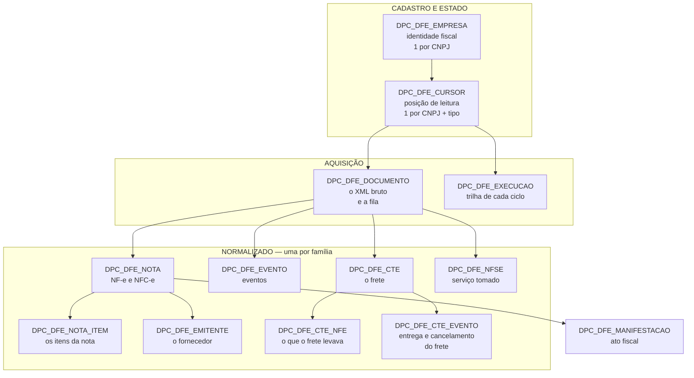

# Tabelas do módulo DFe — para que serve cada uma

> **Atualizado em 02/09/2026.** As **13 tabelas** criadas por [`scripts/01_estrutura_dbeaver.sql`](../scripts/01_estrutura_dbeaver.sql), no schema `POSEIDON`.

Este documento responde **o que cada tabela é e por que existe separada**. Para coluna a coluna, com queries e armadilhas de tela, ver [05_dados-consumo-frontend.md](05_dados-consumo-frontend.md). Para operar, [06_operacao-comandos.md](06_operacao-comandos.md).

## O mapa

| Grupo | Tabelas | Existe para |
|---|---|---|
| Cadastro e estado | `EMPRESA` · `CURSOR` | saber **quem** monitorar e **de onde** continuar |
| Aquisição | `DOCUMENTO` · `EXECUCAO` | guardar o documento **antes** de entendê-lo, e registrar o que a rotina fez |
| Normalizado | `NOTA` · `NOTA_ITEM` · `EMITENTE` · `EVENTO` · `CTE` · `CTE_NFE` · `CTE_EVENTO` · `NFSE` | o dado consultável, uma tabela por família |
| Ato fiscal | `MANIFESTACAO` | registrar o que foi declarado à SEFAZ |

---

## Cadastro e estado

### `DPC_DFE_EMPRESA` — identidade fiscal

**Uma linha por CNPJ monitorado.** Guarda razão social, CNPJ, UF e inscrição estadual — exatamente os campos que o `sped` precisa para montar o `configJson` da comunicação.

**Por que não lê isso do ERP:** lia, e custou dois diagnósticos difíceis. `GeEmpresa::showAll` faz `INNER JOIN` com `consinco.ge_cidade`, então uma linha com `seqcidade` nulo **desaparecia do resultado** e o erro dizia *"empresa não encontrada"* com a linha existindo. E `montacpfcnpj` não é formatador: consulta `consinco.ge_pessoa` e devolve `NULL` em silêncio via `NO_DATA_FOUND`, reprovando o CNPJ na validação.

A identidade passou a ser nossa. Efeito colateral bom: cadastrar um CNPJ saiu de 4 inserts para 1.

> `nro_empresa` é o identificador do **cofre de certificados** (`dpc_conta_certif_digital_emp.cod_empresa`). **Não** é chave para o Consinco.

**Escala:** 13 linhas em produção. Não cresce.

### `DPC_DFE_CURSOR` — a posição de leitura

**Uma linha por CNPJ *e tipo de documento*.** Guarda onde a leitura parou, o estado do fluxo (`A` ativo · `P` pausado · `B` bloqueado · `C` certificado inválido) e o cooldown.

**Por que é separada da empresa:** os quatro serviços têm sequências de NSU **independentes** para o mesmo CNPJ. Uma coluna só de cursor na tabela de empresa não conseguiria guardar quatro posições.

**Esta é a tabela mais sensível do módulo.** `nro_ultimo_nsu` é um **token** que a fonte devolve e que só pode ser *continuado* — e **nem a SEFAZ nem o ADN guardam a posição de leitura**. Ela existe somente aqui. Perder essa coluna não tem reconstrução; enviar valor arbitrário retorna `cStat 656` e bloqueia o certificado por 1 hora, atingindo todas as filiais que compartilham o e-CNPJ da matriz.

Por isso `avancaCursor` usa `greatest()`: **retroceder é impossível por construção**, não por disciplina de quem chama.

> `nro_maximo_nsu` pode ser 0 legitimamente. A SEFAZ informa o total; o **ADN não**. Nesse caso o atraso é **desconhecido, não zero** — nunca calcule `maximo - ultimo` sem checar `maximo >= ultimo`.

**Escala:** 52 linhas em produção (13 × 4). Não cresce.

---

## Aquisição

### `DPC_DFE_DOCUMENTO` — o XML bruto, **e a fila**

**Uma linha imutável por (fluxo, NSU).** Guarda o `docZip` como a fonte entregou — **gzip, não texto** — em `BLOB`.

Acumula dois papéis de propósito:

1. **O acervo.** É o documento fiscal original, com guarda legal de **11 anos** (Ajuste SINIEF 2/2025, que ampliou de 5).
2. **A fila de trabalho.** `status_process` (`P` pendente · `A` andamento · `C` concluído · `E` erro · `I` ignorado) faz dela uma fila durável, consultável em SQL e reprocessável por filtro. Não precisa de broker.

**Por que existe antes de qualquer interpretação:** a SEFAZ retém por 90 dias. Se o parser falhar e o documento não tiver sido guardado, a perda é **definitiva** — há prova disso no próprio banco, nos cursores da rotina antiga parados em 2019. Com esta tabela, bug de parser vira `dfe:normalizar --status=E` depois da correção.

> A UK é `(cod_dfe_cursor, nro_nsu)`, **não** `(empresa, nsu)`. O NSU é sequencial **por fluxo**: o NSU 100 da NF-e e o NSU 100 do CT-e são documentos diferentes. Com a UK antiga eles colidiriam, e a unique que protege contra duplicidade viraria **perda**.

> `chave_nf` tem **50** caracteres, não 44 — a chave de NFS-e tem 50. `VARCHAR2(44)` truncaria em silêncio.

**Escala:** é a tabela que cresce. ~2,3 GB/ano em gzip para o corpus completo de NF-e; dimensione para ~25 GB pelos 11 anos de guarda.

### `DPC_DFE_EXECUCAO` — a trilha

**Uma linha por ciclo, por fluxo.** Registra início e fim, faixa de NSU percorrida, contadores e o **`cod_resultado`** — que é a primeira coisa a olhar quando algo parece errado:

| `cod_resultado` | |
|---|---|
| `EM_DIA` | não há mais nada a buscar |
| `ORCAMENTO` | acabou o orçamento do ciclo |
| `AGUARDANDO` | ainda em cooldown |
| `CURSOR_TRAVADO` | fonte não avançou; **fluxo pausado** |
| `CONSUMO_INDEVIDO` | `cStat 656` |
| `ERRO_SEFAZ` · `ERRO_BD` · `CERT_INVALIDO` | ver `dsc_resultado` |

**Por que não é só log em arquivo:** o freio de emergência **consulta esta tabela**. Ele conta bloqueios por consumo indevido nas últimas 24h e para a rotina em 5 — porque 50 bloqueios consecutivos podem virar bloqueio permanente. Log em arquivo não serve de base para uma decisão automática.

**Escala:** ~96 linhas/dia com 52 fluxos ativos a cada 15 min. Vale política de expurgo depois de alguns meses.

---

## Normalizado — uma tabela por família

Os campos não se sobrepõem: NF-e tem emitente/destinatário e valor de mercadoria; CT-e tem **cinco papéis** e quem paga é o tomador; NFS-e tem prestador/tomador, ISSQN com alíquota e um município de incidência.

Tabela única ficaria quase toda nula, nenhum `not null` seria possível, nenhum índice seria seletivo, e toda consulta precisaria do discriminador de tipo. Em compensação, as três usam os **mesmos nomes** para o que é comum — `nro_nsu`, `cod_situacao`/`dsc_situacao`, `sig_papel_empresa`, auditoria — o que as mantém unionáveis por view quando a tela precisar de caixa de entrada única.

### `DPC_DFE_NOTA` — NF-e e NFC-e

**Uma linha por (empresa, chave).** A empresa entra na chave de dedup porque a mesma nota pode interessar a mais de um estabelecimento.

**A coluna que muda o comportamento da tela é `dsc_tipo_doc`:** `resNFe` significa que só o **resumo** chegou; `procNF` é o XML completo. Quando o completo chega depois, a **mesma linha** é atualizada — é a *promoção*. Sem isso, a nota ficaria eternamente com os dados do resumo, que foi o defeito da rotina antiga.

**`sig_papel_empresa` é o que permite recortar o acervo por papel.** O `NFeDistribuicaoDFe` entrega toda NF-e em que o CNPJ apareça — em **qualquer** papel — e sem essa coluna não há como separar as quatro visões que a tela precisa:

| Valor | Aba | De onde vem |
|---|---|---|
| `DEST` | Recebidas | `dest/CNPJ` |
| `EMIT` | Emitidas | `emit/CNPJ` |
| `TRANSP` | Transporte | `transp/transporta/CNPJ` |
| `AUTXML` | Citadas | `autXML/CNPJ` (lista, até 10) |
| `OUTRO` | — | XML completo lido, CNPJ em nenhum papel conhecido |
| `INDEF` | — | o documento **não permite saber** |

> **`INDEF` e `OUTRO` não são a mesma coisa, e confundi-los quebra a tela.** O `resNFe` tem **546 bytes** e doze tags — não tem `dest`, não tem `transp`, não tem `autXML`. O único CNPJ ali é o do **emitente**. Então nota que só tem resumo é `INDEF`: sabe-se apenas que não somos o emitente. Isso é **temporário** — o XML completo resolve. `OUTRO` é **definitivo**: a informação existia e foi olhada.
>
> E o resumo chega **primeiro**, às vezes dias antes do completo, às vezes o completo nunca chega. `INDEF` será comum. Uma tela que o trate como "não é nossa" esconde nota que é.

Precedência no preenchimento: `dest → emit → transp → autXML`. Uma nota pode ter a empresa em mais de um papel — destinatária **e** autorizada a baixar — e `DEST` vence porque o caso de uso do módulo é a nota recebida.

> Garantia do código, não da sorte: quando o resumo é reprocessado sobre nota que já é completa, o anti-rebaixamento devolve `IGNORADA` e **não escreve** — então `DEST` não é sobrescrito por `INDEF`, qualquer que seja a ordem do reprocessamento.

Tem as quatro colunas de **conciliação com o ERP** (`status_recebimento`, `seq_nf_erp`, `dta_entrada_erp`, `dta_conciliacao`) porque NF-e é a única família que o ERP também registra. `dta_entrada_erp - dta_emissao` é o **atraso de lançamento**, a métrica que a contabilidade quer.

> `seq_nf_erp` guarda **`SEQNF`**, não `SEQNOTAFISCAL` — conferido em dado real que `SEQNOTAFISCAL` vem nulo. E é **referência**, não chave: a PK de `mlf_notafiscal` é composta.

### `DPC_DFE_NOTA_ITEM` — os itens da nota

**Uma linha por (nota, `nro_item`).** É o detalhe da mercadoria: código e descrição do fornecedor, NCM, CFOP, quantidade, valor unitário, e os impostos do item — ICMS, ICMS-ST, IPI, PIS, COFINS e **IBS/CBS**.

**Uma nota pode não ter item, e isso não é erro.** Só o `procNFe` traz `<det>`. O `resNFe` é o **resumo** — chega antes, às vezes dias antes, e não tem itens. Enquanto só o resumo tiver chegado, a nota existe em `DPC_DFE_NOTA` sem nenhuma linha aqui. Quando o completo chega, a nota é promovida e os itens entram. O que distingue os dois casos é `dpc_dfe_nota.dsc_tipo_doc`.

**Os itens são extraídos do XML já gravado**, na normalização — a ingestão não olha conteúdo. Isso tem consequência prática: acrescentar campo de item, ou corrigir a extração, **não exige consultar a SEFAZ de novo**. É `dfe:normalizar` sobre o acervo, sem gastar cota e sem depender da janela de 90 dias.

**Substitui, não atualiza.** O XML traz o conjunto completo, e o número de itens pode mudar entre duas versões do mesmo documento. Upsert item a item deixaria órfão o item que existia antes e não existe mais — então reprocessar apaga os itens daquela nota e regrava todos, **numa transação**. É a única transação do módulo, e existe porque entre o delete e o último insert a nota fica com menos itens do que tinha: uma queda ali destruiria o que estava correto, e o próximo ciclo não repararia (o documento já está marcado como concluído).

#### Quatro coisas que o dado real mostrou e o layout não deixa óbvias

Projetada sobre **833 itens** do acervo capturado, não sobre a especificação lida de fora:

| O que aparece | Por que importa na modelagem |
|---|---|
| **O subgrupo de imposto varia por item** — no mesmo acervo houve `ICMS00`, `ICMS40`, `ICMS60`, `ICMS61`, `ICMSSN102`; `PISAliq`, `PISNT`, `PISOutr`; `IPINT`, `IPITrib` | não há coluna por subgrupo: há coluna por **fato** (CST, base, alíquota, valor), e a extração busca a tag dentro do grupo |
| **`ICMS60` não tem `vBC` nem `vICMS`** — tem `vBCSTRet`/`vICMSSTRet` | as colunas de ST guardam os **dois nomes** que o XML usa para o mesmo fato. Ler só `vBC` deixaria itens com ICMS nulo sem motivo aparente |
| **IBS/CBS já chega hoje** — 826 dos 833 itens trazem o CST do grupo `IBSCBS` | a reforma tributária não é campo para depois. Deixar de fora seria criar lacuna conhecida |
| **`cEAN` vem a string `SEM GTIN`** quando o produto não tem código de barras | é **texto**, nunca número. Tratar como numérico zeraria o campo |

E uma quinta, de precisão: `vUnCom` usa **até 10 decimais** no dado real (`6.4580725910`). A coluna é `NUMBER` sem escala definida de propósito — fixar escala arredondaria, e a conferência de total deixaria de fechar.

#### Duas armadilhas para quem for consultar

**`status_compoe_total` (o `indTot`).** O layout admite item que **não** entra no total da nota. Somar `vlr_produto` sem filtrar por `'1'` pode não fechar com `dpc_dfe_nota.vlr_nota`.

**`cod_produto` é o código do fornecedor, não o nosso.** Não serve de chave para o ERP. Para casar com o cadastro da DPC, o caminho é NCM + descrição, ou o EAN quando existir.

> Vale a conferência que compara **dois caminhos independentes do mesmo XML**: o `ICMSTot`, que virou `dpc_dfe_nota.vlr_nota`, contra a soma dos `<det>`. Divergência aí aponta extração incompleta — é a única verificação do módulo com essa propriedade. Está pronta em `DfeNotaItemRepository::divergenciaDeTotal()`.

**Escala:** a maior nota do acervo tem **300 itens**; a média é ~44. É a tabela que mais cresce depois de `dpc_dfe_documento`.

> **Como criar:** instalação nova já vem com ela no [`01_estrutura_dbeaver.sql`](../scripts/01_estrutura_dbeaver.sql). Base **já instalada** roda a seção 1 de [`alteracoes/atualizacao_v7_a_v10_dbeaver.sql`](../scripts/alteracoes/atualizacao_v7_a_v10_dbeaver.sql), e depois um `dfe:normalizar` popula o acervo já capturado — sem nenhuma chamada à SEFAZ.

### `DPC_DFE_EMITENTE` — o fornecedor

**Uma linha por CNPJ/CPF**, deduplicada. Existe para a razão social do fornecedor não ser repetida em cada nota, e para a tela filtrar por fornecedor sem varrer `dpc_dfe_nota`.

**Por que é tabela e não coluna:** a estrutura equivalente da rotina antiga **não tinha índice** no CPF/CNPJ, e a aplicação usava esse campo como chave de `UPDATE` — full scan a cada gravação, com risco de atingir múltiplas linhas. Aqui é `UK`.

Só serve NF-e. Transportadora e prestador de serviço ficam na própria linha do CT-e e da NFS-e — misturar tornaria esta tabela ambígua.

### `DPC_DFE_EVENTO` — eventos

**Uma linha por (chave, tipo de evento, sequência).** Ciência, confirmação, cancelamento, carta de correção, MDF-e autorizado.

**`cod_dfe_nota` é NULLABLE, e isso é o ponto da tabela.** Na rotina antiga, evento cuja nota ainda não estava na base era **descartado em silêncio** e o NSU avançava — perda definitiva. Aqui o evento é gravado como órfão e religado quando a nota aparecer.

> **Órfão não é "aguardando a nota".** O `NFeDistribuicaoDFe` entrega documentos *de interesse*, o que inclui eventos de notas que a **própria empresa emitiu** — essas vivem no ERP e **nunca** vão religar. Verificado em dois CNPJs: todos os 100 eventos capturados tinham o CNPJ da própria empresa dentro da `chave_nf`. Separe por `substr(chave_nf, 7, 14)`.

### `DPC_DFE_CTE` — o frete

**Uma linha por (empresa, chave).** O CT-e não tem "emitente e destinatário": tem **cinco papéis** — remetente, expedidor, recebedor, destinatário, emitente — e quem paga é o **tomador**.

Os cinco CNPJs ficam na própria linha, sem tabela de partes: a transportadora aparece como emitente aqui e nunca como fornecedora de mercadoria.

**`sig_papel_empresa` é a coluna que a tela vai usar.** `cod_tomador` diz qual *papel* paga, não se somos nós — cruzar os cinco CNPJs no frontend seria refazer um trabalho que a gravação já fez. `TOMA` = frete que a DPC contratou.

> Os valores possíveis são `REM`, `EXPED`, `RECEB`, `DEST`, `TOMA` e `OUTRO` — **não existe `EMIT`**. Quando a própria DPC emite o CT-e (a empresa 3 é transportadora), o CNPJ não aparece em nenhum dos quatro papéis que o parser lê, e a linha fica `OUTRO`. Hoje `OUTRO` mistura "frete que emitimos" com "aparecemos por outro motivo"; para separar, compare `num_cnpj_emitente`.

Sem colunas de conciliação: CT-e não entra em `mlf_notafiscal`.

### `DPC_DFE_CTE_NFE` — o que o frete levava

**Uma linha por (CT-e, chave de NF-e).** É o elo entre frete e mercadoria, e **a razão de existir da captura de CT-e**: responde *"o que estava neste caminhão"* e *"quanto custou trazer esta nota"*.

Só o `procCTe` traz as chaves — o `resCTe` não tem a lista.

> A junção com `dpc_dfe_nota` é sempre `LEFT JOIN`: a nota transportada pode não estar na base (de terceiro, ou emitida fora da janela de retenção).

### `DPC_DFE_CTE_EVENTO` — entrega e cancelamento do frete

**Uma linha por (CT-e, tipo de evento, sequência).** Criada em 02/09/2026 pelo
`v10`, e o que ela trouxe ao ser ligada diz por que ela precisava existir:
**2.853 eventos**, **936 comprovantes de entrega** e **20 CT-e cancelados
totalizando R$ 26.796,56** que até então passavam por válidos na base.

Antes dela, todo `procEvCTe` que chegava era marcado `IGNORADO` — 3.085
documentos parados, e um frete cancelado continuava indistinguível de um frete
devido.

| Coluna | Para que |
|---|---|
| `cod_tipo_evento` | `110111` cancelamento · `110180` comprovante de entrega · `110181` cancelamento do comprovante · `110110` carta de correção · `310610`/`310611` CT-e autorizado/cancelado em MDF-e |
| `dta_entrega`, `num_doc_recebedor`, `dsc_nome_recebedor`, `dsc_hash_entrega` | o comprovante de entrega. **Todos os 936 têm data; só 225 têm nome de recebedor utilizável** — quem for montar tela conta com a data, não com o nome |
| `chave_mdfe` | o MDF-e que autorizou o CT-e, nos eventos `3106xx` |
| `cod_dfe_cte` | **nulável**: evento cujo CT-e ainda não chegou fica órfão e é religado depois, pela `chave_cte` |

O cancelamento (`110111`) escreve `cod_situacao = 3` na `DPC_DFE_CTE`, com
`WHERE` idempotente — reprocessar o mesmo evento não muda nada.

> **Armadilha do layout:** no `procEvCTe` a tag `nProt` aparece **duas vezes**, em
> níveis diferentes. A leitura tem de ser escopada ao nó do evento, senão grava o
> protocolo errado.

### `DPC_DFE_NFSE` — serviço tomado

**Uma linha por (empresa, chave).** Prestador, tomador, ISSQN com base/alíquota/retenção, e o **município de incidência**, que nem sempre é o do prestador — é ele que define para onde vai o ISSQN.

**Duas coisas que surpreendem:**

`chave_nfse` tem **50** caracteres. E há **dois blocos de valor**: `vlr_servico` é o bruto da prestação; `vlr_base_calculo`/`pct_aliquota`/`vlr_issqn`/`vlr_retido`/`vlr_liquido` são o apurado. Não são o mesmo número, e a tela precisa mostrar bruto → retenções → líquido, senão o valor exibido não fecha com o pagamento.

**Não tem colunas de conciliação, e isso muda o peso da tabela.** Verificado no banco: a DPC **não registra NFS-e recebida** no ERP — nem em `mlf_notafiscal`, nem no módulo MRL. Confirmado pela área: *"só olhamos na Qive"*. Não há com o que conciliar, e **esta tabela passa a ser o registro**, não uma cópia dele. É a única das três em que um erro nosso não tem segunda fonte para aparecer.

> Filtre por `dta_competencia`, não por `dta_processamento`: o ADN pode entregar hoje uma nota de competência de anos atrás. Ele **guarda histórico**, ao contrário dos 90 dias da SEFAZ.

---

## Ato fiscal

### `DPC_DFE_MANIFESTACAO` — o que foi declarado à SEFAZ

**Uma linha por (nota, tipo de evento).** Registra o envio, o retorno, o protocolo, as tentativas e o XML de resposta.

**A UK `(cod_dfe_nota, cod_tipo_evento)` é a razão principal da tabela existir separada:** ela **impede manifestar em duplicidade**. Manifestação é ato fiscal com efeito jurídico, e o banco é a última barreira — a primeira é a flag `--confirmar`, que depende de alguém lembrar. A UK não depende de ninguém.

Nasce vazia e **continua vazia** até a contabilidade validar: o `dfe:manifestar` não é agendado e sem `--confirmar` nada é enviado.

---

## Estado em homologação (20/08/2026)

| Tabela | Linhas | |
|---|---|---|
| `dpc_dfe_documento` | 255 | o acervo bruto |
| `dpc_dfe_evento` | 128 | 118 órfãos, quase todos de nota própria |
| `dpc_dfe_cursor` | 56 | 14 empresas × 4 tipos |
| `dpc_dfe_nfse` | 37 | ALL CARS + empresa 30 |
| `dpc_dfe_cte` | 30 | |
| `dpc_dfe_cte_nfe` | 30 | notas transportadas |
| `dpc_dfe_nota` | 19 | |
| `dpc_dfe_nota_item` | 0 | tabela nova; o acervo tem **833 itens** esperando o primeiro `dfe:normalizar` |
| `dpc_dfe_empresa` | 14 | inclui a ALL CARS de teste |
| `dpc_dfe_execucao` | 14 | |
| `dpc_dfe_emitente` | 9 | |
| `dpc_dfe_manifestacao` | 0 | nunca enviado, por decisão |

Note que `cte` e `cte_nfe` têm o mesmo número por coincidência da massa: cada CT-e capturado trouxe exatamente uma nota. Não é regra — um CT-e pode carregar dezenas.

---

## Uma pergunta que a estrutura responde de propósito

**Por que 13 tabelas e não 5?** Cada separação paga uma dívida concreta da rotina anterior:

| Separação | O que evita |
|---|---|
| `EMPRESA` ≠ `CURSOR` | quatro sequências de NSU não caberem numa coluna só |
| bruto ≠ normalizado | bug de parser virar perda definitiva de documento |
| `EVENTO` com FK nullable | evento de nota ausente ser descartado em silêncio |
| `EMITENTE` com UK | `UPDATE` por campo sem índice, em full scan |
| uma tabela por família | tabela majoritariamente nula, sem índice seletivo |
| `NOTA_ITEM` separada, com UK `(nota, item)` | item duplicado a cada reprocessamento, e item órfão quando o documento muda de versão |
| `MANIFESTACAO` com UK | manifestar em duplicidade — risco jurídico |
| `EXECUCAO` em tabela | o freio de emergência não teria como decidir |
