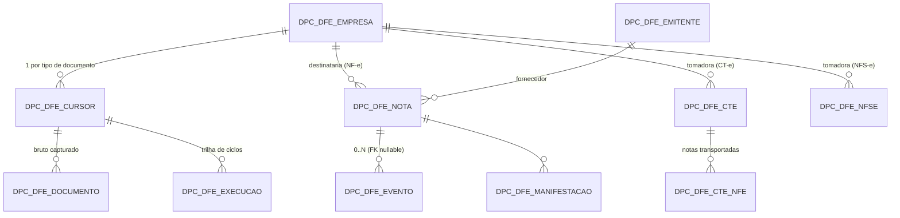

# Modelo de dados — documento fiscal de entrada (módulo DFe) · referência para frontend

> **Atualizado em 20/08/2026.** Cobre as **três famílias** hoje normalizadas — NF-e, CT-e e NFS-e — cada uma na sua tabela. Ver [plano-estrutural-dfe-v2.md](03_conhecimento-motor.md).

Base **Oracle**, schema **`poseidon`**, prefixo `DPC_DFE_`. Alimentado pelos commands `dfe:ingerir` (captura), `dfe:normalizar` (interpreta) e `dfe:conciliar` (compara com o ERP).

> **Uma tabela por família, de propósito.** Os campos não se sobrepõem: NF-e tem emitente/destinatário e valor de mercadoria; CT-e tem tomador entre cinco papéis, origem/destino e as chaves das notas transportadas; NFS-e tem prestador/tomador, ISSQN com alíquota e um município de incidência. Tabela única ficaria quase toda nula e nenhum índice seria seletivo.
>
> Em compensação, as três usam os **mesmos nomes para o que é comum** — `nro_nsu`, `cod_situacao`/`dsc_situacao`, `sig_papel_empresa`, auditoria — o que permite uma listagem unificada por `union all` quando a tela precisar de caixa de entrada única.

> **Não existe nenhuma rota HTTP para esses dados.** `ApiNFE/routes/` não tem nada de DFe — o frontend vai precisar que os endpoints sejam criados na ApiNFE.

> As tabelas existem **somente em homologação (`tst`)**. Ainda não foram instaladas em produção.

## Relacionamento



**A separação que mais importa para você:** `DPC_DFE_EMPRESA` é **identidade fiscal** (uma linha por CNPJ) e `DPC_DFE_CURSOR` é **estado de leitura** (uma linha por CNPJ **e tipo**). Os três serviços da SEFAZ têm sequências de NSU independentes:

| `cod_tipo_dfe` | Fonte | Serviço | Cobre | Tabela normalizada |
|---|---|---|---|---|
| `NFE` | SEFAZ (SOAP) | `NFeDistribuicaoDFe` | NF-e (55) **e** NFC-e (65) — mesmo fluxo | `DPC_DFE_NOTA` |
| `CTE` | SEFAZ (SOAP) | `CTeDistribuicaoDFe` | CT-e | `DPC_DFE_CTE` |
| `MDFE` | SEFAZ (SOAP) | `MDFeDistribuicaoDFe` | MDF-e | — (fluxo captura; normalização pendente) |
| `NFSE` | **ADN Nacional** (REST/mTLS) | `GET /DFe/{NSU}` | NFS-e do padrão nacional | `DPC_DFE_NFSE` |

**Duas fontes, um motor.** O fluxo `NFSE` não vem da SEFAZ: vem do **ADN — Ambiente de Dados Nacional da NFS-e**, que é REST/JSON com autenticação mútua por certificado. Para o frontend isso é transparente — cursor, backlog, fila do bruto e trilha de execução são as mesmas tabelas. Só duas coisas mudam de comportamento, e estão na armadilha 7.

CF-e SAT não tem distribuição nacional por NSU e segue fora do motor.

## As tabelas que o frontend consome

### `DPC_DFE_NOTA` — a listagem e o detalhe

Uma linha por **empresa + chave**. É **somente NF-e** (e NFC-e, que compartilha o fluxo). CT-e e NFS-e têm tabela própria, mais abaixo.

| Coluna | Tipo | Observação |
|---|---|---|
| `cod_dfe_nota` | NUMBER | PK |
| `cod_dfe_empresa` | NUMBER | FK empresa (destinatária) |
| `cod_dfe_emitente` | NUMBER | FK fornecedor — **nullable** |
| `chave_nf` | VARCHAR2(44) | chave de acesso |
| `nro_nsu` | NUMBER | NSU que gerou/atualizou |
| `dsc_tipo_doc` | VARCHAR2(10) | **`resNFe`** = só resumo · **`procNF`** = XML completo |
| `nro_modelo` | NUMBER | 55 = NF-e |
| `nro_serie` / `nro_nf` | NUMBER | série e número |
| `tipo_nf` | NUMBER | 0 = entrada · 1 = saída (do emitente) |
| `vlr_nota` | NUMBER | valor total |
| `dta_emissao` / `dta_recibo` | DATE | sem hora |
| `nro_protocolo` | VARCHAR2(20) | protocolo de autorização |
| `cod_situacao` | NUMBER | 1 autorizada · 2 denegada · 3 cancelada |
| `dsc_situacao` | VARCHAR2(20) | texto pronto para exibir |
| `status_manifestacao` | VARCHAR2(1) | ⚠️ **congelada desde 23/09/2026** — `dfe:manifestar` parou de ler e escrever esta coluna (domínio `N/C/X` não comporta os 4 eventos nem sequência). O sinal real de manifestação agora é derivado na leitura, combinando `DPC_DFE_MANIFESTACAO` (o que nós enviamos) + `DPC_DFE_EVENTO` por `chave_nf` (transferência entre filiais) + chegada do `procNF` (a SEFAZ não devolve ao destinatário o evento da própria manifestação — NT 2014.002). Ver `SefazNfeRepository::subqueryManifestacao()`/`subqueryDocCompleto()` na ApiDPC |
| **`status_recebimento`** | VARCHAR2(1) | **`N`** não entrou no ERP · **`S`** já entrou |
| **`seq_nf_erp`** | NUMBER | `mlf_notafiscal.SEQNF` — referência para localizar no ERP |
| **`dta_entrada_erp`** | DATE | quando entrou no ERP; `dta_entrada_erp - dta_emissao` = **atraso de lançamento** |
| **`dta_conciliacao`** | TIMESTAMP | quando foi conferido; **nulo = nunca conferido** |

UK `(cod_dfe_empresa, chave_nf)`.

### `DPC_DFE_EMPRESA` — identidade fiscal

| Coluna | Observação |
|---|---|
| `cod_dfe_empresa` | PK |
| `nro_empresa` | identificador do cofre de certificados. **Não** é chave para o Consinco |
| `num_cnpj` | 14 dígitos, sem máscara, UK |
| `dsc_razao_social` / `sig_uf` / `num_inscr_estadual` | os campos do configJson do sped |
| `status_manifestar` | `N`/`S` — chave-mestra: sem `S` a empresa não manifesta de jeito nenhum, nem pela tela manual. Manifestação só existe para NF-e |
| `status_manif_auto_ciencia` / `status_manif_auto_confirmacao` | `N`/`S`, novas em 23/09/2026 — habilitam SÓ a automação de cada evento (agendador `--auto`); exigem `status_manifestar='S'` junto |
| `dta_inicio_manif_auto_conf` | DATE, nova em 24/09/2026 — segunda trava da Confirmação automática: com a flag em `S` mas esta data nula, a automação não roda. Preenchida, só pega nota com `dta_entrada_erp` posterior à data (decisão de não drenar o backlog anterior por automação) |

### `DPC_DFE_CURSOR` — estado de leitura (tela de monitoramento)

`cod_dfe_cursor` (PK) · `cod_dfe_empresa` (FK) · `cod_tipo_dfe` · `status_sincronismo` (`A` ativo · `P` pausado · `B` bloqueado por consumo indevido · `C` certificado inválido) · `nro_ultimo_nsu` · `nro_maximo_nsu` · `dta_ultima_consulta` · `dta_liberado_em` · `cod_ultimo_status` · `dsc_ultimo_motivo`.

UK `(cod_dfe_empresa, cod_tipo_dfe)`. Backlog = `nro_maximo_nsu - nro_ultimo_nsu`.

> **Não ofereça edição de `nro_ultimo_nsu` na tela.** É um token devolvido pela SEFAZ e só pode ser continuado; valor arbitrário retorna `cStat 656` e bloqueia o certificado por 1 hora, atingindo todas as filiais que o compartilham. Reposicionar é operação de linha de comando, com guarda que recusa valor não recebido.

### `DPC_DFE_EMITENTE` — o fornecedor

`cod_dfe_emitente` (PK) · `num_cnpj_cpf` (14, sem máscara, UK) · `dsc_razao_social` · `num_inscr_estadual`.

### `DPC_DFE_EVENTO` — eventos

`cod_dfe_evento` (PK) · `cod_dfe_empresa` · **`cod_dfe_nota` nullable** · `chave_nf` · `cod_tipo_evento` · `dsc_evento` · `nro_seq_evento` · `nro_protocolo` · `cod_status` / `dsc_motivo` (**nulos em evento de MDF-e**) · `dta_evento`.

UK `(chave_nf, cod_tipo_evento, nro_seq_evento)`.

Tipos observados em dado real: `210210` Ciência (26) · `610610` MDF-e autorizado (23) · `210200` Confirmação (1) · `210220` e `210240` previstos.

### `DPC_DFE_CTE` — o frete

Uma linha por **empresa + chave**. UK `(cod_dfe_empresa, chave_cte)`.

O CT-e não tem "emitente e destinatário" como a NF-e: tem **cinco papéis** possíveis, e quem paga é o **tomador**. Por isso os CNPJs das partes ficam na própria linha, sem tabela de emitente — a transportadora aparece como emitente aqui e nunca como fornecedora de mercadoria.

| Coluna | Tipo | Observação |
|---|---|---|
| `cod_dfe_cte` | NUMBER | PK |
| `cod_dfe_empresa` | NUMBER | FK empresa |
| `chave_cte` | VARCHAR2(44) | chave de acesso |
| `nro_nsu` | NUMBER | NSU que gerou/atualizou |
| `dsc_tipo_doc` | VARCHAR2(10) | **`resCTe`** = só resumo · **`procCTe`** = XML completo |
| `nro_modelo` | NUMBER | 57 = CT-e · 67 = CT-e OS |
| `nro_serie` / `nro_cte` | NUMBER | série e número |
| `dta_emissao` | DATE | sem hora |
| `cod_cfop` / `dsc_natureza_oper` | VARCHAR2 | CFOP e natureza da operação |
| `cod_modal` | VARCHAR2(2) | `01` rodoviário · `02` aéreo · `03` aquaviário · `04` ferroviário · `05` dutoviário · `06` multimodal |
| `cod_tipo_servico` | VARCHAR2(1) | `0` normal · `1` subcontratação · `2` redespacho · `3` redespacho intermediário · `4` vinculado a multimodal |
| `cod_tipo_cte` | VARCHAR2(1) | `0` normal · `1` complemento de valor · `2` anulação · `3` substituto |
| `dsc_municipio_ini` / `sig_uf_ini` | VARCHAR2 | origem do trecho |
| `dsc_municipio_fim` / `sig_uf_fim` | VARCHAR2 | destino do trecho |
| `num_cnpj_emitente` / `dsc_razao_emitente` | VARCHAR2 | a transportadora |
| `num_cnpj_remetente` · `_expedidor` · `_recebedor` · `_destinat` | VARCHAR2(14) | os outros quatro papéis — **nulos no resumo** |
| `cod_tomador` | VARCHAR2(1) | quem contratou: `0` remetente · `1` expedidor · `2` recebedor · `3` destinatário · `4` outro |
| **`sig_papel_empresa`** | VARCHAR2(6) | papel da **nossa** empresa: `TOMA` · `REM` · `EXP` · `REC` · `DEST` · `EMIT` · `OUTRO` |
| `vlr_prestacao` / `vlr_receber` | NUMBER | valor do serviço e valor a receber |
| `nro_protocolo` | VARCHAR2(20) | protocolo de autorização |
| `cod_situacao` / `dsc_situacao` | NUMBER / VARCHAR2(20) | 1 autorizado · 3 cancelado |

> **`sig_papel_empresa` é o filtro mais útil da tela.** `cod_tomador` diz qual *papel* paga, mas não diz se somos nós — cruzar os cinco CNPJs no frontend seria refazer trabalho já feito na gravação. `TOMA` = frete que a DPC contratou.
>
> Não há colunas de conciliação com o ERP: CT-e não entra em `mlf_notafiscal`.

### `DPC_DFE_CTE_NFE` — quais notas o frete carrega

`cod_dfe_cte_nfe` (PK) · `cod_dfe_cte` (FK) · `chave_nf` (44) · auditoria. UK `(cod_dfe_cte, chave_nf)`.

O elo entre frete e mercadoria, e a razão de existir da captura de CT-e: com ele dá para responder "o que estava neste caminhão" e "quanto custou trazer esta nota". Só o **`procCTe`** traz as chaves — o `resCTe` não tem a lista.

A junção com a NF-e é por chave, e ela pode não estar na base (nota de terceiro, ou emitida fora da janela de retenção) — por isso `left join`:

```sql
select c.chave_cte, c.nro_cte, c.dsc_razao_emitente, c.vlr_prestacao,
       x.chave_nf, n.nro_nf, n.vlr_nota, n.dsc_situacao
  from poseidon.dpc_dfe_cte     c
  join poseidon.dpc_dfe_cte_nfe x on x.cod_dfe_cte = c.cod_dfe_cte
  left join poseidon.dpc_dfe_nota n
         on n.chave_nf        = x.chave_nf
        and n.cod_dfe_empresa = c.cod_dfe_empresa
 where c.cod_dfe_cte = :cod_dfe_cte;
```

### `DPC_DFE_NFSE` — serviço tomado

Uma linha por **empresa + chave**. UK `(cod_dfe_empresa, chave_nfse)`.

| Coluna | Tipo | Observação |
|---|---|---|
| `cod_dfe_nfse` | NUMBER | PK |
| `cod_dfe_empresa` | NUMBER | FK empresa |
| **`chave_nfse`** | **VARCHAR2(50)** | **50 dígitos, não 44** — ver armadilha 7 |
| `nro_nsu` | NUMBER | NSU do ADN |
| `dsc_tipo_doc` | VARCHAR2(10) | `adnNFSe` · `adnDPS` |
| `nro_nfse` | VARCHAR2(15) | número da NFS-e |
| `dta_processamento` | DATE | quando o ADN processou |
| **`dta_competencia`** | DATE | **mês de competência — é o filtro da contabilidade**, não a data de processamento |
| `cod_situacao` / `dsc_situacao` | NUMBER / VARCHAR2(20) | 1 autorizada · 3 cancelada |
| **`sig_papel_empresa`** | VARCHAR2(6) | `TOMA` contratamos · `PREST` prestamos · `INTERM` · `OUTRO` |
| `num_cnpj_cpf_prest` | VARCHAR2(14) | prestador — **pode ser CPF** (autônomo) |
| `dsc_razao_prest` | VARCHAR2(120) | razão social do prestador |
| `num_insc_munic_prest` | VARCHAR2(20) | inscrição municipal |
| `cod_municipio_prest` / `sig_uf_prest` | VARCHAR2 | onde o prestador está |
| `num_cnpj_cpf_toma` / `dsc_razao_toma` | VARCHAR2 | tomador |
| **`cod_municipio_incid`** | VARCHAR2(7) | município onde o ISSQN incide — **nem sempre o do prestador** |
| `dsc_municipio_incid` | VARCHAR2(60) | nome pronto para exibir |
| `cod_trib_nacional` | VARCHAR2(10) | `cTribNac` — código nacional do serviço |
| `cod_trib_municipal` | VARCHAR2(20) | `cTribMun` — código do município |
| `dsc_servico` | VARCHAR2(2000) | descrição livre do serviço |
| `vlr_servico` | NUMBER | valor bruto da prestação (`vServ`) |
| `vlr_base_calculo` | NUMBER | base de cálculo do ISSQN |
| `pct_aliquota` | NUMBER | alíquota aplicada |
| `vlr_issqn` | NUMBER | ISSQN apurado |
| `vlr_retido` | NUMBER | total retido |
| `vlr_liquido` | NUMBER | líquido a pagar |

> **`vlr_servico` e `vlr_liquido` não são o mesmo número, e os dois importam.** O documento traz dois blocos de valor: o bruto do serviço e o apurado do ISSQN (base, alíquota, retenção, líquido). A tela precisa mostrar bruto → retenções → líquido, senão o valor exibido não fecha com o que foi pago.
>
> **Não há colunas de conciliação com o ERP, e isso é intencional.** Verificado no banco: a DPC **não registra NFS-e recebida** como documento fiscal no Consinco — nem em `mlf_notafiscal`, nem no módulo MRL. Confirmado pela área: *"só olhamos na Qive"*. Não há com o que conciliar, e **esta tabela passa a ser o registro**, não uma cópia dele. É a diferença de peso entre esta tela e a de NF-e: aqui ela é a única fonte.

### `DPC_DFE_DOCUMENTO` — o XML para download

`cod_dfe_documento` (PK) · **`cod_dfe_cursor`** (FK, fluxo de origem) · `cod_dfe_empresa` · `nro_nsu` · `dsc_schema` · `dsc_tipo_doc` · **`chave_nf` VARCHAR2(50)** (alargada de 44 para caber a chave de NFS-e) · **`bin_documento` BLOB em gzip** · `status_process` (`P` pendente · `A` andamento · `C` concluído · `E` erro · `I` ignorado) · `qtd_tentativa` · `det_erro` · `dta_recebimento` · `dta_processado`.

UK **`(cod_dfe_cursor, nro_nsu)`** — o NSU é sequencial **por fluxo**, não por empresa.

## Queries de partida

**Listagem com conciliação**

```sql
select n.cod_dfe_nota, n.chave_nf, n.nro_nf, n.nro_serie, n.dta_emissao,
       n.vlr_nota, n.dsc_situacao, n.dsc_tipo_doc,
       -- manifestacao NAO se le de n.status_manifestacao (congelada desde 23/09/2026) -
       -- ver SefazNfeRepository::subqueryManifestacao()/subqueryDocCompleto() para o OUTER APPLY real
       n.status_recebimento, n.seq_nf_erp, n.dta_entrada_erp, n.dta_conciliacao,
       em.num_cnpj_cpf, em.dsc_razao_social,
       e.nro_empresa,
       (select count(*) from poseidon.dpc_dfe_evento v
         where v.cod_dfe_nota = n.cod_dfe_nota) as qtd_evento
  from poseidon.dpc_dfe_nota n
  join poseidon.dpc_dfe_empresa e  on e.cod_dfe_empresa  = n.cod_dfe_empresa
  left join poseidon.dpc_dfe_emitente em on em.cod_dfe_emitente = n.cod_dfe_emitente
 where e.nro_empresa = :empresa
   and n.dta_emissao >= :de
   and n.dta_emissao <  :ate + 1
 order by n.dta_emissao desc, n.nro_nf desc;
```

**Painel de fluxos** (tela de monitoramento)

```sql
select e.nro_empresa, e.num_cnpj, c.cod_tipo_dfe, c.status_sincronismo,
       c.nro_ultimo_nsu, c.nro_maximo_nsu,
       c.nro_maximo_nsu - c.nro_ultimo_nsu as atraso,
       c.dta_ultima_consulta, c.dta_liberado_em, c.dsc_ultimo_motivo
  from poseidon.dpc_dfe_cursor  c
  join poseidon.dpc_dfe_empresa e on e.cod_dfe_empresa = c.cod_dfe_empresa
 order by atraso desc;
```

**Eventos da nota** — pelas duas pontas, porque o evento pode estar órfão:

```sql
select cod_tipo_evento, dsc_evento, nro_seq_evento, nro_protocolo,
       cod_status, dsc_motivo, dta_evento
  from poseidon.dpc_dfe_evento
 where cod_dfe_nota = :cod_dfe_nota
    or chave_nf     = :chave_nf
 order by dta_evento;
```

**XML para download** — o mais recente da chave, preferindo o completo. Serve para as três famílias: a chave é única entre elas, e o `order by` só precisa saber quais tipos são "completos":

```sql
select cod_dfe_documento, dsc_tipo_doc, nro_nsu
  from poseidon.dpc_dfe_documento
 where chave_nf = :chave
 order by case when dsc_tipo_doc in ('procNF','procCTe','adnNFSe') then 0 else 1 end,
          nro_nsu desc;
```

O endpoint precisa fazer `gzdecode()` no BLOB antes de devolver. Em PHP a leitura é direta — o driver `oci8` entrega string.

**Caixa de entrada unificada** — quando a tela quiser as três famílias na mesma lista, o `union all` fica no banco, não no frontend. Só os campos comuns:

```sql
select 'NFE'  as familia, n.chave_nf as chave, n.nro_nf as numero,
       n.dta_emissao as data, n.vlr_nota as valor,
       n.dsc_situacao, null as papel, n.cod_dfe_empresa
  from poseidon.dpc_dfe_nota n
 where n.cod_dfe_empresa = :emp
union all
select 'CTE', c.chave_cte, c.nro_cte, c.dta_emissao, c.vlr_prestacao,
       c.dsc_situacao, c.sig_papel_empresa, c.cod_dfe_empresa
  from poseidon.dpc_dfe_cte c
 where c.cod_dfe_empresa = :emp
union all
select 'NFSE', s.chave_nfse, to_number(s.nro_nfse), s.dta_competencia, s.vlr_servico,
       s.dsc_situacao, s.sig_papel_empresa, s.cod_dfe_empresa
  from poseidon.dpc_dfe_nfse s
 where s.cod_dfe_empresa = :emp;
```

> Repita o filtro **dentro de cada braço** do `union all`, como acima. Filtrar por fora materializa as três tabelas inteiras antes de descartar.

**NFS-e por competência e papel** — a consulta que a contabilidade pede:

```sql
select s.chave_nfse, s.nro_nfse, s.dta_competencia, s.dsc_razao_prest,
       s.dsc_municipio_incid, s.vlr_servico, s.vlr_issqn, s.vlr_retido,
       s.vlr_liquido, s.dsc_situacao
  from poseidon.dpc_dfe_nfse    s
  join poseidon.dpc_dfe_empresa e on e.cod_dfe_empresa = s.cod_dfe_empresa
 where e.nro_empresa       = :empresa
   and s.sig_papel_empresa = 'TOMA'
   and s.dta_competencia  >= :de
   and s.dta_competencia  <  :ate + 1
 order by s.dta_competencia desc, s.vlr_servico desc;
```

## Oito armadilhas

**1. Nota pode ser só resumo.** `dsc_tipo_doc = 'resNFe'` significa que só o resumo chegou. Quando o `procNFe` chega, a **mesma linha** é atualizada para `procNF` (promoção). Só o `procNF` tem valor fiscal e XML completo — a UI deve deixar claro qual dos dois está ali.

**2. Evento órfão não é "aguardando a nota".** `cod_dfe_nota` nulo é o caso comum, e boa parte **nunca** vai ter nota nesta base: o `NFeDistribuicaoDFe` entrega documentos *de interesse*, o que inclui eventos sobre notas que **a própria empresa emitiu** — e essas vivem no ERP. Verificado em dois CNPJs (empresas 1 e 30): **todos** os 100 eventos capturados têm o CNPJ da própria empresa dentro da `chave_nf`.

> Separe por `substr(chave_nf, 7, 14) = e.num_cnpj` (posições 7–20 são o CNPJ do emitente): igual = evento de nota própria, nunca religa; diferente = nota de terceiro, ainda pode chegar. Não exiba os primeiros como pendência — o `dfe:monitorar` já faz essa distinção.

**3. `status_recebimento = 'N'` não é erro.** A nota chega da SEFAZ na emissão e é lançada no ERP dias depois. Combine com `dta_conciliacao`: **nulo** = nunca conferida; **preenchida com `N`** = conferida e realmente ainda não recebida — essa é a lista que a contabilidade quer ver.

> `seq_nf_erp` guarda **`SEQNF`**, não `SEQNOTAFISCAL` — conferido em dado real que `SEQNOTAFISCAL` vem nulo. E é uma **referência**, não chave: a PK de `mlf_notafiscal` é composta e o índice de `SEQNF` não é único. Para deep link na tela do ERP, confirme qual chave ela aceita.

**4. O XML está em gzip.** `bin_documento` não é texto.

**5. CNPJ sem máscara.** `num_cnpj`, `num_cnpj_cpf` e `chave_nf` são só dígitos. Formatação é da tela.

**6. `dta_emissao` é DATE sem hora.** Filtro por período com `>= :de and < :ate + 1`, senão o último dia se perde. Na NFS-e o campo equivalente para filtro é **`dta_competencia`**, não `dta_processamento` — o ADN pode entregar hoje uma nota de competência de meses atrás (o primeiro documento real capturado é de out/2022).

**7. A chave da NFS-e tem 50 caracteres, não 44.** Um `varchar(44)` no frontend, ou uma máscara de exibição feita para chave de NF-e, trunca em silêncio. `DPC_DFE_DOCUMENTO.chave_nf` foi alargada para 50 exatamente por isso; `DPC_DFE_NOTA.chave_nf` e `DPC_DFE_CTE.chave_cte` seguem com 44, que é o correto para elas.

> Ainda no fluxo `NFSE`, **`nro_maximo_nsu` fica nulo**. O ADN não informa o total de documentos — o sinal de fim é a resposta "nenhum documento localizado". Logo `nro_maximo_nsu - nro_ultimo_nsu` é **nulo, não zero**, e a coluna de backlog do painel deve mostrar `-` em vez de calcular. Zero ali seria número inventado.

**8. `sig_papel_empresa` existe porque a DPC está nos dois lados.** A empresa 3 é transportadora e **emite** CT-e e NFS-e; as demais **tomam**. Sem filtrar o papel, a tela de "serviços contratados" mostra também o que a própria DPC vendeu, e o total deixa de significar despesa. Precedência aplicada na gravação: quando a empresa é as duas coisas no mesmo documento, vale **`TOMA`** — o caso de uso que motivou o projeto é o serviço tomado.

## Estado das estruturas

Todas as tabelas existem **somente em homologação (`tst`)**. Nada foi instalado em produção.

| Estrutura | Situação |
|---|---|
| NF-e — `nota`, `emitente`, `evento`, `manifestacao` | instalada e com dado real |
| CT-e — `dpc_dfe_cte`, `dpc_dfe_cte_nfe` | instaladas (`alter_v5`) |
| NFS-e — `dpc_dfe_nfse` | **instalada** (`alter_v6`, 20/08/2026) e **com dado real** |
| Fluxo `NFSE` no cursor + `chave_nf` com 50 | aplicados no mesmo `alter_v6` |

Todas as três famílias estão fechadas ponta a ponta. A NFS-e foi validada com
captura real do ADN em produção, nas duas empresas livres da Qive: **39
documentos capturados, 37 NFS-e normalizadas, 0 erros**, todas com a empresa como
**tomador**. Os 2 restantes são `adnEvento` — tipo sem parser ainda, marcados
`IGNORADO` e reprocessáveis.

### Cobertura medida do ADN (20/08/2026)

Medido nas duas empresas que a Qive não atende — a **900** (ALL CARS) e a **30**
(filial MS). É o número que a decisão sobre a Qive pedia, com dado em vez de
estimativa:

| IBGE | Município | UF | Notas | Prestadores | Valor |
|---|---|---|---|---|---|
| 5002704 | Campo Grande | MS | 9 | 3 | R$ 354.940,25 |
| 3113404 | Caratinga | MG | 9 | 3 | R$ 678,00 |
| 3106200 | Belo Horizonte | MG | 8 | 6 | R$ 5.401,90 |
| 3505708 | Barueri | SP | 3 | 1 | R$ 3,00 |
| 5003702 | Dourados | MS | 2 | 1 | R$ 7.450,36 |
| 3170107 | Uberaba | MG | 2 | 1 | R$ 245,05 |
| 3202454 | Ibatiba | ES | 1 | 1 | R$ 10.857,00 |
| 3205309 | Vitória | ES | 1 | 1 | R$ 150,00 |
| 3130903 | Inhapim | MG | 1 | 1 | R$ 209,00 |
| 2919207 | Lauro de Freitas | BA | 1 | 1 | R$ 50,00 |

**10 municípios · 5 UFs · 37 notas · R$ 379.984,56 · 37 de 37 como tomador.**

Três coisas que essa medição mostra e que valem para quem for montar a tela:

1. **Município pequeno aparece.** Inhapim, Ibatiba, Caratinga e Lauro de Freitas
   não são capitais. A adesão ao padrão nacional não está restrita a cidade grande.
2. **A profundidade do histórico varia por CNPJ.** A ALL CARS trouxe competência
   de **out/2024**; a empresa 30 começa em **mar/2026**. O ADN guarda histórico —
   bem mais que os 90 dias da SEFAZ — mas não o mesmo intervalo para todos. A tela
   não pode assumir janela fixa.
3. **A ordem de grandeza depende do perfil da empresa.** A empresa 30 tem uma nota
   de R$ 92 mil (transportadora) ao lado de outra de R$ 1,00 (benefícios). Formatação
   de valor e ordenação precisam suportar as duas pontas.

> `coberturaPorMunicipio()` agrupa pelo **código do IBGE**, nunca pelo nome. O
> mesmo 3106200 chegou como `BELO HORIZONTE` e `Belo Horizonte`, e 3113404 como
> `Caratinga` nas duas empresas — a grafia é digitada por quem emite, e agrupar por
> ela contava o município duas vezes, inflando exatamente o número que sustenta a
> decisão.

### Massa de teste (medição de 19/08/2026, antes do `alter_v6`)

| Tabela | Linhas |
|---|---|
| `dpc_dfe_empresa` | 14 |
| `dpc_dfe_cursor` | 42 (14 `NFE` + 14 `CTE` + 14 `MDFE`; 2 fluxos ativos — empresas 30 e 900) |
| `dpc_dfe_documento` | 166 |
| `dpc_dfe_nota` | 30 (8 ALL CARS + 22 empresa 30; **10 conciliadas com o ERP**) |
| `dpc_dfe_emitente` | 22 |
| `dpc_dfe_evento` | 128 (118 órfãos, quase todos de notas próprias) |
| `dpc_dfe_manifestacao` | 0 |

As 8 notas da ALL CARS são a massa mais útil para montar tela: valores de R$ 17,80 a R$ 1.752,00, séries 0/1/11/890, de 1 a 4 itens, uma com `tipo_nf = 0` e um emitente MEI — cobrem os casos de borda de formatação.

> Números de `dpc_dfe_cte` e `dpc_dfe_nfse` não constam porque são posteriores a essa medição. Confira direto no banco antes de dimensionar paginação.

---

Referência de operação dos commands (opções, roteiros e armadilhas): [dfe-comandos.md](06_operacao-comandos.md)
