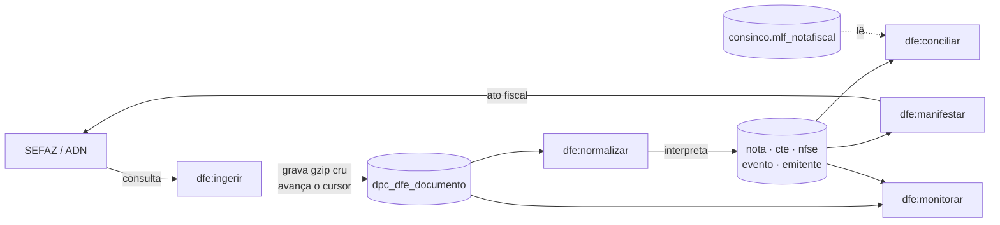

# Comandos do módulo DFe — referência de operação

> **Atualizado em 20/08/2026.** Cobre os 5 commands do `ApiNFE` que operam a captura própria de documento fiscal de entrada — NF-e, CT-e e NFS-e.

Todos rodam pelo `dev.cmd` (que existe porque o `php` do PATH é 7.2 e o projeto exige 8.1+, e porque o certificado A1 precisa de duas variáveis de OpenSSL legacy):

```
cd ApiNFE
dev.cmd dfe:monitorar --sem-certificado
```

## Por que são cinco, e não um

A divisão não é organização de código, é o desenho que impede perda de documento.



A SEFAZ retém os documentos por **90 dias**. Se o parser falhar e o documento não tiver sido guardado antes, a perda é **definitiva** — há prova disso no próprio banco, nos cursores da rotina antiga parados em 2019.

Por isso a ingestão grava o `docZip` como veio e só depois alguém interpreta. **Bug de parser deixa de ser perda permanente e vira `dfe:normalizar --status=E` depois da correção.**

| | fala com fonte externa | pode ser repetido à vontade |
|---|---|---|
| `dfe:ingerir` | **sim** — SEFAZ e ADN | não: consome cota |
| `dfe:manifestar` | **sim** — SEFAZ | não: é ato fiscal |
| `dfe:normalizar` | **nunca** | sim |
| `dfe:conciliar` | não (lê o ERP) | sim |
| `dfe:monitorar` | não | sim |

---

## O motor roda sozinho?

**Sim, por desenho.** As opções que este documento descreve são para diagnóstico e exceção — no dia a dia ninguém digita nada.

O cron do container roda `schedule:run` a cada minuto (`docker-compose/cron/schedule-cron`) e, sob `RUN_SCHEDULE=1`, três commands se sustentam sem ninguém:

| Comando | Cadência | `withoutOverlapping` | Por que essa cadência |
|---|---|---|---|
| `dfe:ingerir` | 15 min | 30 | folgado de propósito: a NT 2014.002 obriga esperar 1h após um `cStat 137`, e o controle é por fluxo via `dta_liberado_em`. A maioria das execuções só confirma que ninguém está liberado e encerra |
| `dfe:normalizar` | 10 min | 20 | mais frequente que a ingestão, para a fila de brutos não acumular |
| `dfe:conciliar` | 30 min | 30 | mais frequente que o fato que observa — a nota chega da SEFAZ na emissão e é lançada no ERP dias depois |

`dfe:manifestar` **não é agendado**. `dfe:monitorar` roda sob demanda.

O TTL do `withoutOverlapping` precisa ficar **acima** da duração máxima da execução (200 chamadas × 30s), senão uma queda de processo deixa a rotina travada até o restart.

> **`dfe:ingerir` sem `--tipo` pega todos os fluxos cadastrados**, inclusive `NFSE`. Quando uma família nova entra, não é preciso mexer no agendamento.

### Três estados se curam sozinhos

Consulta bem-sucedida devolve o fluxo para `A`. Então:

| Estado | Volta sozinho? |
|---|---|
| `B` bloqueado por consumo indevido | **sim**, depois da hora de espera |
| `C` certificado inválido | **sim**, assim que o certificado for corrigido no cofre — reavalia de hora em hora, para não inundar o log |
| `A` ativo, sem nada novo | segue no ciclo normal |

### Dois estados param e esperam gente — de propósito

| Estado | Por que não se cura sozinho | Como sair |
|---|---|---|
| `P` cursor travado | **não há saída automática conhecida.** Se o cursor aponta para faixa expurgada e a fonte não avança, insistir leva a `656`; reposicionar para valor arbitrário também. O procedimento correto precisa ser perguntado à SEFAZ | `--reposicionar-cursor` **somente** para um `ultNSU` já recebido |
| freio acionado | ao atingir `dfe_max_bloqueios_dia` (hoje **10**, em `DPC_PARAMETRO`) o command para de consultar. 50 bloqueios consecutivos podem virar bloqueio **permanente**, e consultar antes do prazo reinicia o cronômetro — uma rotina automática não pode ser capaz de caminhar para isso sozinha | investigar `dpc_dfe_execucao` e, se for deliberado, `--ignorar-freio` |

Nos dois casos, insistir automaticamente é pior que parar.

### O ponto que exige alguém olhando

**Documento em `E` nunca é retentado sozinho.** O agendamento chama `dfe:normalizar` sem argumento, e o default é `--status=P`. Um documento que falhou na interpretação fica em `E` **indefinidamente**, até alguém rodar:

```
dev.cmd dfe:normalizar --status=E
```

Isso é o comportamento correto — retentar em loop um documento que falha por bug de parser encheria o log e gastaria CPU sem nunca resolver. Mas cria uma dependência humana real, e é o **modo de falha silenciosa** do desenho em duas etapas: o documento está guardado e seguro, e ninguém percebe que ele não foi interpretado.

É para isso que existe a seção 4 do `dfe:monitorar`. **Ela deveria estar num alerta, não só num relatório.**

`IGNORADO` também espera intervenção, mas sem urgência: é tipo sem parser, fica guardado com o relógio de 90 dias parado. Hoje há dois casos — evento de CT-e (`procEvCTe`, por decisão) e evento do ADN (`adnEvento`, sem parser ainda).

### O que nunca vai ser automático

- **`dfe:manifestar`** — ato fiscal com efeito jurídico. Não é agendado, e sem `--confirmar` nada sai. Aguarda validação da contabilidade.
- **Ativar um fluxo** — depende da janela de corte da Qive.
- **Normalização de MDF-e** — a captura funciona, o parser não existe; cai em `IGNORADO`.

### E hoje, está ligado?

**Não, e são duas travas que se sustentam:** `RUN_SCHEDULE=0` **e** todos os fluxos pausados.

Ligar o agendador sem antes ter a janela de corte da Qive faria os CNPJs dela serem consultados a cada 15 min — dois consumidores na mesma sequência de NSU é causa documentada de `656`, que conta por certificado e IP e atinge todas as filiais que compartilham o e-CNPJ da matriz.

### Configuração

São dois lugares, e a divisão é proposital.

**No `.env`** ficam apenas as duas coisas que definem *o ambiente*, não o comportamento:

| Variável | Default | O que é |
|---|---|---|
| `RUN_SCHEDULE` | `0` | com 0, **nada** dispara |
| `TIPO_AMBIENTE` | — | `1` produção · `2` homologação |

**Em `POSEIDON.DPC_PARAMETRO`** ficam os parâmetros operacionais:

| Parâmetro | Valor | Faixa aceita | O que é |
|---|---|---|---|
| `dfe_max_consultas` | `200` | 1 a 5000 | orçamento de `distNSU` por ciclo |
| `dfe_pausa_seg` | `30` | 0 a 600 | segundos entre chamadas |
| `dfe_max_bloqueios_dia` | `10` | 1 a 20 | freio de emergência |
| `dfe_min_backoff_656` | `60` | 60 a 1440 | minutos de espera após bloqueio |

```sql
select nome, valor, explicacao from poseidon.dpc_parametro
 where lower(nome) like 'dfe%' order by nome;
```

A coluna `EXPLICACAO` de cada linha traz o **porquê** do valor. É de lá que se lê, não desta tabela: aqui envelhece sem ninguém notar.

#### Por que saíram do `.env`

`dfe_max_bloqueios_dia` é lido por **dois projetos** — o freio, aqui, e o card "usado / limite" da tela do Monitor DFe, na ApiDPC. Com o valor no `.env` de cada um eles divergiram (10 aqui, 5 lá) e **a tela acusava freio acionado com o motor operando normal**. Um valor que dois projetos precisam ler não pode viver em dois arquivos.

A leitura passa por `DpcParametroRepository`, que **valida tipo e faixa**: valor não numérico ou fora de faixa é recusado, cai no default conservador e gera aviso no `dfe:monitorar` e no log. A tabela não tem PK nem `CHECK` — essa é a única validação que existe, e é por isso que ela existe.

O piso de 60 em `dfe_min_backoff_656` não é preferência: consultar antes de vencer a hora **reinicia o cronómetro** do bloqueio. No `.env`, um `5` datilografado por engano passaria; a faixa recusa.

> `dfe_pausa_seg = 30` é **prudência, não medição**. Recebemos `cStat 656` na segunda chamada consecutiva com pausa de 2s, o que não bate com nenhum limite publicado — existe uma regra mais restritiva que ainda não foi caracterizada. Reduzir só depois de medir, com poucas chamadas e supervisão.
>
> 🔴 **A base deste parágrafo foi retratada em 02/09/2026.** A taxa de ~5/dia
> media de 28 a 31/08 estava contaminada pelo cooldown quebrado (`19c7b25`): o
> motor consultava 15 minutos depois de ter sido mandado esperar uma hora. A
> projeção de ~32/dia com 13 CNPJs multiplicava esse número e não se sustenta.
> Remedir com dado limpo antes de mexer no freio — ver
> [02_conhecimento-sefaz.md §5](02_conhecimento-sefaz.md).
>
> `dfe_max_bloqueios_dia = 10` **não escala**. Com 2 fluxos de NF-e a taxa normal é ~5/dia; com os 13 CNPJs do corte da Qive vai a ~32/dia, e 10 volta a cortar o motor todo dia. A saída é contar bloqueio **por fluxo**, não global.

---

## `dfe:ingerir`

A única coisa no módulo que consulta SEFAZ e ADN. Grava o bruto e avança o cursor; **não interpreta conteúdo fiscal**.

### Modos

O command tem três modos mutuamente exclusivos, e a diferença entre eles é o que pode dar errado:

| Modo | Como | Move o cursor? | Consome cota? |
|---|---|---|---|
| **drenagem** | sem flag de modo | **sim** | sim |
| **sonda** | `--nsu=` ou `--chave=` | **não** | sim |
| **reposicionamento** | `--reposicionar-cursor=` | sim, manualmente | não |

### Opções

| Opção | Para quê |
|---|---|
| `--empresa=` | csv de `nro_empresa`. Sem isso, todos os fluxos ativos e liberados |
| `--tipo=` | csv de `NFE`\|`CTE`\|`MDFE`\|`NFSE`. Sem isso, **todos** os fluxos cadastrados |
| `--max-consultas=` | orçamento global do ciclo. Default: `dfe_max_consultas` (200) |
| `--max-consultas-empresa=40` | orçamento por fluxo |
| `--pausa=` | segundos entre chamadas. Default: `dfe_pausa_seg` (30) |
| `--nsu=` | sonda um NSU específico, **sem** mover o cursor |
| `--chave=` | sonda por chave. Só onde a fonte suporta — ver abaixo |
| `--reposicionar-cursor=` | grava `nro_ultimo_nsu` e reativa o fluxo |
| `--confirmar` | exigido para reposicionar para valor **diferente** do `ultNSU` recebido |
| `--dry-run` | não grava, não consulta, não move cursor |
| `--debug` | salva request e resposta em `storage/logs/dfe-ingerir/` |
| `--ignorar-freio` | ignora o freio de emergência. Ver abaixo |

> **`--chave` não existe para todo tipo.** Quem responde se a busca por chave é possível é a **fonte**, não o command: `sped-nfe` aceita chave, `sped-cte` e `sped-mdfe` não têm o parâmetro, e o ADN tem endpoint por chave mas só devolve **eventos** de uma NFS-e. Pedir `--chave` num fluxo que não suporta recusa com mensagem clara, sem gastar cota.

### O freio de emergência

**10 bloqueios por consumo indevido em 24h** (`dfe_max_bloqueios_dia`, em `DPC_PARAMETRO`) e o command para de consultar, exigindo investigação. O motivo está em [Dois estados param e esperam gente](#dois-estados-param-e-esperam-gente--de-propósito).

Quando aciona, o próprio command mostra a consulta para investigar:

```sql
select * from poseidon.dpc_dfe_execucao
 where cod_resultado = 'CONSUMO_INDEVIDO' order by dta_inicio desc;
```

`--ignorar-freio` existe para o caso deliberado, e o nome é o aviso.

### Como o ciclo termina

O `cod_resultado` gravado em `dpc_dfe_execucao` é a primeira coisa a olhar quando algo parece errado:

| `cod_resultado` | Significa | O que fazer |
|---|---|---|
| `EM_DIA` | não há mais nada a buscar | nada |
| `ORCAMENTO` | acabou o `--max-consultas` do ciclo | nada; o próximo ciclo continua |
| `AGUARDANDO` | ainda em cooldown | nada |
| `CURSOR_TRAVADO` | a fonte não avançou o `ultNSU` mas o máximo segue maior | **fluxo pausado.** Ver a armadilha do cursor |
| `CONSUMO_INDEVIDO` | `cStat 656` | esperar. Não consultar antes de vencer o prazo |
| `ERRO_SEFAZ` | falha de comunicação ou rejeição | ver `dsc_resultado` |
| `ERRO_BD` | **nenhum** documento do lote gravou | cursor **não** avançado, de propósito |
| `CERT_INVALIDO` | PFX ilegível ou expirado | cadastro, não código |

> `ERRO_BD` merece atenção: se **alguns** documentos falham, é documento problemático e o cursor avança para não travar a fila. Se **todos** falham, o problema é do banco (coluna, permissão, LOB) e avançar perderia o lote inteiro em silêncio. Aconteceu de verdade: 50 documentos perdidos por `ORA-01465` com o cursor movido de 0 para 10.258.514.

---

## `dfe:normalizar`

Interpreta o bruto já gravado e popula as tabelas normalizadas.

**Invariante do módulo: nunca fala com a SEFAZ nem com o ADN.** É o que permite testar o parser mil vezes contra documento real sem consumir cota, e o que faz correção de parser ser recuperável.

| Opção | Para quê |
|---|---|
| `--status=P` | `P` pendente · `E` erro · `A` travado em andamento |
| `--empresa=` `--nsu=` `--chave=` | restringe o alvo |
| `--limit=500` | máximo por execução |
| `--max-tentativa=5` | ignora documento que já falhou N vezes |
| `--dry-run` | interpreta e mostra, sem gravar |
| `--debug` | mostra o XML e os campos extraídos |

> **O agendamento processa apenas `P`.** Documento em `E` fica lá até alguém rodar `--status=E` — é de propósito, e é o ponto do módulo que mais depende de alguém olhar. Ver [O ponto que exige alguém olhando](#o-ponto-que-exige-alguém-olhando).

**Depois de corrigir um parser**, o comando é este:

```
dev.cmd dfe:normalizar --status=E --debug --limit=5     # confere em poucos
dev.cmd dfe:normalizar --status=E                       # depois, todos
```

Documento de tipo sem parser não vira erro: fica `IGNORADO`, guardado, com o relógio de 90 dias parado. Hoje há dois casos assim — evento de CT-e (`procEvCTe`, por decisão) e evento do ADN (`adnEvento`, sem parser ainda).

---

## `dfe:conciliar`

Marca quais notas capturadas já entraram no ERP. **É o único ponto do módulo que lê a Consinco**, e essa exceção é deliberada: se o ERP cair, a captura continua. Documento não capturado em 90 dias está perdido; conciliação atrasada não custa nada.

| Opção | Para quê |
|---|---|
| `--empresa=` | csv de `nro_empresa` |
| `--dias=90` | janela de `dta_emissao` a reconsultar |
| `--limit=2000` | máximo de notas por execução |
| `--dry-run` `--debug` | |

Grava `status_recebimento`, `seq_nf_erp`, `dta_entrada_erp` e `dta_conciliacao` em `dpc_dfe_nota`.

> **Nunca envolva `nfechaveacesso` em função** ao mexer nessa consulta. Existe o índice `XIE_MLF_NOTAFISCAL_NFE`, e um `trim()` ou `upper()` ali transforma acesso pontual em full scan numa tabela de 390 colunas, a cada 30 minutos.

Só vale para **NF-e**. CT-e não entra em `mlf_notafiscal`, e NFS-e recebida não é registrada no ERP de forma alguma — para nota de serviço, `dpc_dfe_nfse` **é** o registro.

---

## `dfe:manifestar`

Manifestação do destinatário. **Ato fiscal com efeito jurídico**, e por isso nasce desligado.

| Opção | Para quê |
|---|---|
| `--empresa=` `--chave=` `--limit=20` | alvo |
| `--evento=210210` | `210200` confirmação · `210220` desconhecimento · `210240` não realizada |
| `--justificativa=` | **obrigatória** no `210240`, mínimo 15 caracteres |
| `--confirmar` | **sem esta flag nada é enviado** |
| `--dry-run` `--debug` | |

Duas barreiras contra manifestar em duplicidade: a flag `--confirmar` e a UK `(cod_dfe_nota, cod_tipo_evento)` no banco. A segunda é a que vale, porque não depende de ninguém lembrar.

**Não é agendado**, por decisão — aguarda validação da contabilidade em poucas notas antes de qualquer automação.

---

## `dfe:monitorar`

Somente leitura. É o comando para rodar primeiro quando algo parece errado.

| Opção | Para quê |
|---|---|
| `--empresa=` | restringe |
| `--dias=7` | janela do histórico de execuções |
| `--sem-certificado` | pula a leitura dos PFX — bem mais rápido |

São seis seções, e vale saber o que cada uma responde:

| Seção | Responde |
|---|---|
| 1 · Backlog por fluxo | quanto falta drenar, e quais fluxos estão fora de operação |
| 2 · Certificados | quem tem, quem venceu, quem vence em breve — e é a seção que `--sem-certificado` pula |
| 3 · Fila de documentos brutos | quantos aguardam normalização, e **quantos estão parados há mais de 24h** |
| 4 · Pendências de normalização | erros por tipo, e eventos órfãos separando os que **nunca** vão religar |
| 5 · Execuções | histórico de ciclos na janela de `--dias`, com o `cod_resultado` de cada |
| 6 · Conciliação com o ERP | quantas notas ainda não entraram, e quantas nunca foram conferidas |

**A seção 3 é a que merece alerta**, não relatório. Bruto acumulando sem normalizar é o risco real do desenho em duas etapas: durabilidade sem visibilidade. Documento parado há mais de 24h deve ser **zero** — se não for, a normalização não está dando conta ou está quebrada.

**A seção 2 é a que evita repetir um problema conhecido:** a renovação de certificado foi aplicada em 3 de 12 empresas e o vencimento das outras passou **9 meses** sem ninguém notar. O monitor alerta antes do vencimento — mas só vê o que está cadastrado.

> **Evento órfão não é "aguardando a nota".** O `NFeDistribuicaoDFe` entrega documentos *de interesse*, o que inclui eventos de notas que a **própria empresa emitiu** — essas vivem no ERP e nunca vão religar. Verificado em dois CNPJs: **todos** os 100 eventos capturados tinham o CNPJ da própria empresa dentro da `chave_nf`. O monitor separa por `substr(chave_nf, 7, 14)`.

---


## Roteiros

### Ver o que aconteceu

```
dev.cmd dfe:monitorar --sem-certificado
dev.cmd dfe:ingerir --dry-run                 # não consulta, não grava
```

### Sondar sem risco

Cursor intocado, e é o modo seguro para investigar em produção:

```
dev.cmd dfe:ingerir --empresa=30 --tipo=NFE --nsu=4358 --debug
```

O `--debug` salva request e resposta em `storage/logs/dfe-ingerir/`, o que permite reprocessar o parser offline depois.

### Ligar um fluxo novo

```
dev.cmd dfe:ingerir --empresa=30 --tipo=NFSE --reposicionar-cursor=0 --confirmar
# espera o cooldown de 3 min
dev.cmd dfe:ingerir --empresa=30 --tipo=NFSE --max-consultas=3 --pausa=8
dev.cmd dfe:normalizar --empresa=30
```

O cooldown de 3 min não é decoração: reposicionar e consultar na sequência reenvia a **mesma** requisição, e é assim que se toma `656`.

### Reprocessar depois de corrigir parser

Sem tocar em fonte externa:

```
dev.cmd dfe:normalizar --status=E --debug --limit=5
dev.cmd dfe:normalizar --status=E
```

### Voltar um lote para reprocessamento

```sql
update poseidon.dpc_dfe_documento
   set status_process = 'P', qtd_tentativa = 0
 where cod_dfe_cursor = :cursor and nro_nsu between :a and :b;
commit;
```

E depois `dfe:normalizar`. **Sem nenhuma chamada à SEFAZ** — é o ganho central do desenho em duas etapas.

---

## Três armadilhas que já custaram diagnóstico

**1. O cursor é um token, não um número escolhido por nós.** `nro_ultimo_nsu` é devolvido pela fonte e só pode ser **continuado**. O `xMotivo` do 656 é literal: *"Deve ser utilizado o ultNSU nas solicitações subsequentes"*. Enviar 0 depois de já ter recebido um `ultNSU`, ou enviar um NSU obtido por `consChNFe`, dá 656. Foram **4 bloqueios** até entender.

E a consequência mais séria: nem a SEFAZ nem o ADN guardam a posição de leitura — ela existe **somente** em `dpc_dfe_cursor`. Perder essa coluna não tem reconstrução. Por isso `avancaCursor` usa `greatest()`: retroceder é impossível por construção, não por disciplina do chamador.

**2. `CURSOR_TRAVADO` não tem saída automática conhecida.** Se o cursor apontar para faixa expurgada e a fonte não avançar, o fluxo **para**. Não reposicione para valor arbitrário: gera 656 e bloqueia o certificado inteiro. O procedimento correto de retomada precisa ser perguntado à SEFAZ — ver [12_sefaz-656-consumo-indevido.md](12_sefaz-656-consumo-indevido.md), pergunta 5.

**3. Atraso desconhecido não é atraso zero.** A SEFAZ informa `maxNSU`; o **ADN não**. Nesse caso `nro_maximo_nsu` fica 0 e o atraso é **nulo** — o monitor mostra `-`. Nunca calcule `maximo - ultimo` sem checar `maximo >= ultimo`, senão aparece atraso negativo e o total de backlog encolhe, escondendo o atraso real dos outros fluxos.

---

## Cota: dois domínios independentes

| Domínio | Fluxos | Regra |
|---|---|---|
| `SEFAZ` | `NFE` `CTE` `MDFE` | cota do **certificado e do IP**; `consNSU`/`consChNFe` somados: 20/hora |
| `ADN` | `NFSE` | sem limite publicado |

Isso importa na prática: um bloqueio da SEFAZ aplica espera a **todos** os fluxos do domínio SEFAZ — porque todas as filiais usam o e-CNPJ da matriz e saem do mesmo IP — mas **não** pausa a captura de NFS-e, e vice-versa.

O ADN sinaliza fim de fila com **HTTP 404 + erro `E2220`**, não com um 200. Isso é comportamento normal e o command reporta `EM DIA`, não erro.

---

## Documentos relacionados

Todo o material do modulo esta no mesmo hub — **`workspace/.claude/docs/nfe_dfe/`**,
[indice aqui](readme.md).

| Preciso de… | Onde |
|---|---|
| O comportamento da SEFAZ: cStat, 656, cota, NSU, eventos | [02_conhecimento-sefaz.md](02_conhecimento-sefaz.md) |
| O motor: desenho, parametros, defeitos ja vividos, medicoes | [03_conhecimento-motor.md](03_conhecimento-motor.md) |
| Para que serve cada uma das 13 tabelas | [04_dados-tabelas.md](04_dados-tabelas.md) |
| Modelo de dados coluna a coluna, para montar tela | [05_dados-consumo-frontend.md](05_dados-consumo-frontend.md) |
| Achar um script | [09_catalogo-scripts.md](09_catalogo-scripts.md) |
| Subir em um ambiente | [08_operacao-runbook-deploy.md](08_operacao-runbook-deploy.md) |
| Instalar ou alterar a base | [07_ddl-instalacao.md](07_ddl-instalacao.md) |
| A investigacao do `cStat 656` | [12_sefaz-656-consumo-indevido.md](12_sefaz-656-consumo-indevido.md) |
| A decisao sobre a Qive, para a gestao | [01_decisao-qive.md](01_decisao-qive.md) |
| A tela de monitoramento | [13_tela-monitor-dfe.md](13_tela-monitor-dfe.md) |
