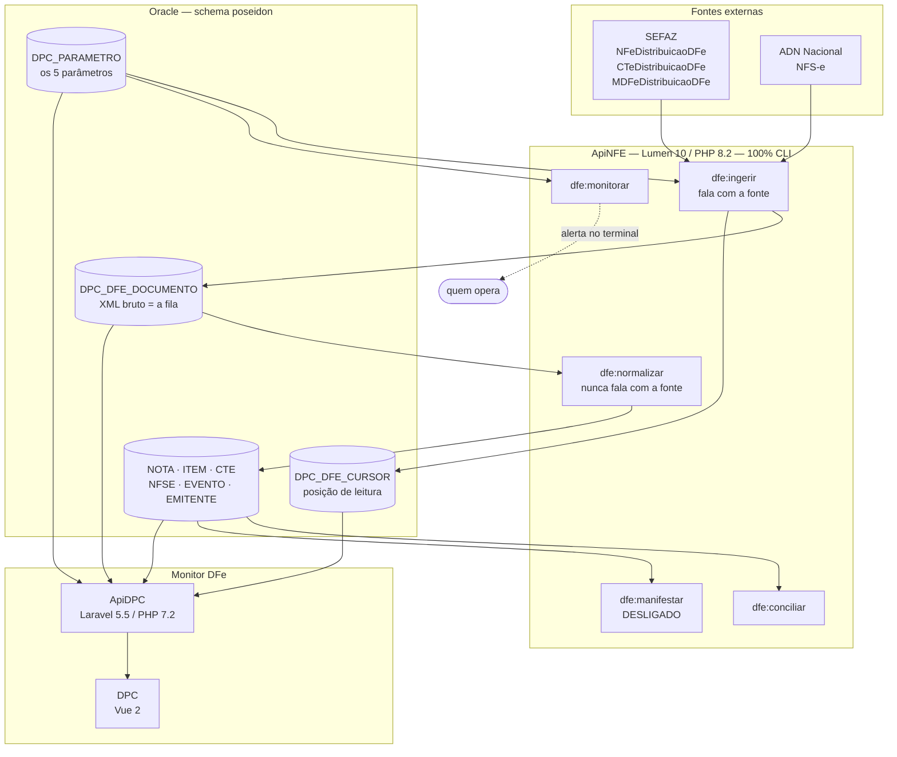

# Módulo DFe — captura própria de documentos fiscais de entrada

Hub de documentação do motor que substitui a **Qive**: captura NF-e, CT-e, MDF-e
e NFS-e de entrada direto da SEFAZ (`DistDFe`) e do ADN Nacional, dentro da
**ApiNFE**, com tela de monitoramento na **ApiDPC + DPC**.

> Centralizado aqui em **02/09/2026**. Antes o material estava em três lugares —
> `ApiNFE/docs/`, `ApiNFE/database/scripts/dfe-entrada/` e
> `itens/` — e o terceiro não era versionado.
>
> `ApiNFE/docs/` e `ApiNFE/database/scripts/` **deixaram de existir**. Este hub é
> o único lugar com documentação **e com os scripts** do módulo — todos `.sql`
> de DBeaver, em `scripts/`.
>
> Consequência a não esquecer: **um deploy da ApiNFE não carrega mais o próprio
> schema.** Quem instalar em ambiente novo vem buscar a DDL aqui.

---

## Comece por aqui

| Preciso de… | Documento |
|---|---|
| **Entender o comportamento da SEFAZ** — cStat, 656, cota, NSU, schemas, eventos | [02_conhecimento-sefaz.md](02_conhecimento-sefaz.md) 🔄 |
| **Entender o motor** — desenho, parâmetros, defeitos já vividos, medições | [03_conhecimento-motor.md](03_conhecimento-motor.md) 🔄 |
| **Quando o motor consulta a SEFAZ** — a regra de negócio inteira, num lugar só | [03_conhecimento-motor.md §2](03_conhecimento-motor.md) |
| **Rodar / operar** os comandos | [06_operacao-comandos.md](06_operacao-comandos.md) |
| **Subir em um ambiente** | [08_operacao-runbook-deploy.md](08_operacao-runbook-deploy.md) |
| Saber **o que cada tabela** guarda | [04_dados-tabelas.md](04_dados-tabelas.md) |
| **Consumir os dados** numa tela | [05_dados-consumo-frontend.md](05_dados-consumo-frontend.md) |
| **Instalar ou alterar a base** | [07_ddl-instalacao.md](07_ddl-instalacao.md) |
| Achar **um script** | [09_catalogo-scripts.md](09_catalogo-scripts.md) |
| **Os dois CNPJs onde dá para testar** — e o que cada teste provou | [10_cadastros-de-teste.md](10_cadastros-de-teste.md) |
| O que foi tocado na **Consinco de teste**, e como desfazer | [11_registro-alteracoes-tst.md](11_registro-alteracoes-tst.md) |
| A investigação do **cStat 656** | [12_sefaz-656-consumo-indevido.md](12_sefaz-656-consumo-indevido.md) |
| A **tela de monitoramento** | [13_tela-monitor-dfe.md](13_tela-monitor-dfe.md) |
| A **decisão de negócio** sobre a Qive | [01_decisao-qive.md](01_decisao-qive.md) |
| **Conciliar com o ERP** — frente em andamento, documentada à parte | [14_conciliacao-erp.md](14_conciliacao-erp.md) 🚧 |

O **número no nome é a ordem sugerida de leitura**, de quem chega agora: por que o
motor existe, o comportamento da SEFAZ, o desenho, os dados, como operar, como
instalar, e por fim o material de referência. Quem já conhece o sistema usa a
tabela acima e ignora a ordem. O `readme.md` não tem número porque é o índice,
não um capítulo.

🚧 = **frente em andamento**, documentada à parte até o desenho assentar.

🔄 = **documento vivo**: atualizar sempre que um conhecimento for adquirido ou
cair. Os dois carregam marcas de confiança (🟢 normativo · 🔵 medido ·
🟡 hipótese · 🔴 derrubado), porque foi confundir hipótese com fato que custou
os diagnósticos mais longos.

## O sistema em um diagrama



## As duas invariantes que sustentam o desenho

```
1. dfe:normalizar NUNCA fala com a SEFAZ.
   Bug de parser deixou de significar documento perdido — a SEFAZ retém
   por ~90 dias, e antes a perda era definitiva.

2. Nada automático consulta a SEFAZ depois de um bloqueio.
   Consultar antes de vencer a hora ZERA o tempo e reinicia a contagem, e o
   fluxo nunca sai do laço sozinho - sem nenhum sinal de erro.
```

## Onde as coisas moram

```
workspace/
├── ApiNFE/                                  o motor (Lumen 10 / PHP 8.2)
│   ├── app/Console/Commands/Dfe*.php        os 5 comandos
│   ├── app/Repositories/Dfe*.php            parser, cursor, execução, nota...
│   └── app/Repositories/DpcParametroRepository.php
│                                            ↑ nenhuma doc e nenhum .sql aqui
├── ApiDPC/app/Repositories/SefazMonitorDfeRepository.php
├── DPC/src/app/sefaz/monitor/               a tela
│
└── .claude/docs/nfe_dfe/                    ◀ O HUB
    ├── docs/                                a documentação
    │   ├── readme.md                        este índice
    │   ├── 01_decisao-qive.md
    │   ├── 02_conhecimento-sefaz.md  🔄
    │   ├── 03_conhecimento-motor.md  🔄
    │   ├── 04_dados-tabelas.md
    │   ├── 05_dados-consumo-frontend.md
    │   ├── 06_operacao-comandos.md
    │   ├── 07_ddl-instalacao.md
    │   ├── 08_operacao-runbook-deploy.md
    │   ├── 09_catalogo-scripts.md
    │   ├── 10_cadastros-de-teste.md
    │   ├── 11_registro-alteracoes-tst.md
    │   ├── 12_sefaz-656-consumo-indevido.md
    │   ├── 13_tela-monitor-dfe.md
    │   └── 14_conciliacao-erp.md                frente aberta, à parte
    │
    ├── itens/                               o que NAO e versionado
    │   ├── *.pfx                            os dois certificados A1
    │   ├── 02_certificado_all_cars_tst.sql  PFX em base64 + senha
    │   └── sefaz-656-consumo-indevido.md    stub, sustenta um link do CLAUDE.md
    │
    └── scripts/                             SO .sql de DBeaver
        ├── levantamento-nfse-municipios.sql   diagnostico, nao instalacao
        └── ddl/                             o UNICO caminho de instalacao
            ├── 01_01_estrutura              ┐
            ├── 01_02_estabelecimentos       │ BLOCO 01 - MOTOR
            ├── 01_03_parametros             │ 13 tabelas de captura
            ├── 01_04_validacao              │
            ├── 01_99_rollback_motor         ┘
            ├── empresas/                    ┐ UM PAR POR EMPRESA:
            │   ├── 29_01 · 29_99_rollback   │ a 29 (DF) e a 30 (MS),
            │   └── 30_01 · 30_99_rollback   ┘ que precisam de certificado
            ├── 03_01_parametrizacao_telas   ┐ BLOCO 03 - permissao e
            └── 03_99_rollback_telas         ┘ limiar dos paineis
```

Arquitetura da ApiNFE como um todo (não só o DFe):
[apinfe-arquitetura.md](../../arquitetura/apinfe-arquitetura.md).

## Estado atual — 02/09/2026

| | |
|---|---|
| Base normalizada | **18.757 documentos**, todos concluídos — 0 pendente, 0 erro, 0 ignorado |
| Fluxos ativos | **2 de 56** (só NFS-e da 30 e da 900) |
| Ambiente | roda em `dkalpha00`, cron ativo, base **homolog**, SEFAZ **real** |
| Produção | **o motor não vive lá, por decisão de 09/09/2026.** prd serve só para o `dfe:conciliar` **ler** a Consinco e confirmar o que o ERP recebeu. As tabelas `dpc_dfe_*` **existem** em prd desde 25/08/2026 — 12 delas, com `dpc_dfe_nota` em 26 colunas contra 37 em tst — mas estão **órfãs**: ninguém as usa. Os 5 parâmetros realmente não foram carregados lá |
| CNPJs livres da Qive | apenas **900** (ALL CARS) e **30** (DPC MS) — os outros 12 seguem com a Qive, e o NSU é compartilhado |
| `dfe:manifestar` | desligado, aguardando a contabilidade |
| Teste de volume (empresa 30) | **adiado, sem data.** Fluxos `NFE` e `CTE` pausados e acumulando atraso de propósito — ver [03_conhecimento-motor.md](03_conhecimento-motor.md) |

Itens abertos, com o porquê de cada um:
[03_conhecimento-motor.md §8](03_conhecimento-motor.md).

## Regras ao mexer nisto

| | |
|---|---|
| **Domínio fiscal não usa Context7** | ele indexa doc de bibliotecas; a `sped-nfe` documenta a API dela, não as regras do fisco. Ordem: portal da NF-e → bases de provedores. Detalhe no cabeçalho de [02_conhecimento-sefaz.md](02_conhecimento-sefaz.md) |
| **Certificado nunca é versionado** | os dois `.pfx` e o `02_certificado_all_cars_tst.sql` — que carrega o PFX em base64 e a senha — ficam em `itens/`, e a pasta **inteira** está no `.gitignore` desde 09/09/2026. A regra era por nome de arquivo e um rename a burlou em silêncio, pela segunda vez; ignorar a pasta protege o propósito, e não um nome. O motor lê o certificado do banco, não do disco |
| **Pasta `scripts/` só tem `.sql`** | nenhum README lá dentro: a explicação de cada grupo é um documento do hub, e o [catálogo](09_catalogo-scripts.md) diz qual |
| **DDL em CRLF** | em LF o DBeaver corta o bloco PL/SQL no `end if;` e devolve `PLS-00103`. Garantido por `workspace/.claude/.gitattributes` |
| **`ddl/01_03_parametros` antes do deploy** | ele carrega valores que o código **lê**; na ordem inversa o freio cai para 5 e o motor se trava em silêncio, e a conciliação passa a ler o clone de homologação em vez de produção |
| **Os dois caminhos terminam no `04_parametros`** | `DPC_PARAMETRO` é tabela compartilhada do ecossistema, então o `01_estrutura` **não** carrega as linhas dela |
| **Nunca escrever `nro_ultimo_nsu` a mão** | valor arbitrário = `cStat 656` e certificado bloqueado por 1 hora, atingindo todas as filiais do e-CNPJ |
