# Conteúdo do Card #3064 - DPC EDI: Cadastro de Projetos

## Branch Sugerida
```
feature/3057-edi-cadastro-projetos
```

---

## Descrição e Requisitos

### 1. Erro ao clicar em coluna para ordenar
**Problema:** Ao clicar em uma coluna para ordenar, retorna um erro.

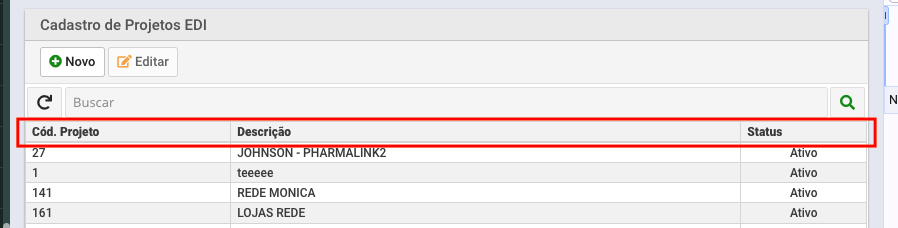
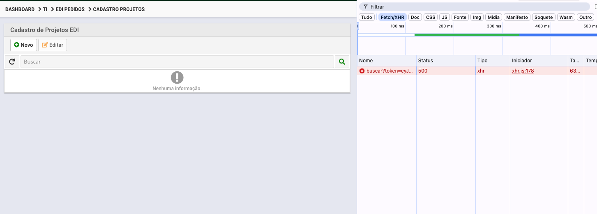

---

### 2. Modal Editar - Alinhamento e espaçamento
**Problema:** No modal Editar, os itens não estão alinhados e com espaço entre as bordas.

**Esperado:** Deixar igual ao exemplo abaixo.

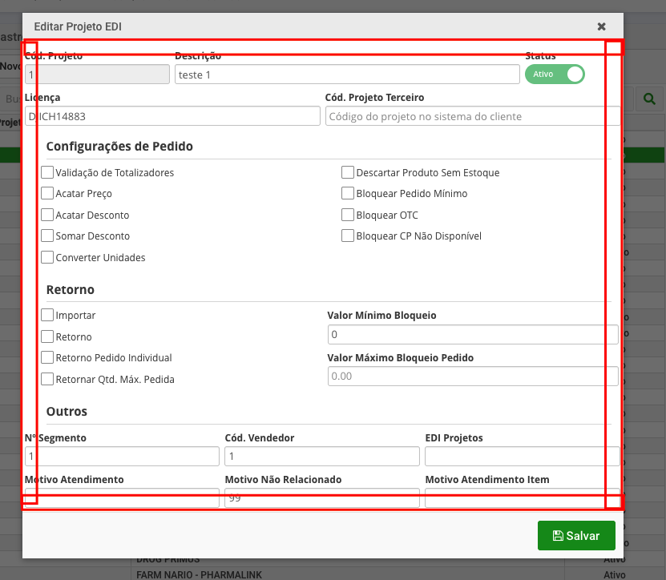

**Exemplo do esperado:**
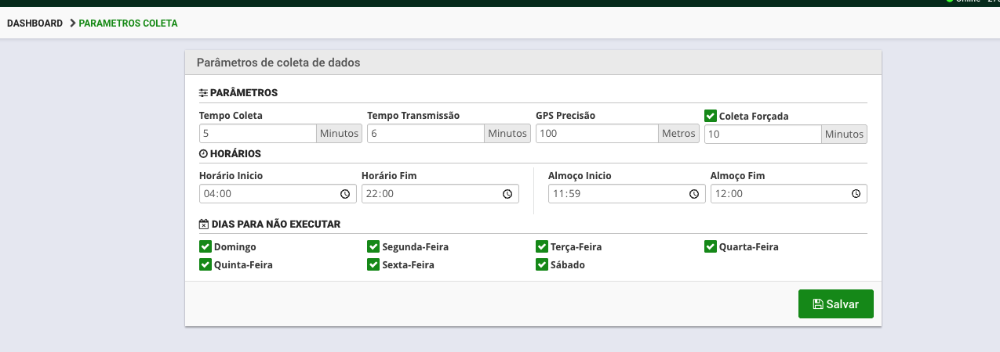

---

### 3. Alterar nomes dos inputs - Compatibilidade com Maracanã
**Problema:** Os nomes dos inputs na tela diferem do Maracanã, dificultando migração do usuário.

**Ação:** Alterar para ficar igual ao Maracanã.

**Exemplo:** O campo descrição no Maracanã está como "Projeto" → manter **Projeto** no DPC Aplicativos.

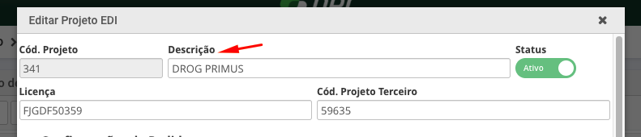

---

### 4. Alterar "Segmento" de input para select
**Problema:** Campo segmento é um input text, deveria ser select.

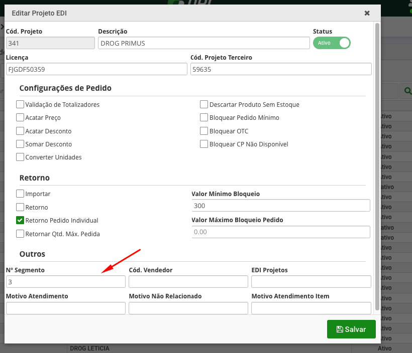

**Ação:** Converter para `<select />` e movê-lo para ficar ao lado do **Cod. do projeto no parceiro**, como no Maracanã:

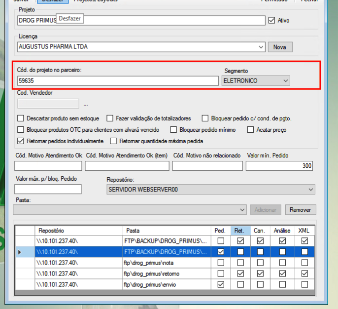

---

### 5. Faltou botão "Nova" para cadastro de licenças
**Problema:** Não há botão para criar novas licenças.

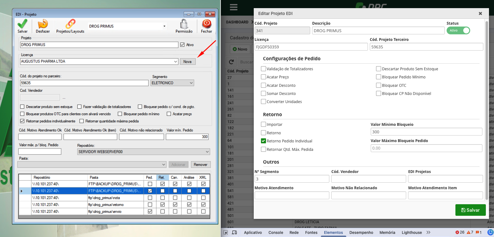

**Esperado:** Incluir botão "Nova" como exemplo:
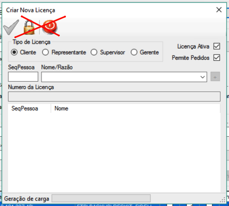

---

### 6. Não exibir input "Cód. Projeto" no modal
**Ação:** Ocultar o campo **Cód. Projeto** no modal (Novo/Editar).

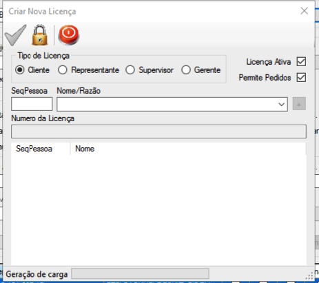

---

### 7. Gerar código de projeto automaticamente (Backend)
**Problema:** Usuário precisa digitar o código manualmente ao criar um projeto.

**Ação:** Alterar para gerar automaticamente no backend usando a sequence:
```sql
select dovemail.dpcs_edi_projeto_pk.nextval cod_projeto
from dual
```

**Exemplo de implementação:**
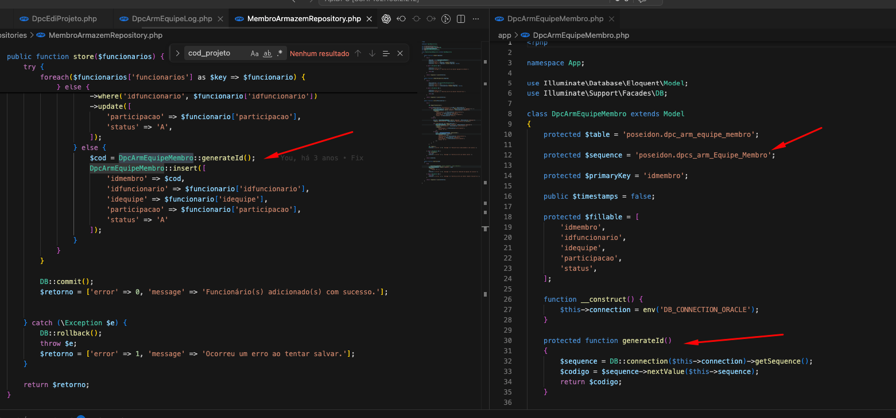

---

### 8. Inclusão de pastas do projeto
**Problema:** Faltou implementar a parte de inclusão de pastas do projeto.

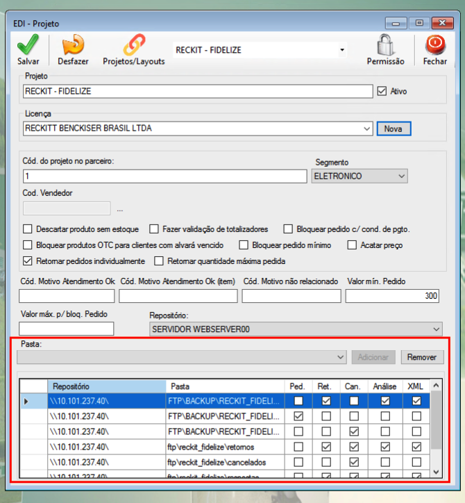

---

### 9. Input "Repositório" faltando
**Problema:** Não há campo para Repositório.

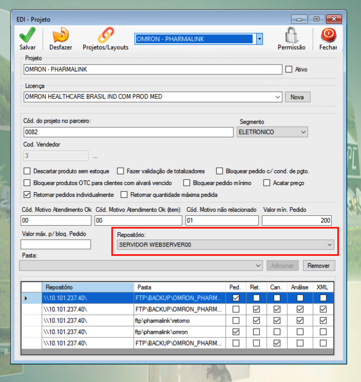

---

### 10. Alterar "Licença" para select
**Problema:** Campo Licença deveria ser um select como no Maracanã.

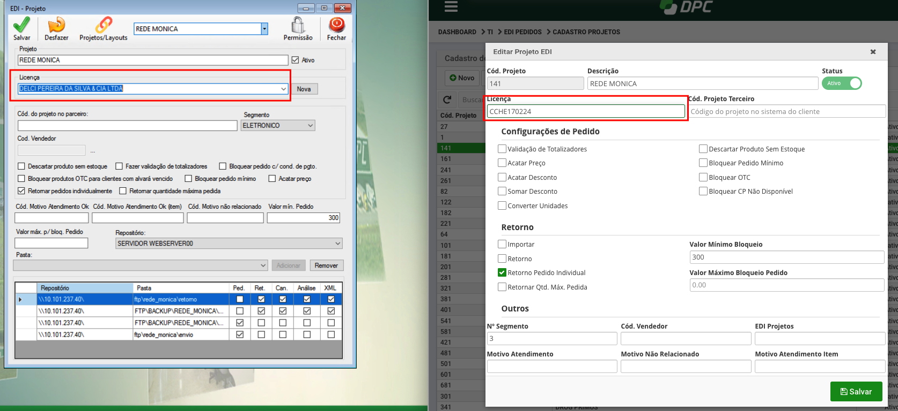

---

### 11. Código do vendedor - Bloqueio condicional
**Problema:** Código do vendedor não é gerenciado corretamente.

**Ação:** 
- Deixar null quando segmento ≠ "COMISSÃO FIXA"
- Bloquear (disabled) quando segmento ≠ "COMISSÃO FIXA"

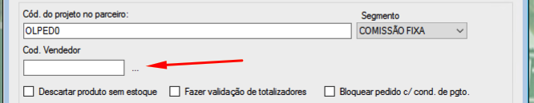
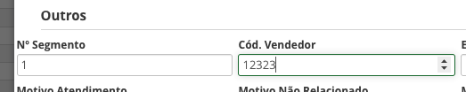

---

## Referência do Card
- **ID Trello:** 3064
- **URL:** https://trello.com/c/wNd2cKAg/3064-dpc-edi-cadastro-de-projetos
- **Atribuído a:** Joabe
- **Labels:** Correções, Erros
